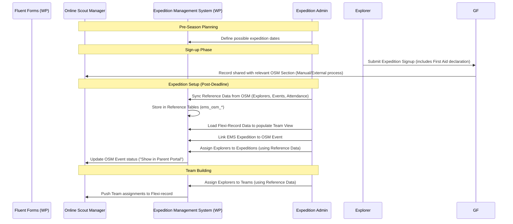

# Product Requirements Document (PRD): Expedition Management System (EMS)

## 1. Overview
### 1.1 Purpose
The Expedition Management System (EMS) is designed to manage and store information for Duke of Edinburgh (DofE) expeditions in South East Scotland. It complements an existing WordPress website by managing expedition dates, leadership, participant teams, and route planning submissions.

### 1.2 Scope
- **Included**: Expedition lifecycle management (dates, locations), leadership assignment, participant team building, route planning submission/approval, and volunteer availability tracking.
- **Excluded**: Online training content (handled via Tutor LMS) and primary CRM/sensitive personal data (handled via Online Scout Manager - OSM).

## 2. System Context & Integrations
### 2.1 Online Scout Manager (OSM)
- **Primary CRM**: OSM remains the source of truth for personal and event information.
- **Authentication**: Serves as the OIDC provider for all users (except WordPress Super Admins).
- **Data Retrieval**: 
    - Pulls personal info (OSM ID, Name, Email) and Participant Unit (from "patrol" field).
    - Imports "Event" data (Name, Dates, Times).
    - Section-based imports for participants (e.g., Bronze in one section, Silver/Gold in another, as defined in configuration).
- **Data Push-back (Flexi-Records)**:
    - Expedition assignments.
    - Team assignments.
    - First Aid status per participant.
    - **Note**: Flexi-records are stored per season in OSM. First Aid status and team assignments are written to the current season's flexi-record at the time of assignment.
- **Event Status Update**: If a participant is assigned in EMS but not yet in the OSM event, EMS updates their OSM status to "Show in Parent Portal".
- **Push-back Authentication**: All EMS-to-OSM write operations are performed via the admin-triggered personal OAuth2 flow (the same flow used for data imports). No tokens are stored server-side. OSM has no machine/service account concept. See Technical Architecture ADR 010.

### 2.2 WordPress & Tutor LMS
- **Hosting**: Integrated with or hosted on the SE Scotland DofE WordPress site.
- **Course Completion**: EMS connects to Tutor LMS to verify online training status.
- **Fluent Forms Integration**: 
    - Participants sign up via Fluent Forms.
    - EMS provides an Admin Signups Board to manage, reconcile, and match Fluent Forms signups against OSM reference data.
- **User Provisioning**: WP accounts (Name, Email, OSM ID) may be pre-provisioned in WP based on OSM sync to facilitate the first OIDC login.

## 3. Expedition Lifecycle & Data Flow

## 4. Functional Requirements

### 4.1 Expedition Planner — Season, Event & Team Management

#### 4.1.1 Seasons
A **season** is the top-level container for a flight of training events, practice expeditions, and qualifying expeditions. Admins create a season before defining any events within it.

#### 4.1.2 Events
An **event** is the EMS term for a training event, practice expedition, or qualifying expedition within a season. Each event has:
- **Type**: `training` | `practice` | `qualifying`
- **Mode of transport**: `hillwalking` | `biking` | `paddling`
- **Level**: `bronze` | `silver` | `gold`
- **Short code**: manually assigned by admin (e.g. `H-SP1` for Hillwalking Silver Practice 1). Must be unique within the season.
- **Leader in charge**: name, email, and phone number — may be blank/TBC at creation
- **Start location**: free text — may be blank/TBC at creation
- **End location**: free text — may be blank/TBC at creation
- **Start date/time**: date required; time optional
- **End date/time**: date required; time optional
- **OSM event link**: OSM event ID — may be blank/TBC at creation; selectable from OSM reference events already synced
- **Route planning information**: rich text field (map links, key notes, etc.)

> **Terminology note**: The EMS internal CPT is named `expedition`; the admin-facing label is **event** for individual training/practice/qualifying instances, and the broader planning concept maps directly to a season's collection of events. See Data Schema §1 for the CPT definition.

#### 4.1.3 Teams
- Each event can be associated with one or more **teams**, each being a list of explorers.
- **Team size**: officially 4–7 members. If a team falls outside this range a validation warning is flagged to the admin (not a hard block).
- Not all explorers attending an event need to be in a team.
- Explorers can be added to an event's unassigned pool or directly into a named team.
- Each team has a **short code** auto-generated from the event code with a sequential suffix (e.g. `H-SP1-1`, `H-SP1-2`). No two teams in the same event may share a code.
- Team numbers must remain **sequential** — gaps are not permitted (e.g. an event cannot have `H-SP1-1` and `H-SP1-4` without `H-SP1-2` and `H-SP1-3`).
- A team with no members ceases to exist (is deleted or archived automatically).

#### 4.1.4 Explorer & Team Assignment Operations
- **Move explorer** between teams within the same event, or between events of the same type/level.
- **Move team** between events of the same type, or **duplicate** a team to another event. The team code designation is updated to match the target event's code.
- **Populate from practice** — duplicate team assignments from a practice event to a qualifying event (or between any two event types).

#### 4.1.5 Importing & Linking
- **Step 1: OSM Reference Sync**: Pull full participant lists, events, and attendance statuses from specific OSM sections. This data is stored in local reference tables and is the source of truth for all planning.
- **Step 2: Flexi-Record Import**: Load team and expedition assignments from OSM Flexi-records. This populates the Team View and does not require local WordPress User records.
- EMS event records must be explicitly linked to an OSM Event record.

#### 4.1.6 Team Builder Views
- **Season Dashboard**: Compact at-a-glance view of all events, teams, and explorer assignments for the season. Layout must be innovative and space-efficient to support quick scanning.
- **Cross-event team view**: Select a team, see which other events/teams the same members appear in, with controls to update assignments in those other events.
- **Explorer move**: Move a person between teams (within an event or between events of the same type) with minimal clicks.
- **Team move/duplicate**: Move or duplicate a whole team between events of the same type; or duplicate to a different type (e.g. practice → qualifier).

#### 4.1.7 Pre-Season Planning
- Admins define a season and populate it with events before assigning explorers.
- **Importing & Linking**: 
    - **Step 1: OSM Reference Sync**: Pull full participant lists, events, and attendance statuses from specific OSM sections. This data is stored in local reference tables and is the source of truth for all planning.
    - **Step 2: Flexi-Record Import**: Load team and expedition assignments from OSM Flexi-records. This populates the "Team View" and does not require local WordPress User records.
    - EMS records must be explicitly linked to an OSM Event record.
- **Teammate Preferences**: When building teams, Admins must be able to view preferences submitted by Explorers during signup.
- **Unit Tracking**: Participant units are retrieved from the OSM "patrol" field.

#### Non-Functionals
- Menu entry under EMS admin menu.
- Slick and modern UI using existing React/Tailwind stack.
- Minimise clicks — primary view is the expedition/team summary dashboard.

### 4.2 First Aid & Safety
- **Declaration**: At signup (via Fluent Forms), participants declare their first aid status:
    - No First Aid.
    - First Response.
    - Full First Aid Qualification.
- **Planning View**: The team building/expedition overview must display the first aid status of each team member to ensure safety coverage.
- **Sync**: First Aid status is pushed back to the current season's OSM flexi-record.

### 4.2a Email Notifications *(Gap — To Be Resolved)*
- Email notifications are required for key workflow triggers but the delivery mechanism has not yet been confirmed. The WP native email system (via SiteGround SMTP) is the most likely approach and should be investigated.
- **Required triggers** (at minimum):
    - Volunteer signup submitted → awaiting Admin/LiC confirmation
    - Volunteer signup confirmed or rejected
    - Explorer assigned to expedition and team
    - LiC approves or provides feedback on a route submission
    - Route submission deadline approaching
- **Action**: Confirm SiteGround SMTP availability and decide on notification implementation before Phase 4.

### 4.3 Volunteer Management
- **Signup**: Volunteers can view a list of expeditions and sign up to assist.
- **Availability**: 
    - A "Whole Expedition" checkbox is provided.
    - If unchecked, volunteers must specify which days and overnight stays they are available for.
- **Confirmation**: All volunteer signups must be **confirmed** by an Expedition Admin or LiC before they are considered part of the expedition team.
- **Visual Views**:
    - **Overview Calendar**: A high-level view showing all expeditions and overall volunteer coverage.
    - **Expedition-Specific View**: A detailed breakdown of volunteers assigned to a single expedition, highlighting confirmed vs. pending status and daily coverage.
    - **Person View**: A view showing an individual volunteer's commitments across the season (even if they've signed up for dates not yet linked to a specific expedition).

### 4.4 Route Planning & Submissions
- **Submission**: Each team must submit GPX files and route cards before a set deadline.
- **Storage**: Files are stored in the WordPress Media Library.
- **Naming Convention & Versioning**: 
    - Files must follow a strict naming convention: `[Team_Code]_[File_Type]_v[X].[ext]` (e.g., `SP1-1_RouteCard_v2.pdf`).
    - The system must maintain a history of submissions so LiCs can see previous versions alongside feedback.
- **Review Loop**:
    - LiC can approve routes or provide feedback for modification.
    - Explorers (and Parents) see the submission status and LiC feedback.

### 4.5 Reporting & Comparison
- **Signup Reconciliation**: 
    - A dedicated board to reconcile Fluent Forms submissions with OSM reference data.
    - **Matching Key**: `scout_id` (primary hidden match) or email address/name (reconciliation fallbacks).
    - **Logic**: Match `ems_signups` records with `ems_osm_explorers` records, offering manual reconciliation for new recruits or unlinked submissions.
- **Reports**:
    - Event participation and staffing levels.
    - Training completion (Tutor LMS).
    - Route planning status.
    - First Aid coverage per team.

### 4.6 Parent-Child Relationship
- **Data Source**: Relationships are retrieved from the `member_access` block in the `getDataPayload` response during authentication/startup.
- **Parsing & Provisioning**: 
    - Parents often log in *before* their child to sign them up.
    - **Multi-Child Aggregation**: The system must iterate through all sections in the payload and aggregate a deduplicated list of `member_id`s (Scout IDs) where the user has `access_type: "parent"`.
    - Upon Parent login and child selection, the EMS must query OSM for the Explorer's details if the local WP account does not exist.
    - If the Explorer does not have a WP account, EMS will provision a "shell" WP account using the OSM `scout_id` as the primary anchor.
- **Shell Account Merge Flow**: When a child subsequently logs in via OIDC, the `login-with-google` plugin will create a new WP account using their email address. The EMS must intercept the post-login hook, query OSM using the newly obtained `access_token` to retrieve the child's `scout_id`, locate any existing shell account with a matching `ems_scout_id` in WP User Meta, and perform a merge — transferring all EMS User Meta to the OIDC account and deleting the shell. This ensures no duplicate records persist.
- **Selection**: Upon login, a Parent must select which child's data they wish to view from the aggregated list.

### 4.7 Access Control & Validations (OSM access_type)
- **Role Differentiation**: The system differentiates users based on the `access_type` field in the OSM payload (`"parent"` vs. `"member"`).
- **DofE Level Signup**: Only users with an `access_type` of `"parent"` can initiate a signup for a new DofE level.
- **Email Validation**: During a new DofE level signup by a parent, the system must validate that the Explorer has an email address registered in OSM. If missing, the parent must be prompted to add the email in OSM before proceeding.
- **Online Courses**: Access to Tutor LMS online courses is strictly restricted to users logged in with an `access_type` of `"member"` (Explorers). Parents cannot complete training on behalf of the Explorer.

## 5. Constraints & Data Protection
### 5.1 Authentication Flow
- **OSM OIDC**: Mandatory for all EMS-specific functions to facilitate data retrieval from OSM.
- **Dual Login**: Users who are also WordPress site admins must log in via OSM to perform EMS tasks.

### 5.2 Data Protection
- **Minimization**: EMS should only store the minimum personal data required for expedition management (e.g., names, units, team assignments).
- **Sensitivity**: Sensitive personal information (medical details, contact info) must remain in OSM and NOT be stored in EMS.
- **Parental Access**: Parents have access to their child's team route planning (GPX, route cards, feedback).
- **Right to Erasure** *(Late Phase)*: GDPR requires that participant data can be deleted on request (e.g., when a young person leaves the programme). A late-phase admin function must be implemented to: remove all EMS User Meta for the user, anonymise their records in the `ems_team_members` and `ems_route_submissions` custom tables, and remove `ems_volunteer_availability` rows. This is deferred to a post-launch phase.

## 6. Architectural Direction
### 6.1 WordPress Integration
- **Custom Plugin**: The EMS will be implemented as a custom WordPress plugin.
- **Separation of Concerns**:
    - **Frontend (Website)**: End-user features (Explorers, Parents, Volunteers) should be integrated into the public-facing website pages via shortcodes (see Shortcode Registry in Technical Architecture §4).
    - **Backend (Dashboard)**: Administrative features (Expedition Admin, LiC approval tools, Reconciliation) should reside within the WordPress Admin Dashboard.
- **Data Model**: **Hybrid** — Custom Post Types (CPTs) for Expeditions and Teams (main entities), with custom database tables for relational data (team membership, volunteer availability, route submission history). See Technical Architecture ADR 001 and ADR 011 for the full specification.

## 7. Definitions & Glossary
- **OSM**: Online Scout Manager.
- **LiC**: Leader in Charge (Primary expedition leader).
- **GPX**: Format for GPS exchange, used for route planning.
- **Route Card**: A document detailing the timed stages of an expedition.
- **Tutor LMS**: The WordPress plugin used for online training modules.
- **Explorer**: A young person (participant) in the DofE program.
- **CPT**: Custom Post Type (WordPress data structure).
