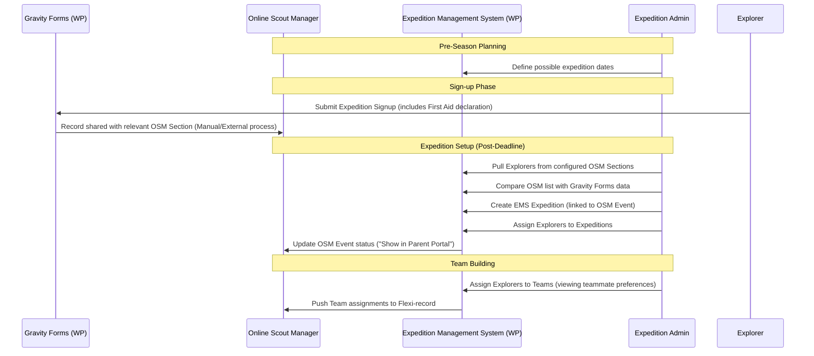

# Product Requirements Document (PRD): Expedition Management System (EMS)

## 1. Overview
### 1.1 Purpose
The Expedition Management System (EMS) is designed to manage and store information for Duke of Edinburgh (DofE) expeditions in South East Scotland. It complements an existing WordPress website by managing expedition dates, leadership, participant teams, and route planning submissions.

### 1.2 Scope
- **Included**: Expedition lifecycle management (dates, locations), leadership assignment, participant team building, route planning submission/approval, and volunteer availability tracking.
- **Excluded**: Online training content (handled via Tutor LMS) and primary CRM/sensitive personal data (handled via Online Scout Manager - OSM).

## 2. System Context & Integrations
### 2.1 Online Scout Manager (OSM)
- **Primary CRM**: OSM remains the source of truth for personal and event information.
- **Authentication**: Serves as the OIDC provider for all users (except WordPress Super Admins).
- **Data Retrieval**: 
    - Pulls personal info (OSM ID, Name, Email) and Participant Unit (from "patrol" field).
    - Imports "Event" data (Name, Dates, Times).
    - Section-based imports for participants (e.g., Bronze in one section, Silver/Gold in another, as defined in configuration).
- **Data Push-back (Flexi-Records)**:
    - Expedition assignments.
    - Team assignments.
    - First Aid status per participant.
- **Event Status Update**: If a participant is assigned in EMS but not yet in the OSM event, EMS updates their OSM status to "Show in Parent Portal".

### 2.2 WordPress & Tutor LMS
- **Hosting**: Integrated with or hosted on the SE Scotland DofE WordPress site.
- **Course Completion**: EMS connects to Tutor LMS to verify online training status.
- **Gravity Forms Integration**: 
    - Participants sign up via Gravity Forms (year-round).
    - EMS provides a comparison view to match Gravity Forms signups against OSM section lists to ensure no one is missed.
- **User Provisioning**: WP accounts (Name, Email, OSM ID) may be pre-provisioned in WP based on OSM sync to facilitate the first OIDC login.

## 3. Expedition Lifecycle & Data Flow

## 4. Functional Requirements

### 4.1 Expedition & Team Management
- **Pre-Season Planning**: Admins define a calendar of possible dates for all expedition levels.
- **Importing & Linking**: 
    - Pull participant lists from specific OSM sections (e.g., "Explorer Scout Unit").
    - EMS records must be explicitly linked to an OSM Event record.
- **Team Composition**: 
    - Participants grouped into teams (4–7 people).
    - **Teammate Preferences**: When building teams, Admins must be able to view preferences submitted by Explorers during signup.
- **Unit Tracking**: Participant units are retrieved from the OSM "patrol" field.

### 4.2 First Aid & Safety
- **Declaration**: At signup (via Gravity Forms), participants declare their first aid status:
    - No First Aid.
    - First Response.
    - Full First Aid Qualification.
- **Planning View**: The team building/expedition overview must display the first aid status of each team member to ensure safety coverage.
- **Sync**: First Aid status is pushed back to an OSM flexi-record.

### 4.3 Volunteer Management
- **Signup**: Volunteers can view a list of expeditions and sign up to assist.
- **Availability**: 
    - A "Whole Expedition" checkbox is provided.
    - If unchecked, volunteers must specify which days and overnight stays they are available for.
- **Confirmation**: All volunteer signups must be **confirmed** by an Expedition Admin or LiC before they are considered part of the expedition team.
- **Visual Views**:
    - **Overview Calendar**: A high-level view showing all expeditions and overall volunteer coverage.
    - **Expedition-Specific View**: A detailed breakdown of volunteers assigned to a single expedition, highlighting confirmed vs. pending status and daily coverage.
    - **Person View**: A view showing an individual volunteer's commitments across the season (even if they've signed up for dates not yet linked to a specific expedition).

### 4.4 Route Planning & Submissions
- **Submission**: Each team must submit GPX files and route cards before a set deadline.
- **Storage**: Files are stored in the WordPress Media Library.
- **Naming Convention & Versioning**: 
    - Files must follow a strict naming convention: `[Team_Code]_[File_Type]_v[X].[ext]` (e.g., `SP1-1_RouteCard_v2.pdf`).
    - The system must maintain a history of submissions so LiCs can see previous versions alongside feedback.
- **Review Loop**:
    - LiC can approve routes or provide feedback for modification.
    - Explorers (and Parents) see the submission status and LiC feedback.

### 4.5 Reporting & Comparison
- **Signup Reconciliation**: 
    - A dedicated view to compare Gravity Forms submissions with OSM section lists.
    - **Matching Key**: Explorer Email address (Note: Gravity Forms must capture the Explorer's specific email, which may differ from the parent/submitter email).
    - **Logic**: Highlight OSM records without matching Gravity Forms, and Gravity Form entries without matching OSM records.
- **Reports**:
    - Event participation and staffing levels.
    - Training completion (Tutor LMS).
    - Route planning status.
    - First Aid coverage per team.

### 4.6 Parent-Child Relationship
- **Data Source**: Relationships are retrieved from OSM in a complex data block during the authentication/startup sequence.
- **Parsing**: The EMS must parse this data block to establish links between Parent accounts and Explorer records.
- **Selection**: Upon login, a Parent must select which child's data they wish to view if multiple children are participating.

## 5. Constraints & Data Protection
### 5.1 Authentication Flow
- **OSM OIDC**: Mandatory for all EMS-specific functions to facilitate data retrieval from OSM.
- **Dual Login**: Users who are also WordPress site admins must log in via OSM to perform EMS tasks.

### 5.2 Data Protection
- **Minimization**: EMS should only store the minimum personal data required for expedition management (e.g., names, units, team assignments).
- **Sensitivity**: Sensitive personal information (medical details, contact info) must remain in OSM and NOT be stored in EMS.
- **Parental Access**: Parents have access to their child's team route planning (GPX, route cards, feedback).

## 6. Architectural Direction
### 6.1 WordPress Integration
- **Custom Plugin**: The EMS will be implemented as a custom WordPress plugin.
- **Separation of Concerns**:
    - **Frontend (Website)**: End-user features (Explorers, Parents, Volunteers) should be integrated into the public-facing website pages (e.g., via shortcodes, blocks, or custom templates).
    - **Backend (Dashboard)**: Administrative features (Expedition Admin, LiC approval tools, Reconciliation) should reside within the WordPress Admin Dashboard.
- **Data Model**: Leverage Custom Post Types (CPTs) for Expeditions and Teams, with custom database tables for complex relationships (like Volunteer availability and OSM parsing) to ensure performance and data integrity.

## 7. Definitions & Glossary
- **OSM**: Online Scout Manager.
- **LiC**: Leader in Charge (Primary expedition leader).
- **GPX**: Format for GPS exchange, used for route planning.
- **Route Card**: A document detailing the timed stages of an expedition.
- **Tutor LMS**: The WordPress plugin used for online training modules.
- **Explorer**: A young person (participant) in the DofE program.
- **CPT**: Custom Post Type (WordPress data structure).
exchange, used for route planning.
- **Route Card**: A document detailing the timed stages of an expedition.
- **Tutor LMS**: The WordPress plugin used for online training modules.
- **Explorer**: A young person (participant) in the DofE program.
- **CPT**: Custom Post Type (WordPress data structure).
