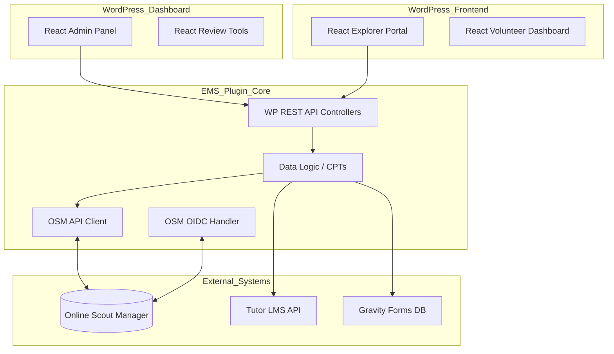

# Technical Architecture Overview: EMS

This document outlines the key architectural decisions and foundational assumptions for the Expedition Management System.

## 1. Foundational Assumptions
- **Environment**: WordPress 7.0+, PHP 8.2+, hosted on SiteGround.
- **Identity**: OSM is the definitive OIDC provider.
- **Plugin Structure**: Modern PHP architecture (Namespacing, Autoloading, Strict Typing).
- **Frontend Builder**: Elementor Pro v4.1.0 (utilizing Container-based layouts).
- **Frontend Framework**: React for interactive application features.

## 2. Key Architectural Decisions (ADRs Needed)

### ADR 001: Data Modeling Strategy
- **Decision**: **Pure Custom Post Types (CPTs) and Post Meta**, leveraging modern WP 7.0 metadata performance improvements.
- **Rationale**: Given the scale and the modern environment, CPTs are the most maintainable path.
- **Structure**:
    - `expedition` CPT: Stores dates, LiC, status.
    - `team` CPT: Linked to an `expedition`.
    - `volunteer_availability` (User Meta): Serialized data for dates/overnights.

### ADR 002: OSM Integration & Sync Strategy
- **Decision**: **Persistent Scout ID Anchor & Role Differentiation**.
- **Approach**: 
    - Use the OSM `member_id` (`ems_scout_id`) as the immutable primary key for all internal Explorer record mapping. 
    - This ensures that parent-child relationships remain valid even if the child does not yet have an OSM account (`user_id`).
    - Dedicated `OSM_Parser` class for aggregating multi-child lists from the `member_access` block and identifying the `access_type` (`"parent"` vs. `"member"`).
    - **Access Control**: Core plugin logic must enforce role-based access based on this `access_type` (e.g., Parent-only signups, Explorer-only course access).
    - Flat relationship mapping in User Meta using Scout IDs for maximum cross-account compatibility.

### ADR 003: Frontend Integration Pattern
- **Decision**: **React-based Single Page Application (SPA) embedded via Shortcode**.
- **Rationale**: Following the pattern of modern plugins like Tutor LMS, we will build the user interfaces (Explorer Portal, Volunteer Dashboard) as React applications. These will be "hydrated" into the page via a simple shortcode wrapper. 
- **Benefits**: 
    - Smooth, no-reload transitions (e.g., switching between children, signing up for dates).
    - Highly interactive components (Drag-and-drop team building, visual calendars).
    - Better separation of concerns (PHP handles the API, React handles the UI).
- **Elementor Role**: Elementor will provide the page wrapper, header, and footer, with the EMS React App living inside an Elementor section.

### ADR 004: Volunteer Availability & Confirmation Logic
- **Decision**: Use a custom `confirmed` meta field on the expedition-volunteer relationship to track participation status.

### ADR 005: File Management & Security
- **Decision**: **REST API Protected Proxy**.
- **Approach**: 
    - Store files in `/wp-content/uploads/ems-secure/`.
    - Access via a custom WP REST API endpoint (`/wp-json/ems/v1/download/`). 
    - Endpoint verifies JWT/Nonce and permissions before serving the file via `readfile()`.

### ADR 006: Administrative Interface
- **Decision**: **React-based "Single Page" Admin Dashboard**.
- **Approach**: 
    - Create a top-level "Expedition Management" menu in the WP Dashboard using `add_menu_page()`.
    - Enqueue a React bundle specifically for the admin area.
    - Use the **@wordpress/components** library (the same library used by the Block Editor) to ensure the UI looks and feels like a native part of WordPress.
- **Key Management Views**:
    - **Reconciliation Dashboard**: A real-time comparison tool for Gravity Forms vs. OSM records.
    - **Team Builder**: A drag-and-drop interface for moving Explorers between expeditions and teams.
    - **Volunteer Command Center**: A grid view for confirming volunteers and managing seasonal availability.
    - **Reporting Engine**: Visualizations for training status and route planning progress.

### ADR 007: Test-Driven Development (TDD) Mandate
- **Decision**: **Mandatory TDD Lifecycle**.
- **Rationale**: To ensure the long-term maintainability of the EMS and to facilitate safe code generation by agents, all features and bug fixes must follow a strict TDD lifecycle:
    1. **Red**: Write a failing test that defines the expected behavior.
    2. **Green**: Write the minimum code necessary to make the test pass.
    3. **Refactor**: Clean up the code while ensuring tests remain green.
- **Enforcement**: Code will not be considered "complete" or ready for deployment without accompanying passing tests.

### ADR 008: Testing Frameworks
- **Decision**: **PHPUnit + Brain Monkey** (Backend) and **Vitest + React Testing Library** (Frontend).
- **Backend Rationale**: PHPUnit is the industry standard. **Brain Monkey** allows us to mock WordPress functions (hooks, filters, etc.) without the overhead of loading the entire WP core, making tests extremely fast and isolated.
- **Frontend Rationale**: **Vitest** is a modern, faster alternative to Jest, perfectly suited for React SPAs. **React Testing Library** encourages testing behavior from the user's perspective rather than implementation details.
- **E2E Testing**: **Playwright** will be used for critical path end-to-end testing (e.g., successful route submission, volunteer signup flow).

### ADR 009: Post-Login Hydration Flow (Identity vs. Context)
- **Decision**: **Two-Step User Initialization**.
- **Approach**: 
    1. **Identity Step**: The existing `login-with-google` plugin handles the standard OIDC handshake, mapping the OSM `user_id` to a WordPress User account.
    2. **Context Step**: The EMS plugin hooks into `rtcamp.google_user_logged_in`. Upon capture of the `access_token`, the EMS plugin performs an immediate secondary fetch of the OSM `getDataPayload` (Startup API).
- **Rationale**: Keeps the authentication layer generic and lightweight while ensuring the EMS captures all necessary business context (Scout IDs, child links, access types) immediately after login. This ensures the React SPAs have all required metadata available in User Meta upon first render.

## 3. Proposed Component Diagram (High Level)

