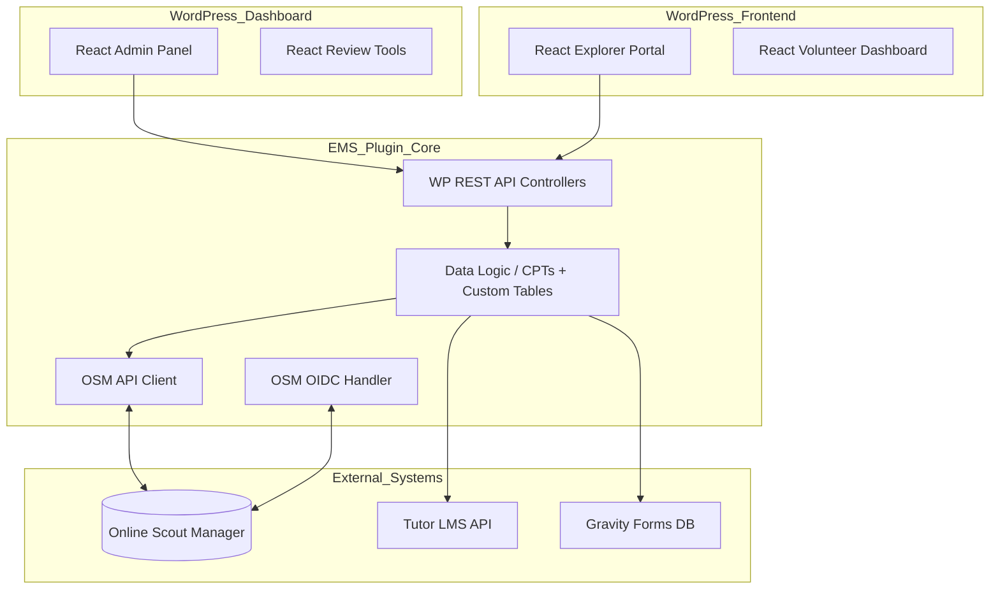

# Technical Architecture Overview: EMS

This document outlines the key architectural decisions and foundational assumptions for the Expedition Management System.

## 1. Foundational Assumptions
- **Environment**: WordPress 7.0+, PHP 8.2+, hosted on SiteGround.
- **Identity**: OSM is the definitive OIDC provider.
- **Plugin Structure**: Modern PHP architecture (Namespacing, Autoloading, Strict Typing).
- **Theme**: Hello Elementor with Elementor Pro (site content and marketing pages). EMS portal pages use a custom page template, not Elementor sections.
- **Frontend Framework**: React for interactive application features.

## 2. Key Architectural Decisions (ADRs Needed)

### ADR 001: Data Modeling Strategy
- **Decision**: **Hybrid — Custom Post Types (CPTs) for main entities, custom database tables for relational data.**
- **Rationale**: CPTs provide the best fit for Expeditions and Teams (WP admin list views, post lifecycle, meta API). Custom tables are required for relationship data where serialized arrays would prevent efficient querying.
- **Structure**:
    - `expedition` CPT: Stores dates, LiC, status, level.
    - `team` CPT: Linked to an `expedition`. Relational membership via custom table.
    - Custom tables for: team membership, volunteer availability, route submission history. (See ADR 011.)

### ADR 002: OSM Integration & Sync Strategy
- **Decision**: **Reference-First Data Sync with Persistent Scout ID Anchor.**
- **Approach**: 
    - **Step 1: Reference Sync**: Sync all section members, events, and attendance statuses from OSM into dedicated local tables (`ems_osm_*`). This is the primary source of truth for participant lists and event planning.
    - **Step 2: Flexi-Record Loading**: Load team and expedition data from OSM Flexi-records, matching participants to the local reference tables via `ems_scout_id`.
    - **WP User Independence**: Initial team building and reconciliation views do not require WordPress User records. WP Users are only required for active system interactions (logging in, submitting routes, volunteer signup).
    - **Identity Mapping**: Use the OSM `member_id` (`ems_scout_id`) as the immutable primary key for all internal Explorer record mapping. 
    - This ensures that parent-child relationships remain valid even if the child does not yet have an OSM account (`user_id`).
    - Dedicated `OSM_Parser` class for aggregating multi-child lists from the `member_access` block and identifying the `access_type` (`"parent"` vs. `"member"`).
    - **Access Control**: Core plugin logic must enforce role-based access based on this `access_type` (e.g., Parent-only signups, Explorer-only course access).
    - Flat relationship mapping in User Meta using Scout IDs for maximum cross-account compatibility.
    - **Push-back Operations**: All server-to-OSM write operations (flexi-record updates, event status changes) are performed via the same admin-triggered personal OAuth2 authorization code flow as data imports (see ADR 010). No tokens are stored. OSM has no machine/service account concept.

### ADR 003: Frontend Integration Pattern
- **Decision**: **React-based SPA embedded via Shortcode, rendered inside a custom WP page template.**
- **Page Template Approach**: EMS portal pages (`[ems-explorer-portal]`, `[ems-parent-portal]`, etc.) use a custom page template (`ems-page-template.php`) registered by the plugin. This template calls `get_header()` and `get_footer()`, which render the site's Elementor Pro Theme Builder header and navigation automatically. The EMS React SPA runs in the content area only.
    - **Why not Elementor sections**: Embedding React inside Elementor sections creates asset optimisation conflicts (CSS/JS combining, lazy loading, defer). The custom template approach avoids all of these while delivering identical visual output.
    - **Result**: EMS portal pages are visually indistinguishable from any other site page — same header, navigation, and footer — with no Elementor coupling in the content area.
- **Frontend SPA Styling**: Frontend portal SPAs (Explorer, Parent, Volunteer) are styled using **Elementor's global CSS custom properties**, which are present on every page rendered by Elementor Pro. Key variables include `--e-global-color-primary`, `--e-global-color-accent`, `--e-global-typography-primary-font-family`, and spacing tokens. No CSS imports are needed — the SPA references these variables directly, ensuring automatic design consistency with the rest of the site.
- **Benefits**: 
    - Smooth, no-reload transitions (e.g., switching between children, signing up for dates).
    - Highly interactive components (drag-and-drop team building, visual calendars).
    - Full site header/nav inherited with zero Elementor coupling in the application area.
    - Design consistency via Elementor CSS variables without any theme dependency in JS.

### ADR 004: Volunteer Availability & Confirmation Logic
- **Decision**: Use the `ems_volunteer_availability` custom database table (see ADR 011) to store availability and confirmation status per user per expedition date.
- **Schema**: `[id, user_id, expedition_post_id, date, overnight, confirmed, confirmed_by]`
- **Rationale**: The seasonal calendar view requires querying availability across all users for a date range. Serialized User Meta or a single `confirmed` flag cannot support these queries efficiently.

### ADR 005: File Management & Security
- **Decision**: **REST API Protected Proxy**.
- **Approach**: 
    - Store files in `/wp-content/uploads/ems-secure/`.
    - Access via a custom WP REST API endpoint (`/wp-json/ems/v1/download/`). 
    - Endpoint verifies JWT/Nonce and permissions before serving the file via `readfile()`.
- **Direct Access Protection**: An `.htaccess` rule blocking direct URL access to `/wp-content/uploads/ems-secure/` should be added. **Note**: Confirm `.htaccess` write access on SiteGround before implementing; investigate as part of Phase 5 security hardening if not available.

### ADR 006: Administrative Interface
- **Decision**: **React-based "Single Page" Admin Dashboard using `@wordpress/components`**.
- **Approach**: 
    - Create a top-level "Expedition Management" menu in the WP Dashboard using `add_menu_page()`.
    - Enqueue a React bundle specifically for the admin area.
    - Use the **`@wordpress/components`** library to ensure the admin UI looks and feels like a native part of WordPress (same components as the Block Editor).
- **Scope**: `@wordpress/components` is used **exclusively in the WP Admin Dashboard**. It is not used in frontend portal SPAs (those use Elementor CSS variables — see ADR 003).
- **Version Pinning**: `@wordpress/components` must be pinned to a specific minor version in `package.json`. It is not a stable API — WP major releases introduce deprecations and component API changes. Audit deprecation notices before each WP major upgrade on staging.
- **Key Management Views**:
    - **Reconciliation Dashboard**: A real-time comparison tool for Gravity Forms vs. OSM records.
    - **Team Builder**: A drag-and-drop interface for moving Explorers between expeditions and teams.
    - **Volunteer Command Center**: A grid view for confirming volunteers and managing seasonal availability.
    - **Reporting Engine**: Visualizations for training status and route planning progress.

### ADR 007: Test-Driven Development (TDD) Mandate
- **Decision**: **Mandatory TDD Lifecycle**.
- **Rationale**: To ensure the long-term maintainability of the EMS and to facilitate safe code generation by agents, all features and bug fixes must follow a strict TDD lifecycle:
    1. **Red**: Write a failing test that defines the expected behavior.
    2. **Green**: Write the minimum code necessary to make the test pass.
    3. **Refactor**: Clean up the code while ensuring tests remain green.
- **Enforcement**: Code will not be considered "complete" or ready for deployment without accompanying passing tests.

### ADR 008: Testing Frameworks
- **Decision**: **PHPUnit + Brain Monkey** (Backend) and **Vitest + React Testing Library** (Frontend).
- **Backend Rationale**: PHPUnit is the industry standard. **Brain Monkey** allows us to mock WordPress functions (hooks, filters, etc.) without the overhead of loading the entire WP core, making tests extremely fast and isolated.
- **Frontend Rationale**: **Vitest** is a modern, faster alternative to Jest, perfectly suited for React SPAs. **React Testing Library** encourages testing behavior from the user's perspective rather than implementation details.
- **E2E Testing**: **Playwright** will be used for critical path end-to-end testing (e.g., successful route submission, volunteer signup flow).

### ADR 009: Post-Login Hydration Flow (Identity vs. Context)
- **Decision**: **Two-Step User Initialization**.
- **Approach**: 
    1. **Identity Step**: The existing `login-with-google` plugin handles the standard OIDC handshake, mapping the OSM `user_id` to a WordPress User account.
    2. **Context Step**: The EMS plugin hooks into `rtcamp.google_user_logged_in`. Upon capture of the `access_token`, the EMS plugin performs an immediate secondary fetch of the OSM `getDataPayload` (Startup API). The resulting context (Scout IDs, child mapping, `access_type`) is persisted to WP User Meta.
    3. **Token Disposal**: The user's `access_token` is used solely for this one-time `getDataPayload` fetch and is **not stored** after hydration is complete. No per-user token persistence is required.
- **Rationale**: Keeps the authentication layer generic and lightweight while ensuring the EMS captures all necessary business context immediately after login. Ongoing OSM API calls use the admin-triggered sync OAuth flow (ADR 010), not individual user tokens. This ensures the React SPAs have all required metadata available in User Meta upon first render.

### ADR 010 (Revised): Admin-Triggered OSM Sync OAuth
- **Decision**: All EMS-to-OSM operations (data imports and Phase 6 push-backs) are performed via a dedicated admin-triggered OAuth2 authorization code flow. No tokens are persisted. OSM has no machine/service account concept.
- **Approach**:
    - Admin clicks "Sync from OSM" (or a push-back action) in the EMS dashboard.
    - EMS redirects to `https://www.onlinescoutmanager.co.uk/oauth/authorize` with the required scopes. For data imports: `section:member:read section:flexirecord:read`. For Phase 6 push-backs: write scopes are added to the same flow.
    - Admin authenticates with OSM (or the step is transparent if already logged in to OSM in the browser). OSM redirects back to EMS with an authorization code.
    - EMS exchanges the code for an `access_token` + `refresh_token` at `https://www.onlinescoutmanager.co.uk/oauth/token`.
    - The operation (import or push-back) executes immediately using the access token.
    - **Tokens are discarded after use** — consistent with ADR 009. No token storage in WP Options or User Meta.
- **Implementation**: A custom `OSM_Sync_Auth_Handler` class in EMS admin. The `login-with-google` plugin is **not** used for this flow — that plugin handles user session login only and cannot be repurposed for mid-session service calls.
- **Rationale**: OSM does not support machine accounts or long-lived API keys. Manual re-auth overhead is acceptable because OSM data is not highly volatile and syncs are infrequent, admin-triggered operations. Avoiding token persistence keeps the security surface minimal.
- **Trade-off**: An admin must be present to trigger a sync. There is no background/scheduled import.

### ADR 012: Auth Provider Interface
- **Decision**: The dependency on the `login-with-google` plugin is isolated behind an `EMS\Auth\Auth_Provider` interface.
- **Rationale**: Although the team owns the `login-with-google` plugin source code, the hook `rtcamp.google_user_logged_in` is Google-branded and may be renamed in a future refactor. Isolating the dependency means only a single adapter class needs updating if the hook changes — no business logic is affected.
- **Structure**:
    - `Auth_Provider` interface: defines `get_access_token(): string` and `get_user_data(): array`.
    - `LoginWithGoogle_Auth_Provider`: concrete adapter that hooks into `rtcamp.google_user_logged_in` and extracts the token and user payload.
- **The hook** (`rtcamp.google_user_logged_in`) must be documented in the `login-with-google` plugin's changelog as a breaking-change surface for EMS.

### ADR 013: Flexirecord Mapper
- **Decision**: The mapping between OSM flexi-record columns and EMS fields is **admin-configurable** and stored in WP Options as a JSON structure (`ems_flexirecord_column_map`).
- **Rationale**: Flexi-record column names and order are user-defined in OSM and vary between sections and seasons. Hardcoding column names would break on any structural change to the flexi-record. A configurable mapper also enables the bidirectional use case: once EMS is established as the source of truth, the same mapping is used in reverse to create/update the flexi-record from EMS data (Phase 6).
- **Import flow** (Phase 1): Admin fetches the live flexi-record structure (`getFlexiStructure`), maps each column to an EMS field via a UI, saves the mapping, then triggers the data import.
- **Export flow** (Phase 6): The saved mapping is applied in reverse — EMS expedition/team data is written back to OSM flexi-record columns.
- **Parsing**: Flexi-record data values are free text. The importer must handle parse failures gracefully, bucketing rows as: ✅ clean, ⚠️ partial (some fields parsed), ❌ unparseable. Partial and failed rows are presented in an admin review screen before any data is committed. Admin can override or skip individual rows.
- **Mapping schema** (`ems_flexirecord_column_map`): `{ "expedition_code": "column_id", "team_code": "column_id", "participant_scout_id": "column_id", ... }`

### ADR 011: Custom Database Tables
- **Decision**: Three custom tables are created on plugin activation alongside the CPT-based data model.
- **Rationale**: These tables manage relational and time-series data that cannot be queried efficiently via serialized Post Meta. This resolves the hybrid data model (ADR 001).
- **Tables**:
    - `ems_team_members`: `[id, team_post_id, user_id, added_by, added_at]` — links Explorers to Teams. Replaces the unqueryable `ems_participants` Post Meta array.
    - `ems_volunteer_availability`: `[id, user_id, expedition_post_id, date, overnight, confirmed, confirmed_by]` — stores per-day volunteer availability for the seasonal calendar view.
    - `ems_route_submissions`: `[id, team_post_id, version, file_type, wp_media_id, submitted_by, submitted_at, feedback, status]` — stores full submission history with LiC feedback per version.
- **Creation**: Tables are created/updated via `dbDelta()` on the `register_activation_hook`.

## 3. Proposed Component Diagram (High Level)

## 4. Shortcode Registry

All EMS React applications are embedded via WordPress shortcodes. The following shortcodes are registered by the plugin:

| Shortcode | Interface | Audience |
|---|---|---|
| `[ems-explorer-portal]` | Explorer Portal SPA | Explorers (member) |
| `[ems-parent-portal]` | Parent Portal SPA (child selection + expedition view) | Parents |
| `[ems-volunteer-dashboard]` | Volunteer signup and availability calendar | Volunteers |
| `[ems-route-submit]` | Route card and GPX upload form | Explorers + Parents |
| `[ems-route-status]` | Route submission status and LiC feedback view | Explorers + Parents |
