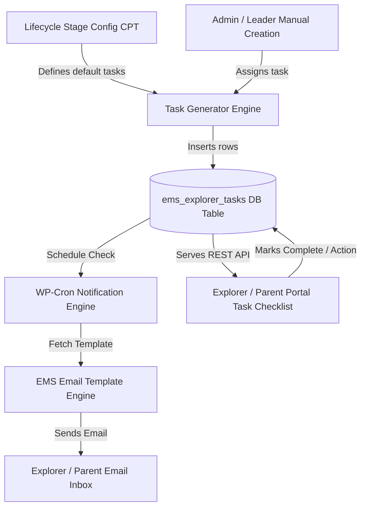
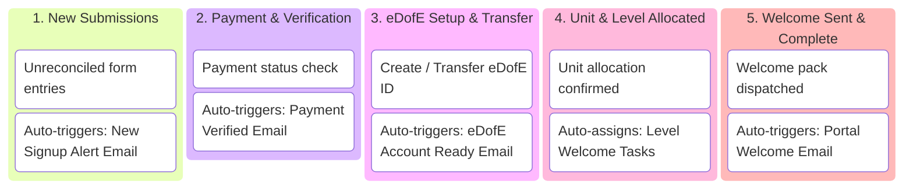
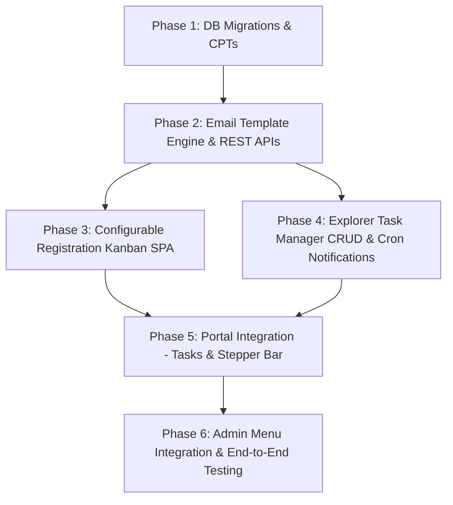

# Explorer Task Management, Configurable Registration Kanban & Email Template Specification

This document details the architectural specification and implementation plan for four integrated core enhancements to the Expedition Management System (EMS):
1. **Configurable Expedition Lifecycle & Explorer Task Management System**
2. **Configurable DofE Registration Processing Kanban Board**
3. **EMS Email Template Engine & Notification Triggers**
4. **WordPress Admin Menu Integration Architecture**
5. **Participant & Parent Portal Integration Architecture**

---

## 1. Configurable Expedition Lifecycle & Explorer Task Management System

### 1.1 Architectural Overview

The Expedition Lifecycle is decoupled from hardcoded steppers and driven by **configurable workflow templates** (`ems_lifecycle_stage` custom post type or database schema).

Explorers are assigned actionable, trackable tasks with automated email notifications triggered on task assignment, approaching due dates, and overdue states.



---

### 1.2 Data Schema & Database Specifications

#### A. Custom Post Type: `ems_lifecycle_stage`
* **Title**: Stage Name (e.g. `1. Welcome & eDofE Setup`, `2. First Aid & Training Check`, `3. Team Allocation & Route Submission`, `4. Final Expedition Sign-off`).
* **Meta Fields**:
  * `ems_stage_order` *(int)*: Sequence position (1, 2, 3, 4...).
  * `ems_dofe_level` *(string)*: `bronze` | `silver` | `gold` | `all`.
  * `ems_expedition_type` *(string)*: `training` | `practice` | `qualifying` | `all`.
  * `ems_default_tasks` *(serialized array)*: List of task templates auto-instantiated when an explorer enters this stage.

#### B. Custom Database Table: `wp_ems_explorer_tasks`
Created via `EMS\Core\Table_Installer` on plugin update:

| Column | Type | Constraints | Description |
| :--- | :--- | :--- | :--- |
| `id` | `BIGINT(20)` | `PRIMARY KEY AUTO_INCREMENT` | Task instance ID |
| `scout_id` | `BIGINT(20)` | `INDEX, NOT NULL` | Target Explorer ID (`ems_osm_explorers.scout_id`) |
| `stage_id` | `BIGINT(20)` | `NULLABLE` | Linked `ems_lifecycle_stage` post ID |
| `expedition_post_id` | `BIGINT(20)` | `NULLABLE, INDEX` | Scoped to specific event |
| `team_post_id` | `BIGINT(20)` | `NULLABLE, INDEX` | Scoped to specific team |
| `title` | `VARCHAR(255)` | `NOT NULL` | Task title |
| `description` | `TEXT` | `NULLABLE` | Instructions & markdown details |
| `action_type` | `VARCHAR(50)` | `NOT NULL` | `complete_course` \| `submit_route` \| `verify_edofe` \| `external_url` \| `custom_check` |
| `action_url` | `VARCHAR(500)` | `NULLABLE` | Link to action (e.g. course URL or form link) |
| `priority` | `VARCHAR(20)` | `DEFAULT 'normal'` | `low` \| `normal` \| `high` \| `urgent` |
| `status` | `VARCHAR(20)` | `DEFAULT 'pending'` | `pending` \| `in_progress` \| `submitted` \| `completed` \| `overdue` |
| `due_date` | `DATETIME` | `NULLABLE, INDEX` | Task deadline |
| `notify_on_assign` | `TINYINT(1)` | `DEFAULT 1` | Send email upon task assignment |
| `reminder_days_before` | `INT` | `DEFAULT 3` | Days before due date to send reminder email |
| `assigned_by` | `BIGINT(20)` | `NOT NULL` | WP User ID of assigning leader |
| `created_at` | `DATETIME` | `NOT NULL` | Creation timestamp |
| `completed_at` | `DATETIME` | `NULLABLE` | Completion timestamp |

---

### 1.3 Admin Task Manager (Full CRUD)

Registered under **EMS Admin** → **Explorer Tasks** (`ems-tasks`):
* **Task Creation Wizard**:
  * **Scope Selector**: Assign to Single Explorer, Team, Expedition Cohort, or Entire Unit.
  * **Due Date Picker** & **Reminder Schedule Configuration**.
  * **Template Import**: One-click import from `ems_lifecycle_stage` CPT.
* **Task Table & Filter Bar**:
  * Filter by Status (`Pending`, `Overdue`, `Completed`), Expedition, Team, or Unit.
  * Bulk actions: Mark Complete, Re-assign Due Date, Send Immediate Reminder Email, Delete.

---

## 2. Configurable DofE Registration Processing Kanban Board

### 2.1 Problem Statement & Objectives

Replaces manual spreadsheet processing of participant applications and expedition sign-ups with a **configurable real-time Kanban Board** inside WordPress Admin (**EMS Admin** → **Signups & Kanban**).

---

### 2.2 Configurable Registration Workflow Stages

Registration workflows are **fully configurable by administrators** via a dedicated "Stage Settings" tab inside the Signups Board. Admins can add, reorder, edit, or disable stage columns.



#### Stage Configuration Properties:
For each workflow stage, administrators configure:
* **Stage Name & Slug**: e.g., `New Submissions` (`new_submission`), `eDofE Setup` (`edofe_setup`).
* **Column Order & Badge Color**: e.g. `#ff9800` (Orange for verification), `#4caf50` (Green for complete).
* **Automated Action Triggers on Card Entry**:
  1. **Send Email Template**: Select an email template from the Email Template Engine to automatically dispatch when a card enters this stage.
  2. **Auto-Assign Default Tasks**: Automatically assign a suite of Explorer Tasks when a participant transitions to this stage.
  3. **Update Status Meta**: Automatically sync internal statuses (`signup_status`, `payment_status`).

---

### 2.3 Card Anatomy & Visual Layout

```
┌────────────────────────────────────────────────────────────────────────┐
│ 🔴 UNRECONCILED                            [ BRONZE ]  [ FORM #1042 ]  │
│                                                                        │
│ David Strachan                                                         │
│ Unit: Falcons ESU  •  Parent: Sarah Strachan                           │
│ Submitted: 24 Sep 2026                                                 │
│                                                                        │
│ ┌────────────────────────────────────────────────────────────────────┐ │
│ │ 💳 Payment: Paid    │  🆔 eDofE: 7894123 (Transfer Needed)          │ │
│ └────────────────────────────────────────────────────────────────────┘ │
│                                                                        │
│ Quick Actions:                                                         │
│ [ Match Explorer ]   [ Edit eDofE ID ]   [ ✉️ Send Email ]   [ 👁️ View ] │
└────────────────────────────────────────────────────────────────────────┘
```

#### Badges & Interactive Controls:
* **DofE Level Badges**: Bronze (`#cd7f32`), Silver (`#c0c0c0`), Gold (`#ffd700`).
* **Payment Badges**: Green pill (`Paid`), Red pill (`Unpaid / Pending`).
* **Reconciliation Alert**: Red indicator for submissions not yet linked to an OSM scout ID.
* **1-Click Manual Email Trigger**: Button on card to manually send any configured email template.
* **Inline Quick-Edit Fields**: Double-click eDofE Number or Unit to edit inline.

---

### 2.4 Inspector Drawer & Batch Operations

* **Slide-Out Inspector Drawer**: Clicking a card opens full submission details, match reconciliation controls, email dispatch log, and audit history.
* **Bulk Operations**: Multi-select cards to advance stages in bulk, send batch emails, or export to CSV.
* **View Toggle**: Switch between **Kanban Columns View** and **Excel-Style Spreadsheet Grid View**.

---

## 3. EMS Email Template Engine & Notification Triggers

### 3.1 Overview

A centralized **Email Template Engine** enables administrators to create, customize, and manage all automated and manual email communications sent by the Expedition Management System.

### 3.2 Data Schema & Storage

Stored via Custom Post Type `ems_email_template` or option schema:
* **Post Title**: Template Name (e.g., `Registration Welcome Pack`, `eDofE ID Verified`, `Task Assignment Alert`, `Task Overdue Reminder`).
* **Meta Fields**:
  * `ems_email_subject` *(string)*: Subject line supporting smart tags (e.g., `Welcome to {dofe_level} DofE, {explorer_first_name}!`).
  * `ems_email_recipient` *(string)*: `parent` | `explorer` | `both` | `unit_leader` | `custom`.
  * `ems_trigger_event` *(string)*: `kanban_stage_entry` | `task_assigned` | `task_reminder` | `task_overdue` | `manual_only`.
  * `ems_stage_slug` *(string)*: Optional target stage slug for automatic trigger.
  * `ems_html_body` *(longtext)*: HTML email template with rich text styling and smart tags.

---

### 3.3 Smart Tags / Merge Tags Reference

The email rendering engine parses smart tags dynamically before sending:

| Smart Tag | Description | Example Output |
| :--- | :--- | :--- |
| `{explorer_first_name}` | Participant's first name | David |
| `{explorer_last_name}` | Participant's last name | Strachan |
| `{parent_name}` | Parent/Carer full name | Sarah Strachan |
| `{dofe_level}` | Award level | Silver |
| `{unit_name}` | ESU Patrol / Unit name | Falcons ESU |
| `{edofe_number}` | 7-digit eDofE ID | 7894123 |
| `{payment_status}` | Status of award/expedition payment | Paid |
| `{portal_login_url}` | Direct magic-link to EMS portal | `https://see-expeditions.org.uk/portal` |
| `{task_title}` | Name of assigned task | Complete Navigation Quiz |
| `{task_due_date}` | Task deadline | 15 Oct 2026 |
| `{task_action_url}` | Direct link to task action | `https://see-expeditions.org.uk/portal#task-42` |
| `{leader_in_charge_name}`| Leader name for expedition | John Doe |

---

## 4. WordPress Admin Menu Integration Architecture

All new management screens and tools are integrated into the existing WordPress Admin sidebar hierarchy under the parent **EMS** menu.

### 4.1 Menu Map & Routing Architecture

```
WordPress Admin Sidebar
└── 🏆 EMS (Parent Menu: ems-dashboard)
    ├── 🗺️ Expedition Board       (slug: ems-expeditions)     -> React SPA: Event & Team Planner
    ├── 📋 Signups & Kanban      (slug: ems-signups)         -> React SPA: Registration Kanban, Spreadsheet & Stage Config
    ├── 📌 Explorer Tasks        (slug: ems-tasks)           -> React SPA: Task Manager CRUD & Lifecycle Stages
    ├── ✉️ Email Templates       (slug: ems-email-templates) -> React SPA: Email Template Editor & Delivery Logs
    ├── 👤 Explorers Roster      (slug: ems-explorers)       -> React SPA: Sync Roster & Explorer Profiles
    ├── 🙋 Volunteers            (slug: ems-volunteers)      -> React SPA: Volunteer Roster & Availability Grid
    ├── 🏰 Unit Manager          (slug: ems-unit-leaders)    -> React SPA: District Cards & ESU Unit Mapping
    ├── 🔄 OSM Sync              (slug: ems-osm-sync)        -> React SPA: OAuth 2.0 Manual Sync & Preview
    └── ⚙️ Settings              (slug: ems-settings)        -> PHP Admin: API modes, Flexi-map & Auth Rules
```

---

## 5. Participant & Parent Portal Integration Architecture

Inside `[ems-portal]`, these new features surface across **three unified top-level navigation tabs**:

```
 ┌───────────────────────┬───────────────────────┬───────────────────────┐
 │ Expeditions & Events  │   My Tasks & Actions  │     Sign up forms     │
 └───────────────────────┴───────────────────────┴───────────────────────┘
```

---

### 5.1 "My Tasks & Actions" Portal Center

Explorers and parents get a dedicated **Task Center** to view and complete assigned requirements:

#### A. Task Filter Pills
Users can filter tasks by status:
* **`Pending Actions`** (Active tasks requiring explorer/parent completion).
* **`Upcoming Due`** (Tasks due within 7 days).
* **`Completed Tasks`** (Historical log of finished tasks).

#### B. Dynamic Action Handlers
Task cards render interactive action controls tailored to the `action_type`:

| Action Type (`action_type`) | Portal UI Component / Action |
| :--- | :--- |
| `complete_course` | Primary **"Go to Course"** button linking directly to the Tutor LMS course permalink. |
| `submit_route` | Primary **"Upload Route Card / GPX"** button launching an inline upload modal directly in the portal. |
| `verify_edofe` | Primary **"Enter eDofE ID"** button opening a inline input field to update the 7-digit eDofE number. |
| `external_url` | Primary **"Open Link"** button opening specified target URL in a new tab. |
| `custom_check` | Interactive checkbox allowing the explorer/parent to mark the requirement complete directly. |

#### C. Parent View Scoping
When a parent selects a child using the top child-selector drawer, the Task Center filters strictly to tasks assigned to that child (`scout_id`). Badges distinguish tasks for the explorer vs tasks requiring parent sign-off.

---

### 5.2 Real-Time Registration Progress Stepper (Kanban Stage Tracker)

Inside the **"Sign up forms"** view in the portal:

1. **Live Stepper Bar**: Each participant application renders a **visual horizontal progress stepper bar** reflecting the active Kanban workflow stage configured in admin:
   ```
   [ 1. Submitted ] ───► [ 2. Payment Verified ] ───► ( 3. eDofE Setup ) ───► [ 4. Unit Allocated ] ───► [ 5. Complete ]
   ```
2. **Contextual Status Callout**:
   A human-readable callout box describes current progress:
   > *"Status Update: Your application is at Step 3 (eDofE Account Setup). Our team is verifying your eDofE registration number."*

---

### 5.3 Deep-Linking & Email Notification Integration

Every email sent by the **Email Template Engine** includes smart-tagged deep links:
* `https://see-expeditions.org.uk/portal?tab=tasks&task_id=42`
* `https://see-expeditions.org.uk/portal?tab=signups&signup_id=104`

#### SPA Deep-Link Behavior:
When an explorer or parent clicks a link in an email:
1. The portal React SPA loads session state via OIDC authentication.
2. The router automatically activates the target top-level tab (`tasks` or `signups`).
3. The targeted task card or registration application card is automatically scrolled into view and highlighted with a 3-second animated pulse border.

---

### 5.4 REST API Extensions for Portal (`/ems/v1/portal/`)

* `GET /ems/v1/portal/explorer/{scout_id}/tasks` — Retrieves pending and completed tasks for the authorized scout ID.
* `POST /ems/v1/portal/task/{task_id}/complete` — Marks task as complete or submits action payload (e.g. route file upload or eDofE ID).

---

## 6. Summary Technical Implementation Roadmap



1. **Phase 1: DB & CPT Foundations**: Migrate `wp_ems_explorer_tasks` table and register `ems_lifecycle_stage` & `ems_email_template` CPTs.
2. **Phase 2: Email Engine**: Build `EMS\Core\Email_Engine` parser, smart tag replacement, and REST endpoints (`/ems/v1/email-templates`).
3. **Phase 3: Configurable Kanban SPA**: Build React Kanban board with drag-and-drop, stage configuration tab, and automated trigger bindings.
4. **Phase 4: Task Manager & Cron**: Build Task Manager React SPA, WP-Cron scheduled notification runner, and task assignment APIs.
5. **Phase 5: Portal Integration**: Build "My Tasks & Actions" tab, dynamic action handlers, live Kanban stage stepper bar, and deep-link router in `[ems-portal]` React SPA.
6. **Phase 6: Menu Alignment & Testing**: Wire WP Admin submenus (`ems-signups`, `ems-tasks`, `ems-email-templates`) and run complete PHPUnit/Vitest test suite.
