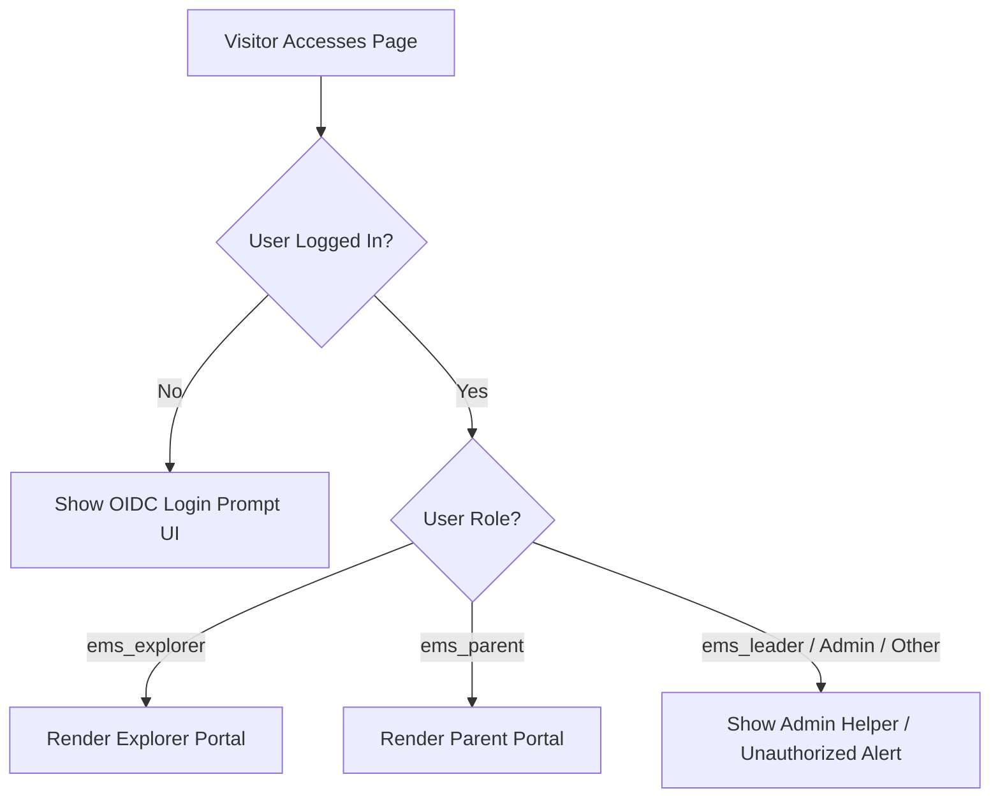

# Milestone 4: Explorer & Parent Front-Facing Web Portal — Implementation Spec

This document defines the technical specification, REST API endpoints, user interface designs, and access control policies for implementing **Milestone 4 (Explorer & Parent Front-Facing Web Portal)**.

---

## 1. Core Architecture & Authentication Gate

Rather than managing multiple page templates and distinct scripts, Milestone 4 introduces a single unified shortcode `[ems-portal]` rendering a dynamic React SPA.

### 1.1 Authentication & Role-Based Gate
The frontend SPA adapts its layout based on the logged-in user's role and metadata. If a user is not authenticated or lacks roles:

*   **Unauthenticated / Guests**: Shows a clean, styled landing banner with a prominent "Log In via Online Scout Manager" button redirecting to the WordPress OIDC authentication flow.
*   **Unauthorized (e.g. Administrators, Volunteers without Explorer/Parent profiles)**: Shows a fallback notification panel indicating their administrative role, and provides shortcuts to return to the WP dashboard.
*   **Authorized Explorers (`ems_explorer`)**: Loads the **Explorer Portal** interface scoped to the current user's explorer records.
*   **Authorized Parents (`ems_parent`)**: Loads the **Parent Portal** featuring child selector controls.



---

## 2. Data Retrieval & Security Rules

All queries must enforce strict boundary checks to ensure that participants only view their own information, and parents only view the information of children mapped to them.

### 2.1 Parent-Child Identity Linkage
Parent-child associations are derived during first sign-in using OIDC metadata:
*   `ems_access_type`: User meta field (`'member'` or `'parent'`).
*   `ems_scout_ids`: Serialized array of OSM member IDs (`scout_id`s) stored in WP user meta for parent users.
*   `ems_children`: Deserialized array of child details stored in WP user meta.

### 2.2 Privacy Preservation Policy
To protect member privacy, the Team/Roster view of the portal enforces a strict limit on displayed teammate information:
*   **Permitted details**: First Name, Last Name Initial (e.g., `David S.`), and Patrol/Unit (e.g., `Peregrines`).
*   **Restricted details**: Full last names, email addresses, phone numbers, and home addresses are never exposed to peers or peer parents.

---

## 3. REST API Specifications

The frontend SPA communicates with WordPress via the following namespace `ems/v1/portal/` endpoints:

### 3.1 `GET ems/v1/portal/me`
Retrieves authentication state, profile info, and a list of accessible profiles.
*   **Permission Callback**: `is_user_logged_in()`
*   **Response Payload**:
    ```json
    {
      "logged_in": true,
      "access_type": "parent",
      "display_name": "Sarah Strachan",
      "profiles": [
        {
          "scout_id": 30001,
          "first_name": "David",
          "last_name": "Strachan",
          "patrol": "Falcons"
        },
        {
          "scout_id": 30002,
          "first_name": "James",
          "last_name": "Strachan",
          "patrol": "Kestrels"
        }
      ]
    }
    ```

### 3.2 `GET ems/v1/portal/explorer/{scout_id}`
Retrieves timeline, event details, sign-up forms, and checklist data for a specific explorer.
*   **Permission Callback**: Checks if the logged-in user's WordPress User ID owns this `scout_id` (via matching `ems_scout_ids` user meta for parents, or matching email/user linkage for explorers).
*   **Response Payload**:
    ```json
    {
      "explorer": {
        "scout_id": 30001,
        "first_name": "David",
        "last_name": "Strachan"
      },
      "signups": [
        {
          "id": 5,
          "dofe_level": "silver",
          "signup_status": "allocated",
          "payment_status": "reconciled",
          "created_at": "2026-06-13 20:00:00"
        }
      ],
      "events": {
        "training": [
          {
            "id": 101,
            "name": "Navigation Masterclass",
            "start_date": "2026-07-15 09:00:00",
            "end_date": "2026-07-15 17:00:00",
            "location": "Mourne Activity Centre",
            "osm_event_url": "https://www.onlinescoutmanager.co.uk/ext/events/...",
            "leader_in_charge": {
              "name": "John Doe",
              "email": "john.doe@scouts.org",
              "phone": "07700900077"
            }
          }
        ],
        "practice": [],
        "qualifying": []
      },
      "training_checklist": [
        {
          "course_name": "First Aid Training",
          "completed": true,
          "completion_date": "2026-05-10",
          "course_url": "https://example.com/courses/first-aid"
        },
        {
          "course_name": "Campcraft & Cooking",
          "completed": false,
          "completion_date": null,
          "course_url": "https://example.com/courses/campcraft"
        }
      ],
      "team": {
        "team_code": "S-PR1-1",
        "route_status": "feedback_required",
        "whatsapp_link": "https://chat.whatsapp.com/ExampleInviteCode",
        "teammates": [
          { "first_name": "Alice", "last_initial": "S", "patrol": "Falcons" },
          { "first_name": "Bob", "last_initial": "T", "patrol": "Falcons" }
        ]
      }
    }
    ```

---

## 4. User Interface Layouts (Vite React UI)

The visual design inherits automatically from the active WordPress parent theme (**Hello Elementor**), utilizing the site's typography, colors, and layout structure.

### 4.1 Login / Guest Portal Screen
Rendered when the session is not authenticated.
*   **Hero Message**: "Expedition Management System — Participant Portal"
*   **Primary CTA**: Styled "Log In via Online Scout Manager" button.
*   **Context Message**: Informs users that login is managed through Online Scout Manager, linking their progress securely.

### 4.2 Parent View: Multi-Child Dashboard
*   **Child Roster Bar**: A top navigation drawer showing card buttons for each child linked to the parent.
*   **High-Level Sign-Up Summary**:
    *   Displays high-level sign-up metadata (`dofe_level`, `signup_status`, `payment_status`) fetched from `ems_signups`.
    *   *No full form submissions are rendered*, keeping the view clean.
*   **Child Details Panel**: Selecting a child displays their individual timelines and active events.

### 4.3 Explorer / Child view
*   **Timeline Tracker Indicator**: A visual step-by-step indicator tracking the participant's expedition lifecycle stage:
    `Signed Up` ➔ `Date Assigned` ➔ `Team Formed` ➔ `Route Approved`
*   **Event Category Tabs**:
    *   Three tabs: **Training**, **Practice**, **Qualifying**.
    *   **Conditional Display**:
        *   *No events*: The tab is greyed out.
        *   *One active event*: The details (times, location, OSM links, Leader in Charge) render directly.
        *   *Multiple events*: A list is shown first, opening details upon selection.
*   **Practice & Qualifying Detail Panels**:
    *   When an event is selected, sub-tabs display:
        1.  **Overview**: Times, locations, Leader-in-Charge details.
        2.  **Team**: Shows Teammates list (First Name + Last Initial + Patrol) and WhatsApp Group Joining Links.
        3.  **Training**: List of required training courses with live links. Complete checkmarks derived from Tutor LMS.
        4.  **Route & Resources (Stubs)**: Placeholder widgets explaining route card uploading and document retrieval features coming in future milestones.

---

## 5. Gherkin Behavioral Scenarios

```gherkin
Feature: Milestone 4 - Explorer & Parent Front-Facing Web Portal

  Scenario: Unauthenticated visitor sees login CTA
    Given the current visitor is not logged in
    When they access the [ems-portal] page
    Then they should see the Online Scout Manager login prompt

  Scenario: Logged-in Explorer sees their own timeline and event details
    Given I am logged in as a user with the role "ems_explorer"
    And my scout_id is 30001
    When I access the [ems-portal] page
    Then I should see my active expedition timeline: "Team Formed"
    And the "Training" tab should show details for "Navigation Masterclass"
    And the teammates list should show "Alice S. (Falcons)" but hide Alice's email address

  Scenario: Logged-in Parent selects child and checks status
    Given I am logged in as a user with the role "ems_parent"
    And I have children with scout_ids 30001 and 30002
    When I access the [ems-portal] page
    Then I should see profile cards for "David Strachan" and "James Strachan"
    When I select the profile for "David Strachan"
    Then I should see David's training completion status list
    And I should see David's team WhatsApp group link
```
