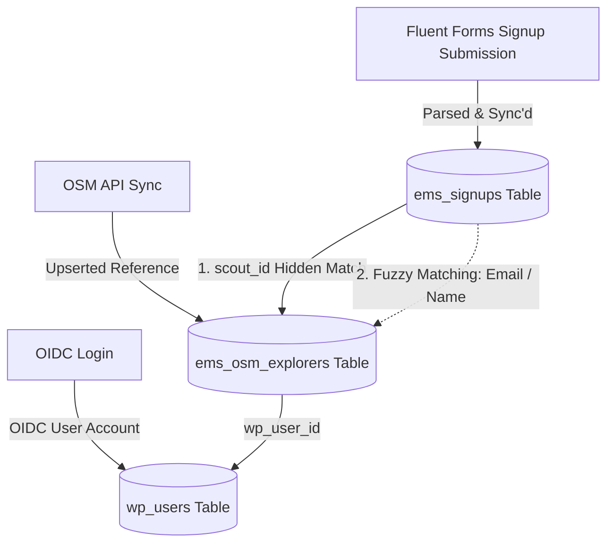
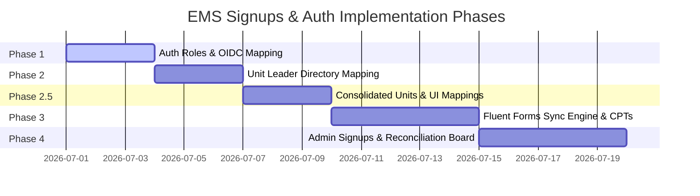

# EMS Signups and Authentication — Implementation Plan

This document defines the plan and technical specifications for implementing custom WordPress user roles, mapping these roles on OIDC login, setting up the Fluent Forms signup sync engine with a Unit Leader directory, and building the Admin Signups & Reconciliation Board.

---

## Completed Specs & Phases
Work completed on custom roles and OIDC mapping has been archived in [completed-signups-and-auth.md](file:///Users/davidstrachan/Projects/expedition-management-system/docs/completed-signups-and-auth.md).

## Technical Specifications

### [x] Spec 1: WordPress User Roles & OIDC Mapping (Completed)
Detailed specification and logic have been moved to [completed-signups-and-auth.md](file:///Users/davidstrachan/Projects/expedition-management-system/docs/completed-signups-and-auth.md).

### [x] Spec 2: Consolidated Units & Mappings (Completed)
Detailed specification and logic have been moved to [completed-signups-and-auth.md](file:///Users/davidstrachan/Projects/expedition-management-system/docs/completed-signups-and-auth.md).

---

### [x] Spec 3: Signup Data Model & Fluent Forms Sync (Completed)
Detailed specification and logic have been moved to [completed-signups-and-auth.md](file:///Users/davidstrachan/Projects/expedition-management-system/docs/completed-signups-and-auth.md).

---

### Spec 4: Admin Signups Board & Reconciliation

Admin dashboards require a unified screen to review Fluent Forms signup data, verify them against OSM reference data, and link them together.

#### 1. Identity Linkage Model
To connect submissions generated by Fluent Forms with existing OSM Explorer records:

Reconciliation runs through these ordered priority paths:
1. **Direct Match (Hidden Scout ID)**: If the form is submitted via the Parent Portal, the form embeds the child's `scout_id` as a hidden field. This connects the signup row directly to `ems_osm_explorers.scout_id` with 100% confidence.
2. **Fuzzy Match (Email / Name)**: If `scout_id` is null or zero (e.g., a new recruit signup not yet synced in OSM):
   * Search `ems_osm_explorers` for a row matching the explorer's email address (case-insensitive).
   * If email is missing/blank, search by `first_name` and `last_name` combination.
   * If a match is found, show it as a **"Proposed Link"** on the admin dashboard.
3. **Unlinked (New Recruit)**: If no match is found, flag the signup as "New / Unlinked". The admin cannot process this signup until the explorer is created/synced in OSM.

#### 2. REST API Endpoints
* `GET ems/v1/signups`: Lists all signup records with resolved explorer names, emails, and linked status.
* `POST ems/v1/signups/{id}/reconcile`: Manually links a signup to a specific `scout_id`.
  * **Linkage Rule**: Confirming a manual link updates `ems_signups.scout_id` to link the signup record, but **does not** dynamically rewrite the parent user's WordPress metadata. We rely strictly on the next parent OIDC login hydration call to pull parent-child links from OSM globals (Option B).
  * **Validation Rules**:
    * Verify that both the signup record (`id`) and the target `scout_id` exist.
    * Prevent linking/reconciliation actions if the signup record's status is already marked as `'processed'`.
* `POST ems/v1/signups/{id}/process`: Marks a signup as `processed` (completed back-office allocation).

#### 3. Administrative Interface (React)
A new "Sign Ups" tab is registered in the Explorer View SPA in the WP Admin Dashboard:
* Displays a table of all sign-ups from `ems_signups`.
* For linked signups: Show explorer name, level, first aid, ESU unit, and a tick mark.
* **ESU/Unit Field**: Displays the mapped unit (ESU name and Short Code) based on the signup's `unit_id`. Renders an editable select/dropdown letting the administrator manually override or assign the correct unit at any point before processing.
* **Unit Mapping Exceptions**:
  * **0 Mapped Units**: Displays a warning badge indicating "Unassigned Unit".
  * **Multiple Mapped Units**: Displays an option listing the proposed units, prompting the administrator to click and select/confirm the correct one.
* For proposed/unlinked signups: Renders a warning badge and a "Link Explorer" button opening a search dialog to reconcile manually.
* Filter controls for: Level (Bronze/Silver/Gold), Status (Pending/Processed), ESU/Unit, and Matching Status (Linked/Proposed/Unlinked).
* Batch Action: "Mark Selected as Processed".

---

## Sequencing Recommendation & Phases

### [x] Phase 1 — WP User Roles & OIDC Mapping (Completed)
Tasks and scenarios implemented. See [completed-signups-and-auth.md](file:///Users/davidstrachan/Projects/expedition-management-system/docs/completed-signups-and-auth.md) for details.

### [x] Phase 2 — Unit Leader Directory & Admin Menus (Completed)
Tasks and scenarios implemented. See [completed-signups-and-auth.md](file:///Users/davidstrachan/Projects/expedition-management-system/docs/completed-signups-and-auth.md) for details.

### [x] Phase 2.5 — Consolidated Units Directory & Settings UI (Completed)
Tasks and scenarios implemented. See [completed-signups-and-auth.md](file:///Users/davidstrachan/Projects/expedition-management-system/docs/completed-signups-and-auth.md) for details.

### [x] Phase 3 — Fluent Forms Sync Engine & Unit Lookup Integration (Completed)
Tasks and scenarios implemented. See [completed-signups-and-auth.md](file:///Users/davidstrachan/Projects/expedition-management-system/docs/completed-signups-and-auth.md) for details.

### Phase 4 — Admin Signups Board & Reconciliation UI
1. **Behavioral Design (TDD)**: Create Gherkin scenarios in `tests/features/admin-reconciliation.feature` covering REST API requests and manual linking constraints.
2. **Implementation**:
   * Implement REST endpoints for `/signups` listing (returning resolved unit details) and `/reconcile` / `/process` actions.
   * Create React Admin Component for "Sign Ups" tab, rendering the reconciliation workflow with dropdown overrides and unassigned/multi-unit warnings.
3. **Tests**:
   * **API Integration Tests**: Implement `tests/features/admin-reconciliation.feature` scenarios verifying `/reconcile` validates signup & `scout_id` existence, blocks reconciliation of already `'processed'` signups, and validates fuzzy matching query logic.
   * **UI Vitest Tests**: Write tests in `tests/js/AdminSignupsBoard.test.tsx` verifying component renders "Unlinked", "Proposed Link", "Unassigned Unit", and "Multiple Mapped Units" statuses, triggers manual search dialogs, and fires action API endpoints appropriately.
