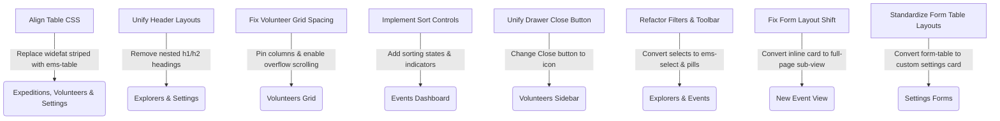

# EMS UI & UX Consistency Audit Report

**Date of Audit:** 2026-07-21  
**Auditor:** Lead UI Systems Engineer & Design Auditor  
**Target System:** WordPress Admin UI (`https://localhost/wp-admin/admin.php?page=ems*`)  
**Design Reference Baseline:** [Participant Places (SignupsBoard.tsx)](file:///Users/davidstrachan/Projects/expedition-management-system/resources/js/admin/signups-board/SignupsBoard.tsx)  
**Reference Specification:** [DESIGN_RULES.md](file:///Users/davidstrachan/Projects/expedition-management-system/docs/DESIGN_RULES.md)

---

## 1. Establishing the Visual & UX Baseline

To eliminate ad-hoc visual styling and build a cohesive UI system, we designate **Participant Places** (`SignupsBoard.tsx`) as the **Visual Reference Baseline** for the Expedition Management System. All other screens should match this standard.

### Reference Page Features (Baseline):
* **Layout Structure:** Uses a split layout (`.ems-signups-container`) combining a list view with a collapsible details inspector panel (`.ems-signups-inspector`).
* **Table Styling:** Custom table class `.ems-table` is used. Table header cells feature interactive sort arrows (`▲`, `▼`, `⇅`) centered on metadata columns, with uniform cell spacing, custom hover states, and clear row focus visual cues.
* **Filter Bars & Toolbars:** Standardizes filters with `.ems-signups-toolbar` and compact custom dropdown components (`.ems-select`). Custom active-pill badges (`.ems-filter-pill`, `.ems-filter-pill--active`) are used to filter categories.
* **Pagination System:** Features a standardized footer (`.ems-table-pagination`) using `.ems-select-sm` for items per page selector and compact pagination buttons.
* **Header Hierarchy:** Displays a single primary page heading rendered by PHP, avoiding nested duplicate titles.
* **Badge System:** Custom badge classes (`.ems-pill`, `.ems-status-badge`) translate database states into styled representations.

---

## 2. Comparative Audit Against the Baseline

| Screen / Component | Spacing & Grid | Typography & Contrast | Tables & Row Structure | Buttons & Dropdowns | Table Sorting | Status vs. Baseline |
| :--- | :--- | :--- | :--- | :--- | :--- | :--- |
| **Participant Places** | **Pass (Baseline)** | **Pass (Baseline)** | **Pass (Baseline)** | **Pass (Baseline)** | **Pass (Baseline)** | **Reference Standard** |
| **Expedition Signups** | Pass | Fail (Raw state leaked) | Pass (Uses `.ems-table`) | Pass | Pass | Needs Polish |
| **Expeditions Board** | **Fail (Layout shift & margins)** | Fail (Double H1 header) | **Fail (Uses WP `widefat` table)** | **Fail (Inconsistent buttons/filters)** | **Fail (No sort headers)** | **Needs Refactor** |
| **Explorers (OSM Reference)** | Pass | Fail (Double H1/H2 headers) | **Fail (Uses WP `widefat` table)** | **Fail (Select styling deviates)** | Pass | Needs Polish |
| **Volunteers Grid** | **Fail (Overflow & layout)** | Fail (Legend mismatch) | **Fail (Uses WP `wp-list-table`)** | Pass | **Fail (No sort headers)** | **Needs Refactor** |
| **Settings Pages** | **Fail (Retro WP layout)** | Pass | **Fail (Uses WP `widefat` table)** | **Fail (Legacy inputs & CTAs)** | N/A | **Needs Refactor** |

---

## 3. Screen-by-Screen Deviations & Layout Analysis

### A. Volunteers Grid (Volunteers Page)
* **Table Architecture & Layout Overrides:** 
  * Instead of using the baseline `.ems-table` class, it renders a native WordPress admin list structure: `<table className="wp-list-table widefat fixed striped table-view-list">`. This overrides our clean custom layout rules, resulting in inconsistent cell paddings and border spacing.
* **Severe Horizontal Overflow & Text Wrapping:**
  * **Event Columns Proliferation:** The grid displays each active event as a separate column (often 10+ columns). This creates a very wide table structure. When there are many events, the table overflows the container, breaking the layout boundaries of the WordPress admin panel.
  * **Lack of Column Pinning:** The left-most "Volunteer" header column (listing names/emails) is not sticky. When scrolling horizontally to view shift commitments for later dates, the volunteer's identity is scrolled out of view, causing severe cognitive friction.
  * **Text Clipping:** Columns representing different expeditions wrap and clip text arbitrarily (`.ems-ellipsis`) instead of scaling cleanly.
* **Indicator Legend Disconnect:** The grid legend points to circular commitment states (`Solid Circle`, `Dotted Circle`), but actual table cells render plain characters (`✓`, `?`, `✖`, `—`).
* **Drawer Close Control:** The side drawer uses a textual `Close` button instead of the baseline cross icon `×`.

### B. Expeditions Board (Events Dashboard)
* **Layout Shifts and Jumping Spacing:**
  * **Inline Create Card:** The "+ Create Event" button triggers an inline creation form (`.ems-new-event-card`) directly below the header but *above* the tab navigation. This causes a massive layout shift, pushing all navigation and tables down the page.
  * **Arbitrary Bottom Margins:** Spacing around the tab navigation bar utilizes custom margin classes like `ems-mt-20` and `ems-mb-16` instead of the rigid, standard spacing increments ($24\text{px}$ containers / $12\text{px}\text{--}16\text{px}$ cells) declared in `DESIGN_RULES.md`.
* **Inconsistent Control Elements (Tabs vs. Checkboxes):**
  * **Filter controls:** There are no dropdowns or select selectors for category filtering (like Level or Type) on the table, forcing users to scan the full list.
  * **Legacy Checkbox Label:** The tab bar uses flat button elements (`.ems-tab-nav__button`) combined with a trailing raw HTML `<label>` checkbox layout for "Show Archived Events". This completely breaks the baseline design pattern, which uses clean active-pill badges (`.ems-filter-pill`) for state toggles.
* **Button Placement:** The "+ Create Event" CTA is positioned inside the title container header (`.ems-flex-between`). While functional on desktop, it lacks the proper padding and margin bounds to keep from wrapping on compact screens.

* **UX Evaluation of Event Creation Layout:**
  > [!IMPORTANT]
  > The event creation form (`EventForm.tsx`) contains over 18 complex inputs, including a **Leaflet Interactive Map Picker** and a **Rich Text Editor (TinyMCE/wp-editor)**. 
  > * Placing this form inside a narrow sliding drawer side panel (~400px wide) would look extremely cramped, wrapping the Rich Text toolbar layout and making the interactive map too small to select coordinates.
  > * Instead of a sliding drawer, the Event Creation form should load as a **full-page React sub-view** (e.g. `activeTab === 'create'`), exactly matching the layout of the `EventDetailPage` edit view. This preserves visual canvas space while eliminating the jumping layout shift of the current inline implementation.

### C. Settings Pages (EMS Settings)
* **Form Layout Mismatch (.form-table):** 
  * The Settings tabs (General, OSM Connection, Managed Sections, Unit Lookup, Form Mappings, etc.) render forms using the default WordPress `.form-table` class layout structure. This structures input blocks into wide left-aligned header columns (`<th scope="row">`) and right-aligned fields. This visual structure diverges completely from the compact, modern card grid layouts in the baseline.
* **Legacy Inputs & Controls:**
  * Uses default WordPress input widths like `class="regular-text"`, `class="large-text"`, or `class="small-text"` instead of our custom, standardized CSS inputs (`.ems-select`, `.ems-input`).
* **Table Overrides:**
  * The *Managed Sections* and *Currently Managed* tables inside the Settings sub-views render raw WordPress widefat layouts (`<table class="wp-list-table widefat fixed striped">`) instead of the baseline `.ems-table` style.
* **Cramped Sub-Page Actions:**
  * Action buttons (e.g., "Save General Settings", "Save Managed Sections") are wrapped inside legacy `
` blocks which align left. The baseline system aligns primary CTAs to the right inside clean, custom toolbar wrappers.

### D. Explorers Page (OSM Reference)
* **Filter Control Style Deviations:** 
  * The filters bar (`.ems-osm-ref-filter-bar`) renders raw HTML select inputs instead of using the custom `.ems-select` wrapper class used in the baseline Participant Places toolbar.
  * It lacks standard labels and alignment spacing, causing the selectors to sit cramped next to the page heading.
* **Table and Heading Duplications:**
  * Displays the parent wrap `<h1>Explorer List</h1>` alongside the React-rendered `<h2>Explorer List</h2>` header on the same page.
  * Uses standard WordPress widefat classes (`wp-list-table widefat`) instead of custom styled baseline tables.

### E. Expedition Signups Queue
* **Badge Inconsistency:** The *First Aid* column renders raw backend string tags (e.g. `first-response` or `none`) directly. The baseline page translates these into user-friendly badges (e.g. `✚ First Response`).

---

## 4. Priority Refactoring Steps

To achieve complete consistency, the following refactoring roadmap should be executed:

1. **Task 1: Table Standardization (High Priority) - [Completed]**
   * Replace `<table className="wp-list-table widefat fixed striped table-view-list">` in `Volunteers.tsx`, `widefat striped` in `EventsDashboard.tsx`, and all occurrences of `wp-list-table widefat` in [Settings_Page.php](file:///Users/davidstrachan/Projects/expedition-management-system/src/Admin/Settings_Page.php) with the standardized `.ems-table` styling class.

2. **Task 2: Convert New Event Form to Full-Page React Sub-View (High Priority) - [Completed]**
   * Refactor the inline `.ems-new-event-card` form in `EventsDashboard.tsx` to load as a full-page sub-view state (e.g. `activeTab === 'create'`) in `ExpeditionBoard.tsx`, matching the existing `EventDetailPage` layout. This ensures full screen width for the Leaflet Map and TinyMCE editor fields without shifting page layout components.

3. **Task 3: Unify Sidebar Close Controls (High Priority) - [Completed]**
   * Replace the textual `Close` button in the header of the Volunteer details side panel (`volunteers/index.tsx`) with the absolute close button styling containing the `×` icon to match the `ExplorerProfile` baseline.

4. **Task 4: Standardize Settings Forms (Medium Priority)**
   * Refactor [Settings_Page.php](file:///Users/davidstrachan/Projects/expedition-management-system/src/Admin/Settings_Page.php) to render layout sections within custom card blocks (`.ems-card` / `.ems-panel`) and replace the legacy `.form-table` class with modern grid layouts. Replace legacy input class selectors (`regular-text`, `large-text`) with the custom `.ems-input` selector class.

5. **Task 5: Standardize Filter Controls & Toolbar (Medium Priority) - [Completed]**
   * Refactor the select controls on the Explorers page (`OSMReference.tsx`) and the checkbox label in `EventsDashboard.tsx` to use baseline `.ems-select` classes and `.ems-filter-pill` wrappers for aesthetic unity.

6. **Task 6: Refactor Volunteer Grid Layout & Horizontal Scroll (Medium Priority) - [Completed]**
   * In `volunteers/index.tsx`, refactor the matrix table layout to support large sets of events cleanly:
     * Pin the first "Volunteer" column (`position: sticky`, `left: 0`) to keep volunteer identities visible while scrolling through event columns.
     * Restructure `.ems-volunteers-table-wrap` to contain horizontal table overflow gracefully using custom styled scrollbars.
     * Align cell graphics with the legend specifications (circular badges/borders representing commitment levels) or update the text labels in the legend to accurately reflect `✓`, `?`, `✖`, `—` indicators.

7. **Task 7: Add Events Table Sorting (Medium Priority) - [Completed]**
   * Equip `EventsDashboard.tsx` with sort indicators and sorting state logic to match the baseline Participant Places table functionality.
