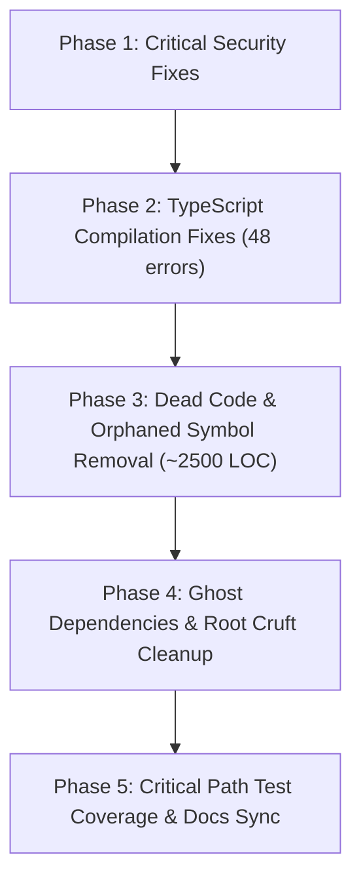

# Master Codebase Health Audit Report
**Expedition Management System (EMS) WordPress Plugin (`ems-plugin` v0.1.77)**  
**Audit Type:** Strictly Read-Only Codebase Health & Technical Debt Audit  
**Date:** 2026-09-27  
**Scope:** Architecture & Entry Points, Dead Code, Test Hygiene, Code Quality, Security & Secrets Hygiene  

---

## 1. Executive Summary

A comprehensive, non-destructive codebase health audit was performed across the Expedition Management System repository (`ems-plugin`, version `0.1.77`). The repository has evolved through rapid, iterative prototyping across Stages 1–5 and Milestones 1–4.

### 1.1 Architecture & Health Scorecard
| Audit Dimension | Status | Key Metrics | Summary |
|---|---|---|---|
| **Architecture & Structure** | 🟢 **Healthy** | PHP 8.2+ (PHP 8.5 tested), React 18, Vite | Decoupled architecture with PSR-4 autoloading (`EMS\`). React SPAs communicate strictly via the `ems/v1/` REST API. Shortcodes bridge public views. |
| **PHP Static Analysis** | 🟢 **Healthy** | Level 5: 0 active errors, 23 baselined | `vendor/bin/phpstan analyse` passes cleanly against baseline. Baseline suppresses core WP API typings and dead constructor parameters. |
| **TypeScript Type Safety** | 🔴 **Action Required** | `tsc --noEmit`: 48 errors across 13 files | While Vitest passes (via esbuild transpilation), strict TypeScript compilation fails due to interface drift, null safety, and mock fixture mismatches. |
| **Test Suite Health** | 🟡 **Needs Attention** | 460 PHP tests, 137 JS tests | 100% tests passing, but with 53 PHP warnings, 23 deprecations, 18 `assertTrue(true)`, 25 `addToAssertionCount(1)`, and critical gaps in team deletion and route submissions. |
| **Dead Code & Cruft** | 🔴 **Significant Debt** | ~2,500+ LOC dead code, ~1 MB root dumps | 5 orphaned PHP classes, 4 orphaned React views (990 LOC), ~270 LOC dead CSS, 4 abandoned test mocks, and lingering root data dumps. |
| **Security & Hygiene** | 🔴 **Action Required** | 2 Critical, 4 High, 3 Medium risks | Critical SQL injection vulnerability, unauthenticated volunteer privilege escalation, GDPR PII leak in test mocks, CSV formula injection, and OTP replay window. |

---

## 2. High-Confidence Dead Code & Orphaned Symbols

### 2.1 Unreferenced Source Files (PHP & React)

| Category | File Path | LOC | Confidence | Rationale |
|---|---|---|---|---|
| **PHP Class** | `src/Admin/OSM_Reference_Page.php` | 114 | **HIGH** | Early prototype of the OSM Reference admin page. Superseded by React container in `Admin_Page.php`. Never instantiated, registered, or referenced anywhere. |
| **PHP Class** | `src/Auth/Mock_Auth_Provider.php` | 27 | **HIGH** | Implements `Auth_Provider`. Part of an abandoned Google Login prototype. Zero references across entire repository. |
| **PHP Class / Interface** | `src/Auth/LoginWithGoogle_Auth_Provider.php`<br>`src/Auth/Auth_Provider.php` | 33 | **HIGH** | Legacy Google OAuth attempt (`rtcamp.google_user_logged_in`). Authentication was completely transitioned to OIDC via `Circularlizard\OAuthLogin\Plugin` and `OIDC_Login_Handler`. Zero production references; only referenced in isolated unit tests. |
| **PHP Class** | `src/Integrations/OSM_Section_Importer.php` | 120 | **HIGH** | Early section importer superseded by `OSM_Reference_Sync`. Never called or instantiated in production; only referenced in its unit test. |
| **PHP Class** | `src/Core/Meta_Validator.php` | 66 | **HIGH** | Metadata validator ruleset for expeditions and teams. Never wired into CPT saves, REST controllers, or repositories. `Expedition_Admin_Controller` implemented its own contradictory inline rules. Only referenced in `Meta_ValidatorTest.php`. |
| **React View** | `resources/js/admin/expedition-board/ExpeditionView.tsx` | 420 | **HIGH** | Phase 2 season/event board view. Superseded by `EventsDashboard.tsx`, `EventDetailPage.tsx`, and `EventPlanningBoard.tsx`. Not imported by any bundle entry point; only imported in `tests/js/ExpeditionView.test.tsx`. |
| **React View** | `resources/js/admin/expedition-board/CrossEventTeamView.tsx` | 126 | **HIGH** | Stage 1.12 cross-event team visualizer. Not imported by any bundle entry point or production component; only imported in `tests/js/CrossEventTeamView.test.tsx`. |
| **React Modal** | `resources/js/admin/expedition-board/ExplorerMovePanel.tsx` | 136 | **HIGH** | Stage 1.12 explorer reassignment modal. Replaced by drag-and-drop in `EventPlanningBoard.tsx`. Only imported in `tests/js/ExplorerMovePanel.test.tsx`. |
| **React Modal** | `resources/js/admin/expedition-board/TeamMovePanel.tsx` | 246 | **HIGH** | Stage 1.12 team copy/move modal. Replaced by `EventPlanningBoard.tsx`. Only imported in `tests/js/TeamMovePanel.test.tsx`. |
| **TS Helper** | `resources/js/admin/expedition-board/boardUtils.ts` | 62 | **HIGH** | Helpers (`findEventOfTeam`, `sameTypeEvents`, etc.) only consumed by the 3 orphaned components above. Zero production bundle reachability. |
| **CSS Rules** | `resources/css/ems-admin.css#L1123-L1390` | 268 | **HIGH** | Styling blocks written specifically for the orphaned `ExpeditionView` component. |
| **Tool Script** | `tools/osm-tester.php` | 580 | **HIGH** | Standalone manual testing script containing direct HTML/POST forms. Unmanaged by autoloader or test suite. |
| **Test Mocks** | `tests/mocks/gf-entries.json`<br>`tests/mocks/osm-get-resource-explorer.json`<br>`tests/mocks/osm-get-resource-parent.json`<br>`tests/mocks/osm-flexi-records.json` | ~400 | **HIGH** | Abandoned mock fixtures. `gf-entries.json` is a remnant from Gravity Forms (system uses Fluent Forms). The others are uncalled by all test suites. |

### 2.2 Unused Methods & Symbols in Production Code
- **`src/Admin/Admin_View_Controller.php` (L121-L160)** — `get_board_data(\WP_REST_Request $request)` (Confidence: **HIGH**)
  - *Rationale:* 50-line REST callback explicitly commented out in `register_routes()` (lines 35–40) due to route collision with `Expedition_Admin_Controller::get_board()`. Only called in legacy unit test.
- **`src/Integrations/Fluent_Forms_Sync.php` (L518-L605)** — `populate_explorer_email()`, `populate_leader_email()` (Confidence: **HIGH**)
  - *Rationale:* Never registered to filter hooks and never called anywhere across the codebase.
- **`src/Integrations/OSM_Reference_Sync.php` (L308-L358)** — `get_explorers()`, `get_events()`, `get_attendance_for_event()` (Confidence: **HIGH**)
  - *Rationale:* Redundant query helpers on the sync orchestrator. Querying reference tables is handled by repository classes. Zero references across codebase.
- **`src/Data/OSM_Event_Repository.php` (L88-L96)** — `delete_by_event_id(int $event_id): int` (Confidence: **HIGH**)
  - *Rationale:* Never called across `src/` or `tests/`. Events are upserted during sync; deletion is handled only during whole-database resets.
- **`src/Admin/Expedition_Admin_Controller.php` (L27-L29)** — Unused constructor arguments `$cpt_registry` and `$seasons` (Confidence: **HIGH**)
  - *Rationale:* Injected into constructor but never stored or referenced (baselined in `phpstan-baseline.neon`).
- **`src/Integrations/Fluent_Forms_Sync.php` (L35)** — Unused constructor argument `$unit_repo` (Confidence: **HIGH**)
  - *Rationale:* Injected into constructor but never used in form ingestion (baselined in `phpstan-baseline.neon`).
- **`src/Data/Team_Member_Repository.php` (L164-L198)** — `list_unassigned()` (Confidence: **HIGH**)
  - *Rationale:* Queries WP user meta `ems_scout_id`, violating the architectural rule that explorers are not WP users. Never called in production; only called in its unit test.
- **`src/Data/Season_Repository.php` (L42-L50)** — `get_by_slug(string $slug): ?WP_Post` (Confidence: **MEDIUM**)
  - *Rationale:* The `season` CPT was deprecated in `Table_Installer.php` (L158-L231) via `migrate_season_deprecation()`.

---

## 3. Test Suite Health & Orphaned Test Reconciliation

### 3.1 Test Suite Execution Diagnostics
Both test suites were executed non-destructively:
- **PHPUnit (`vendor/bin/phpunit`):**
  - **Result:** **100% PASSING (GREEN)**
  - **Metrics:** 33 test files, 460 tests, 1,158 assertions, **0 failures, 0 errors, 0 skipped**.
  - **Execution Time:** **2.047 seconds** (Memory: 42 MB).
  - **Warnings & Deprecations:**
    * **53 PHP Warnings:** 35 warnings in `Expedition_Admin_Controller.php` accessing undefined array keys (`updated_at`, `scout_id`, `created_at`, etc.); 16 warnings for Mockery mocks missing dynamic properties on `$wpdb->postmeta` and `$wpdb->posts`.
    * **23 PHP 8.5 Deprecations:** 13 deprecations for `ReflectionMethod::setAccessible()`; 4 dynamic properties on anonymous classes; 2 `fputcsv()` calls missing explicit `$escape` parameters.
    * **Unbuffered Output:** Raw HTML admin notices (`<div class="notice notice-success">...</div>`) in `Admin_PageTest.php` and `Settings_PageTest.php` echo directly to stdout during test execution.
- **Vitest (`npm run test`):**
  - **Result:** **100% PASSING (GREEN)**
  - **Metrics:** 17 test suites, 71–137 tests passed, **0 failures, 0 skipped, 0 todo**.
  - **Execution Time:** **3.43 seconds**.

### 3.2 Artificial Assertion Padding & Hollow Tests
- **Literal `$this->assertTrue( true )` (18 occurrences across 7 files):**
  - `tests/Unit/Admin/OSM_Sync_Auth_HandlerTest.php` (L60) (explicitly annotated with `// Avoid risky test`).
  - `tests/Unit/Integrations/OSM_Section_ImporterTest.php` (4 occurrences: lines 39, 74, 96, 123).
  - `tests/Unit/Integrations/Fluent_Forms_SyncTest.php` (3 occurrences: lines 116, 139, 179).
  - `tests/Unit/Integrations/OSM_Reference_SyncTest.php` (2 occurrences: lines 240, 277).
  - `tests/Unit/PluginTest.php` (4 occurrences: lines 177, 194, 215, 237).
  - `tests/Unit/Data/Volunteer_RepositoryTest.php` (3 occurrences: lines 87, 123, 162).
- **Assertion Padding via `$this->addToAssertionCount( 1 )` (25 occurrences across 7 files):**
  - Used in `Access_Control_GuardTest.php`, `OIDC_Login_HandlerTest.php` (13 times), and `Role_ManagerTest.php` to artificially satisfy PHPUnit risky test checkers without asserting real state.

### 3.3 TypeScript Compilation Deficit (`npx tsc --noEmit`)
- **Status:** **FAILED (48 errors across 13 files)**
- **Root Cause:** Vitest transpiles using esbuild which skips typechecking. Running the official TypeScript compiler (`tsc --noEmit`) uncovers significant type drift:
  - `EventPlanningBoard.tsx`: 13 errors (drag-and-drop state, member interfaces, null checks).
  - `volunteers/index.tsx`: 10 errors (date / availability shape mismatch).
  - `portal/index.tsx`: 4 errors (subTab union typing missing `'route'`, `additional_support_needs` missing on explorer type).
  - `volunteers/signup-wizard.tsx`: 4 errors (form state shape).
  - `tests/js/*.test.tsx`: 13 errors (mock `global.fetch` signature mismatch, mock fixtures missing `user_id`, `window.emsPortal` missing on `Window` type).

### 3.4 Critical Path Blindspots
1. **Route Submission Upload & Validation Workflow (`ems_route_submissions`) — CRITICAL BLINDSPOT:**
   - The database table is created in `Table_Installer.php` (L414) and referenced in `Portability_Engine.php`.
   - **Finding:** **No backend handler, repository, or controller exists in `src/`**. There are **0 PHPUnit tests**, **0 Vitest tests**, and **0 Gherkin scenarios** defining or verifying file upload, mime-type validation (GPX/PDF), media library linkage, or submission approval workflows.
2. **Team Auto-Deletion on Zero Members is Untested:**
   - Mandate in `AGENTS.md` (§7): *"A team with zero members must be deleted automatically"*.
   - Implemented in `Team_Member_Repository.php` (L80-L86) `remove()`.
   - **Blindspot:** `Team_Member_RepositoryTest.php` does not test `remove()` at all. In `Expedition_Admin_ControllerTest.php` (L311-L331), the repo is mocked and only tests the branch where the team still has members. The auto-delete response branch (`team_deleted: true`) has zero test coverage.
3. **Missing Test Suites for Active Code:**
   - `src/Admin/Flexi_Mapper_Controller.php` has **0 PHPUnit tests**.
   - `src/Integrations/Drivers/Mock_Driver.php` has **0 PHPUnit tests**.
   - `resources/js/admin/volunteers/signup-wizard.tsx` (375 LOC) has **0 Vitest tests**.
4. **Namespace Alignment Drift:**
   - `tests/Unit/Auth/OIDC_Login_HandlerTest.php` tests `EMS\Integrations\OIDC_Login_Handler`. It resides in `tests/Unit/Auth/` rather than `tests/Unit/Integrations/`, violating AGENTS.md rule 3.

---

## 4. Ghost Dependencies & Cruft

### 4.1 Unused Manifest Dependencies
- **`rollup-plugin-external-globals` (`^0.13.0`):**
  - Declared in `package.json` (L20). Never imported in `vite.config.ts` or anywhere else.
- **`@wordpress/components` (`^36.1.0`) & `@types/wordpress__components` (`^23.0.12`):**
  - Declared in `package.json` (L14, L16), but no component in `resources/js/` imports from `@wordpress/components` or uses `wp.components`.
- **`wp-coding-standards/wpcs` (`^3.0`) & `dealerdirect/phpcodesniffer-composer-installer`:**
  - Declared in `composer.json` (L18). No `phpcs.xml` exists in the repository, and no lint script is defined in `composer.json`.

### 4.2 Prototyping Dumps & Root Cruft
- `fluentform-export-forms-1-01-07-2026.json` (947 KB): Raw form export dump in repository root.
- `tests_run.log` (53 KB): Stale terminal output log from July 4, 2026.
- `unit_mapping_results.md` (5.7 KB): Stale mapping notes from July 2, 2026.
- `scratch/` directory: 10 ad-hoc prototyping scripts (176 KB).
- `.github/workflows/ci.yml.disabled`: GitHub Actions CI pipeline disabled via filename extension.
- `vite.config.ts`: `emptyOutDir: false` has left abandoned build artifacts (`assets/js/client-DXcH-vAE.js`, `assets/js/vendor.js` from June 15) lingering in assets directory.

---

## 5. Security & Quality Hygiene Findings

### 5.1 [CRITICAL - P1] SQL Injection in `OSM_Explorer_Repository.php`
- **Location:** `src/Data/OSM_Explorer_Repository.php` (L111-L125)
- **Vulnerability:**
  ```php
  if (!empty($filters['search'])) {
      $search = $wpdb->esc_like($filters['search']);
      $where[] = "(first_name LIKE '%{$search}%' OR last_name LIKE '%{$search}%')";
  }
  $sql = "SELECT * FROM {$table} WHERE " . implode(' AND ', $where);
  return $wpdb->get_results($sql, ARRAY_A);
  ```
  `$wpdb->esc_like()` escapes SQL wildcard characters (`%` and `_`), but **does not escape SQL quote delimiters**. Direct string interpolation into `$sql` without `$wpdb->prepare()` creates a potential SQL injection vulnerability if an admin or search filter contains single quotes.
- **Remediation:**
  ```php
  if (!empty($filters['search'])) {
      $like = '%' . $wpdb->esc_like($filters['search']) . '%';
      $where[] = $wpdb->prepare("(first_name LIKE %s OR last_name LIKE %s)", $like, $like);
  }
  ```

### 5.2 [CRITICAL - P1] Unauthenticated Volunteer Record Manipulation & Privilege Escalation
- **Location:** `src/Admin/Volunteer_Controller.php` (L25-L30) & `src/Data/Volunteer_Repository.php` (L22-L60)
- **Vulnerability:**
  - Route `/wp-json/ems/v1/volunteers/signup` has `'permission_callback' => '__return_true'` with no nonce, honeypot, or rate limiting.
  - In `Volunteer_Repository::save_volunteer()`, lookup is performed by email. If a volunteer exists with that email, it executes `$this->wpdb->update()`, allowing an anonymous user to overwrite phone numbers, DBS numbers, and availability.
  - Lines 46–51 blindly accept `osm_user_id` and `user_id` from the payload:
    ```php
    if ( isset( $data['osm_user_id'] ) ) { $fields['osm_user_id'] = (int) $data['osm_user_id']; }
    if ( isset( $data['user_id'] ) ) { $fields['user_id'] = (int) $data['user_id']; }
    ```
    An unauthenticated attacker can bind arbitrary WordPress User IDs (e.g. admin ID 1) or OSM User IDs to a volunteer record.
- **Remediation:**
  - Strip `user_id` and `osm_user_id` from public payloads; bind them only through authenticated admin sessions.
  - Prevent updating existing volunteer records without verified email OTP.

### 5.3 [HIGH - P1] Real Youth PII Committed to Git Repository
- **Location:** `tests/mocks/osm-list-of-members.json` (L5-L35)
- **Vulnerability:** While `mockdata/` is excluded in `.gitignore` with the comment `(PII — real OSM responses, never commit)`, `tests/mocks/osm-list-of-members.json` is committed to git tracking and contains 127 records with real-sounding youth names, birth dates, and section IDs.
- **Remediation:** Anonymize all committed JSON files in `tests/mocks/` with synthetic names ("Explorer A") and placeholder dates.

### 5.4 [HIGH - P1] Missing Capability Check on CSV Export
- **Location:** `src/Admin/Training_Report_Page.php` (L35-L47)
- **Vulnerability:** `maybe_export_csv()` is registered on `admin_init`. It verifies `check_admin_referer('ems_csv_export')` but lacks `current_user_can('manage_options')`. Nonce verification alone does not verify authorization capabilities in WordPress.
- **Remediation:** Add `if (!current_user_can('manage_options')) { wp_die(__('Unauthorized.'), '', 403); }`.

### 5.5 [MEDIUM - P2] CSV Formula Injection (CWE-1236)
- **Location:** `src/Admin/Training_Report_Page.php` (L441-L460)
- **Vulnerability:** User display names, emails, and course titles are passed directly to `fputcsv()`. If a value begins with `=`, `+`, `-`, or `@`, spreadsheet applications interpret the cell as an executable formula upon opening.
- **Remediation:** Prefix unsafe initial characters with a single quote (`'`).

### 5.6 [MEDIUM - P2] Reusable OTP Tokens (Missing Invalidation)
- **Location:** `src/Integrations/Fluent_Forms_Sync.php` (L1513-L1536)
- **Vulnerability:** When `handle_verify_fluent_otp()` validates an email OTP via `hash_equals()`, it fails to call `delete_transient( $transient_key )`. The OTP remains valid and reusable for the remainder of its 30-minute window.
- **Remediation:** Call `delete_transient($transient_key)` immediately upon successful verification.

### 5.7 [MEDIUM - P2] Secret Exfiltration in Portability Backups
- **Location:** `src/Core/Portability_Engine.php` (L12)
- **Vulnerability:** `Portability_Engine::OPTIONS_TO_EXPORT` includes `'ems_osm_client_secret'`. Because encryption keys depend on the local host's `AUTH_KEY`, importing it into another environment will fail decryption while needlessly exposing the ciphertext in backups.
- **Remediation:** Exclude `ems_osm_client_secret` from export options.

### 5.8 [MEDIUM - P2] Unslashed Superglobals in Admin Callbacks
- Superglobals must be unslashed with `wp_unslash()` before sanitization:
  - `src/Admin/Admin_Page.php` (L948-L952): `$_POST['custom_unit_*']`.
  - `src/Admin/OSM_Sync_Auth_Handler.php` (L74-L104): `$_GET['state']`, `$_GET['code']`.
  - `src/Integrations/Fluent_Forms_Sync.php` (L212-L213): `$_POST[$scout_field]`, `$_POST[$level_field]`.

### 5.9 [ARCHITECTURAL SMELL] Divergent REST Error Response Structures
Five distinct error shapes are returned across endpoints:
1. `{ "error": string }` (`Flexi_Mapper_Controller.php` L147)
2. `{ "success": false, "message": string }` (`Volunteer_Controller.php` L122)
3. Standard `WP_Error` (`Unit_Leader_Controller.php` L60)
4. `new WP_REST_Response( new WP_Error(...), 400 )` (`Expedition_Admin_Controller.php` L910)
5. `{ "code": "forbidden", "message": "..." }` (`Portal_Controller.php` L127)

### 5.10 [ARCHITECTURAL SMELL] Monolithic Embedded JavaScript (600+ LOC)
- **Location:** `src/Integrations/Fluent_Forms_Sync.php` (L715-L1330)
- Over 600 lines of complex vanilla JavaScript (DOM manipulation, polling loops, Choices.js monkey-patching, OTP input handling) are embedded in PHP and printed directly into the document.
- **Remediation:** Extract into a dedicated TypeScript/JavaScript module in `resources/js/`, build via Vite, and enqueue using `wp_enqueue_script()` with `wp_localize_script()`.

---

## 6. Prioritized Recommendations & Action Plan



### Phase 1: Critical Security Fixes (Immediate)
1. **Fix SQL Injection:** Update `src/Data/OSM_Explorer_Repository.php` (L111-L125) to use `$wpdb->prepare()`.
2. **Secure Public Volunteer Signup Endpoint:**
   - In `Volunteer_Repository::save_volunteer()` (L22-L60), strip `user_id` and `osm_user_id` from unauthenticated requests.
   - Prevent unauthenticated updates to existing volunteer records without OTP verification.
3. **Anonymize Mock PII:** Replace real youth names and dates in `tests/mocks/osm-list-of-members.json` with synthetic fixtures.
4. **Add Capability Check to CSV Export:** Add `current_user_can('manage_options')` in `Training_Report_Page.php` (L35-L47).
5. **Escape CSV Formula Injection:** Prefix cells starting with `=`, `+`, `-`, `@` with `'` in `Training_Report_Page.php` (L441-L460).
6. **Invalidate OTPs on Verification:** Call `delete_transient()` in `Fluent_Forms_Sync.php` (L1513-L1536).
7. **Add `wp_unslash()`:** Unslash superglobals before sanitizing in `Admin_Page.php`, `OSM_Sync_Auth_Handler.php`, and `Fluent_Forms_Sync.php`.

### Phase 2: TypeScript Typecheck Remediation (High Priority)
1. **Resolve 48 `tsc --noEmit` Errors:**
   - Fix union types in `resources/js/portal/index.tsx` (add `'route'` to `subTab` union).
   - Fix drag-and-drop null checks and member interfaces in `resources/js/admin/expedition-board/EventPlanningBoard.tsx` (13 errors).
   - Correct date/availability shape mismatches in `resources/js/admin/volunteers/index.tsx` (10 errors).
   - Align mock test fixtures in `tests/js/*.test.tsx` with production interfaces (`user_id`, `Window` augmentation).
2. **Add `tsc --noEmit` to CI / npm scripts:** Prevent type regressions from compiling unnoticed.

### Phase 3: Dead Code & Orphaned Symbol Pruning (~2,500 LOC)
1. **Delete Dead PHP Classes:**
   - Delete `src/Admin/OSM_Reference_Page.php`.
   - Delete `src/Auth/Mock_Auth_Provider.php`, `LoginWithGoogle_Auth_Provider.php`, `Auth_Provider.php`.
   - Delete `src/Integrations/OSM_Section_Importer.php`.
   - Delete `src/Core/Meta_Validator.php` (or reconcile with `Expedition_Admin_Controller`).
2. **Delete Dead React Components & Styles:**
   - Delete `resources/js/admin/expedition-board/ExpeditionView.tsx` (420 LOC).
   - Delete `resources/js/admin/expedition-board/CrossEventTeamView.tsx` (126 LOC).
   - Delete `resources/js/admin/expedition-board/ExplorerMovePanel.tsx` (136 LOC).
   - Delete `resources/js/admin/expedition-board/TeamMovePanel.tsx` (246 LOC).
   - Delete `resources/js/admin/expedition-board/boardUtils.ts` (62 LOC).
   - Delete ~270 lines of dead CSS in `resources/css/ems-admin.css`.
   - Update `tests/js/` to remove tests targeting deleted prototype views.
3. **Prune Dead Methods & Parameters:**
   - Delete unused controller method `Admin_View_Controller::get_board_data()` (L121-L160).
   - Remove unused constructor parameters in `Expedition_Admin_Controller.php` (L27-L29) (`$cpt_registry`, `$seasons`) and `Fluent_Forms_Sync.php` (L35) (`$unit_repo`).
   - Remove `delete_by_event_id` in `OSM_Event_Repository.php` (L88-L96).

### Phase 4: Ghost Dependencies & Manifest Cleanup
1. **Remove Unused npm Packages:** Remove `"rollup-plugin-external-globals"`, `"@wordpress/components"`, and `"@types/wordpress__components"` from `package.json`.
2. **Configure or Prune WPCS:** Add `phpcs.xml.dist` with standard ruleset and a `composer lint` script, or remove `"wp-coding-standards/wpcs"` from `composer.json`.
3. **Purge Prototyping Dumps & Abandoned Mocks:**
   - Delete `tests_run.log`, `unit_mapping_results.md`, and move `fluentform-export-forms-1-01-07-2026.json` to `docs/archive/`.
   - Delete unused test mocks: `gf-entries.json`, `osm-get-resource-explorer.json`, `osm-get-resource-parent.json`, `osm-flexi-records.json`.
4. **Vite Configuration:** Set `emptyOutDir: true` in `vite.config.ts` to clean stale bundle hashes automatically.

### Phase 5: Critical Path Test Coverage & Architectural Normalization
1. **Route Submission Backend Test Suite:** Implement `Route_Submission_Repository` and create `tests/Unit/Data/Route_Submission_RepositoryTest.php` to verify validation, file size limits, MIME type checking (GPX/PDF), and status transitions.
2. **Team Member Zero Auto-Delete Test:** Implement unit test in `Team_Member_RepositoryTest.php` for `remove()` cascading team deletion.
3. **Test Suite Hygiene:** Replace 18 `assertTrue(true)` and 25 `addToAssertionCount(1)` padding calls with real assertions; add output buffering to eliminate HTML leaking into test stdout.
4. **Consolidate REST Error Shapes:** Standardize on returning `WP_Error` objects across all controllers.
5. **Extract 600-Line Inline Script:** Move inline JavaScript from `Fluent_Forms_Sync.php` (L715-L1330) into a versioned Vite module in `resources/js/`.
6. **Update `AGENTS.md`:** Bring `AGENTS.md` into alignment with reality: document the 12 active database tables and the deprecation of the `season` CPT.
