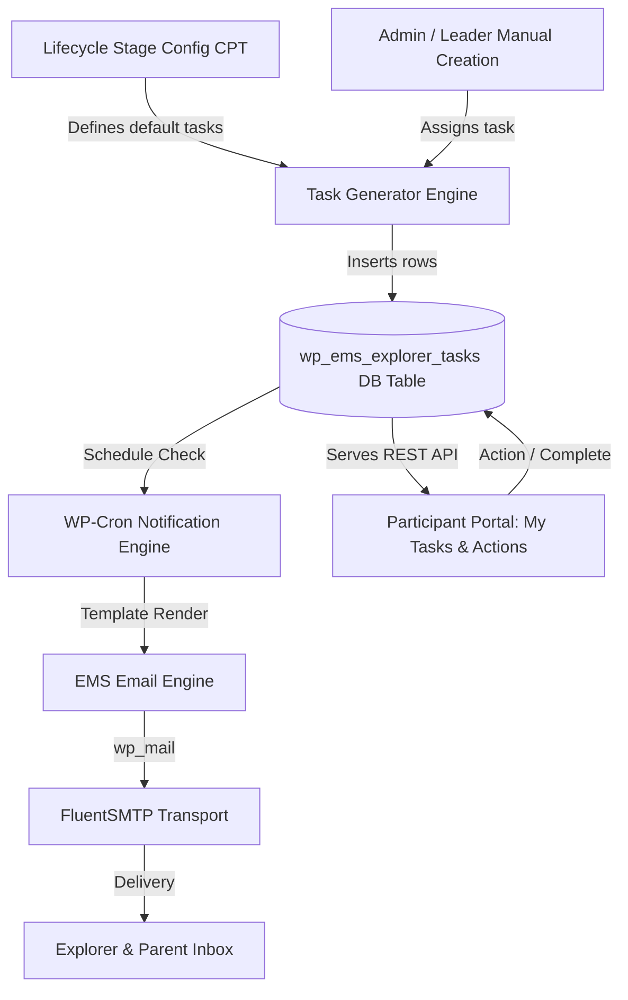

# Explorer Task Management, Expedition Lifecycle & Portal Specification

This document details the architectural specification and implementation plan for the **Explorer-Facing Task Management System, Expedition Lifecycle Stages, and Participant Portal Experience** in the **Expedition Management System (EMS)**.

---

## 1. Executive Summary & Architectural Scope

The Explorer Task Management system guides participants and their parents through every requirement of the Duke of Edinburgh expedition journey—from initial registration and eDofE profile setup, through first aid verification, course completion, route planning, to final post-expedition sign-off.

### Core Capabilities:
1. **Configurable Expedition Lifecycle Stages (`ems_lifecycle_stage` CPT)**: Workflow templates that define default required tasks per award level and event type.
2. **Dedicated Task Tracking Table (`wp_ems_explorer_tasks`)**: Granular tracking of tasks assigned to explorers with statuses, deadlines, and dynamic action handlers.
3. **Leader Task Manager Screen (`ems-tasks`)**: Admin UI for assigning tasks individually, by team, by expedition cohort, or across an entire ESU unit.
4. **Participant & Parent Portal Integration (`[ems-portal]`)**: A dedicated **"My Tasks & Actions"** tab featuring interactive action triggers, parent-child filtering, and progress steppers.
5. **Automated Reminders & FluentSMTP Email Delivery**: WP-Cron scheduled notifications for upcoming due dates and overdue tasks, routed transparently through **FluentSMTP** via WordPress core `wp_mail()`.



---

## 2. Configurable Expedition Lifecycle Stages

### 2.1 Decoupled Lifecycle Architecture

Rather than hardcoding task checklists into code, the expedition lifecycle is driven by customizable templates defined via a custom post type.

#### Custom Post Type: `ems_lifecycle_stage`
* **Post Title**: Stage Name (e.g., `1. Welcome & eDofE Setup`, `2. Training & First Aid Check`, `3. Team Allocation & Route Submission`, `4. Final Expedition Sign-off`).
* **Meta Fields**:
  * `ems_stage_order` *(int)*: Sequence position (1, 2, 3, 4...).
  * `ems_dofe_level` *(string)*: `bronze` | `silver` | `gold` | `all`.
  * `ems_expedition_type` *(string)*: `training` | `practice` | `qualifying` | `all`.
  * `ems_default_tasks` *(serialized JSON array)*: List of task templates auto-instantiated when an explorer enters this stage or registers for an expedition.

#### Default Lifecycle Progression:
```
┌─────────────────────────────────┐
│ 1. Welcome & eDofE Setup        │ ➔ Enter 7-digit eDofE ID, verify account registration
├─────────────────────────────────┤
│ 2. Training & First Aid Check   │ ➔ Complete Tutor LMS Navigation course, declare First Aid
├─────────────────────────────────┤
│ 3. Team & Route Submission      │ ➔ Join assigned team, upload GPX & Route Card for review
├─────────────────────────────────┤
│ 4. Pre-Expedition Briefing      │ ➔ Equipment check, dietary/medical confirmation
├─────────────────────────────────┤
│ 5. Expedition Sign-Off          │ ➔ Presentation submission, assessor sign-off on eDofE
└─────────────────────────────────┘
```

---

## 3. Data Schema: `wp_ems_explorer_tasks`

Created via `EMS\Core\Table_Installer` on plugin upgrade:

| Column | Type | Constraints | Description |
| :--- | :--- | :--- | :--- |
| `id` | `BIGINT(20) UNSIGNED` | `PRIMARY KEY AUTO_INCREMENT` | Task instance ID |
| `scout_id` | `BIGINT(20) UNSIGNED` | `INDEX, NOT NULL` | Target Explorer ID (`ems_osm_explorers.scout_id`) |
| `stage_id` | `BIGINT(20) UNSIGNED` | `NULLABLE` | Linked `ems_lifecycle_stage` post ID |
| `expedition_post_id` | `BIGINT(20) UNSIGNED` | `NULLABLE, INDEX` | Scoped to specific expedition event |
| `team_post_id` | `BIGINT(20) UNSIGNED` | `NULLABLE, INDEX` | Scoped to specific team |
| `title` | `VARCHAR(255)` | `NOT NULL` | Task title |
| `description` | `TEXT` | `NULLABLE` | Instructions and requirements |
| `action_type` | `VARCHAR(50)` | `NOT NULL` | Action handler type (see below) |
| `action_url` | `VARCHAR(500)` | `NULLABLE` | Link to action (e.g. course URL or form link) |
| `priority` | `VARCHAR(20)` | `DEFAULT 'normal'` | `low` \| `normal` \| `high` \| `urgent` |
| `status` | `VARCHAR(20)` | `DEFAULT 'pending'` | `pending` \| `in_progress` \| `submitted` \| `completed` \| `overdue` |
| `due_date` | `DATETIME` | `NULLABLE, INDEX` | Task deadline |
| `notify_on_assign` | `TINYINT(1)` | `DEFAULT 1` | Send email upon task assignment |
| `reminder_days_before` | `INT` | `DEFAULT 3` | Days before due date to send reminder email |
| `last_reminder_sent_at`| `DATETIME` | `NULLABLE` | Timestamp of last reminder dispatch |
| `assigned_by` | `BIGINT(20) UNSIGNED` | `NOT NULL` | WP User ID of assigning leader |
| `created_at` | `DATETIME` | `NOT NULL` | Creation timestamp |
| `completed_at` | `DATETIME` | `NULLABLE` | Completion timestamp |

### Supported Action Types (`action_type`):

1. **`complete_course`**: Links directly to a Tutor LMS course or quiz. When the participant completes the course, Tutor LMS webhooks/hooks automatically mark the task as complete.
2. **`submit_route`**: Prompts the explorer to upload a GPX route file or Route Card PDF. Creates a record in `ems_route_submissions`.
3. **`verify_edofe`**: Prompts the participant/parent to enter their 7-digit eDofE ID, updating `ems_participant_signups.dofe_number`.
4. **`external_url`**: Opens an external link (e.g. kit list checklist, consent form, OS Maps link).
5. **`custom_check`**: Self-service checkbox allowing the explorer/parent to mark the item as completed.

---

## 4. Leader Task Management Interface (`ems-tasks`)

Registered under **EMS Admin** → **Explorer Tasks** (`ems-tasks`):

### 4.1 Task Creation Wizard
* **Scope Selector**:
  * **Single Explorer**: Type-ahead search against `ems_osm_explorers`.
  * **Team**: Select all members belonging to a specific team post ID.
  * **Expedition Cohort**: Select all participants enrolled in an upcoming event.
  * **Unit**: Select all active explorers in a specific ESU unit.
* **Template Selector**: Pre-fill from `ems_lifecycle_stage` default tasks.
* **Deadline & Reminders**: Due date picker with configurable reminder offsets (e.g. 7 days and 2 days before).

### 4.2 Tasks Data Grid & Filter Bar
* **Filters**: By Status (`Pending`, `Overdue`, `Completed`), Expedition, Team, Unit, or Award Level.
* **Overdue Highlighting**: Urgent red badge and counter for tasks past their deadline.
* **Bulk Operations**:
  * Mark Selected Complete.
  * Extend Due Date.
  * Dispatch Immediate Reminder Email.
  * Delete.

---

## 5. Participant & Parent Portal Experience (`[ems-portal]`)

The portal frontend (`resources/js/portal/`) is structured into three unified navigation tabs:

```
 ┌───────────────────────┬───────────────────────┬───────────────────────┐
 │ Expeditions & Events  │   My Tasks & Actions  │     Sign up forms     │
 └───────────────────────┴───────────────────────┴───────────────────────┘
```

### 5.1 "My Tasks & Actions" Center

```
┌────────────────────────────────────────────────────────────────────────┐
│ 📌 MY TASKS & ACTIONS                                                  │
│ Active Participant: [ David Strachan (Falcons ESU) ▼ ]                 │
├────────────────────────────────────────────────────────────────────────┤
│ Filter: [ (•) Pending Actions (3) ]  [ Upcoming (1) ]  [ Completed (5) ]│
├────────────────────────────────────────────────────────────────────────┤
│ ┌────────────────────────────────────────────────────────────────────┐ │
│ │ 🔴 DUE IN 2 DAYS                         [ HIGH PRIORITY ]         │ │
│ │ Complete Navigation & Route Planning Quiz                          │ │
│ │ Complete the online Tutor LMS module before team route drafting.   │ │
│ │ Due Date: 12 Oct 2026                                              │ │
│ │                                                                    │ │
│ │ [ 🎓 Go to Course (Tutor LMS) ➔ ]                                  │ │
│ └────────────────────────────────────────────────────────────────────┘ │
│ ┌────────────────────────────────────────────────────────────────────┐ │
│ │ 🟡 DUE IN 7 DAYS                         [ NORMAL ]                │ │
│ │ Upload Draft Team Route Card                                       │ │
│ │ Upload your team's OS route card and GPX export for LiC approval.  │ │
│ │ Due Date: 17 Oct 2026                                              │ │
│ │                                                                    │ │
│ │ [ 📤 Upload Route File / GPX ]                                     │ │
│ └────────────────────────────────────────────────────────────────────┘ │
│ ┌────────────────────────────────────────────────────────────────────┐ │
│ │ ⚪ NO DEADLINE                           [ NORMAL ]                │ │
│ │ Verify 7-Digit eDofE Registration Number                           │ │
│ │ Enter your eDofE ID so your completion can be signed off.          │ │
│ │                                                                    │ │
│ │ [ 🆔 Enter eDofE Number ]                                          │ │
│ └────────────────────────────────────────────────────────────────────┘ │
└────────────────────────────────────────────────────────────────────────┘
```

### 5.2 Parent View Scoping
When a parent account is logged in via OIDC:
* The parent child-selector drawer at the top of the portal displays their linked children (`ems_children`).
* Switching child filters all tasks strictly to that child's `scout_id`.
* Tasks requiring parent sign-off (e.g. consent, medical confirmation) display an explicit **"Parent Signature Required"** badge.

### 5.3 Live Expedition Lifecycle Stepper
Within the portal, participants view their current stage in the expedition journey:
```
[ 1. Welcome & eDofE ] ──► [ 2. Training Check ] ──► ( 3. Team & Route ) ──► [ 4. Briefing ] ──► [ 5. Sign-off ]
```
Clicking any active stage displays the tasks required to advance.

---

## 6. Email Reminders, WP-Cron & FluentSMTP Architecture

### 6.1 FluentSMTP Integration Verification

> [!IMPORTANT]
> **FluentSMTP operates at the WordPress core transport layer.**
> 
> * Any email dispatched via standard `wp_mail()` is captured, processed, and delivered by FluentSMTP.
> * There is **no need** for proprietary FluentSMTP SDK calls or custom database logging in EMS application code.
> * EMS encapsulates mail delivery in `EMS\Core\Email_Engine`, formatting rich HTML and delegating to `wp_mail()`. FluentSMTP handles SMTP connections, SES credentials, delivery retries, and logging automatically.

### 6.2 WP-Cron Reminder Engine

A recurring hourly WP-Cron event (`ems_hourly_task_reminders`) checks for pending tasks:

```php
namespace EMS\Core;

class Task_Reminder_Cron {
    public const CRON_HOOK = 'ems_hourly_task_reminders';

    public function run(): void {
        global $wpdb;
        $table = $wpdb->prefix . 'ems_explorer_tasks';
        $now   = current_time( 'mysql' );

        // 1. Find tasks due within reminder window where no reminder has been sent yet
        $tasks_to_remind = $wpdb->get_results(
            $wpdb->prepare(
                "SELECT * FROM {$table}
                 WHERE status = 'pending'
                   AND due_date IS NOT NULL
                   AND due_date > %s
                   AND due_date <= DATE_ADD(%s, INTERVAL reminder_days_before DAY)
                   AND last_reminder_sent_at IS NULL",
                $now,
                $now
            )
        );

        foreach ( $tasks_to_remind as $task ) {
            $this->send_reminder( $task );
            $wpdb->update(
                $table,
                array( 'last_reminder_sent_at' => current_time( 'mysql' ) ),
                array( 'id' => $task->id )
            );
        }

        // 2. Mark overdue tasks
        $wpdb->query(
            $wpdb->prepare(
                "UPDATE {$table} SET status = 'overdue'
                 WHERE status = 'pending'
                   AND due_date IS NOT NULL
                   AND due_date < %s",
                $now
            )
        );
    }

    private function send_reminder( object $task ): void {
        // Look up explorer and parent email from ems_osm_explorers
        // Format email with smart tags and portal deep link
        // Dispatch via wp_mail() -> intercepted transparently by FluentSMTP
    }
}
```

### 6.3 Deep-Linking to Portal Tasks
Reminder emails include direct links:
`https://see-expeditions.org.uk/portal?tab=tasks&task_id=42`

When clicked:
1. The portal React SPA authenticates the user via OIDC.
2. The router switches to the `My Tasks & Actions` tab.
3. The targeted task card is scrolled into view and highlighted with an animated pulse border.

---

## 7. REST API Endpoints

### 7.1 Portal Endpoints (`/ems/v1/portal/`)
* **`GET /ems/v1/portal/explorer/{scout_id}/tasks`**:
  * Permission: User must own the scout ID or be a linked parent (`OIDC_Login_Handler`).
  * Returns active, upcoming, and completed tasks for the specified explorer.
* **`POST /ems/v1/portal/task/{task_id}/complete`**:
  * Marks `custom_check` complete or updates action payload (`verify_edofe`).
* **`POST /ems/v1/portal/task/{task_id}/route-upload`**:
  * Accepts GPX/PDF upload, creates `ems_route_submissions` row, marks task as `submitted`.

### 7.2 Admin Endpoints (`/ems/v1/tasks/`)
* **`GET /ems/v1/tasks`**:
  * Permission: `manage_options`. Filter by status, expedition, team, unit.
* **`POST /ems/v1/tasks`**:
  * Create new task or batch assign to team/expedition.
* **`PUT /ems/v1/tasks/{id}`**:
  * Update status, deadline, or assignment details.
* **`DELETE /ems/v1/tasks/{id}`**:
  * Delete task.
* **`POST /ems/v1/tasks/{id}/send-reminder`**:
  * Immediately dispatches reminder email to explorer/parent via `wp_mail()`.

---

## 8. Implementation Roadmap & TDD Sequence

Following the mandatory **TDD Workflow**:

### Phase 1: Database Migration & Repository (PHPUnit)
1. **Migration**: Add `wp_ems_explorer_tasks` table creation to `Table_Installer.php`.
2. **Repository**: Create `EMS\Data\Explorer_Task_Repository` with methods:
   * `create_task(...)`
   * `get_tasks_for_explorer(int $scout_id, string $status = '')`
   * `update_task_status(int $task_id, string $status)`
   * `batch_create_tasks(...)`
3. **PHPUnit Tests**: Comprehensive unit tests in `tests/Unit/Data/Explorer_Task_RepositoryTest.php`.

### Phase 2: WP-Cron Reminder Engine & Email Dispatch (PHPUnit)
1. **Cron Runner**: Implement `EMS\Core\Task_Reminder_Cron`.
2. **Email Engine**: Implement `EMS\Core\Email_Engine::send()`.
3. **PHPUnit Tests**: Verify due date boundary matching, overdue transition, and `wp_mail()` stubbing via Brain Monkey.

### Phase 3: Portal REST API & Portal UI (Vitest + RTL)
1. **REST Controller**: Register portal endpoints in `EMS\Portal\Portal_Controller`.
2. **React Components**:
   * `resources/js/portal/tasks/TaskCenter.tsx`
   * `resources/js/portal/tasks/TaskCard.tsx`
   * `resources/js/portal/tasks/ActionModal.tsx`
3. **Vitest Unit Tests**: Test filter pills, action handlers, and completion triggers.

### Phase 4: Admin Task Manager SPA (`ems-tasks`)
1. **Admin Controller**: Register `EMS\Admin\Task_Admin_Controller`.
2. **React SPA**: `resources/js/admin/tasks/TaskManager.tsx`.
3. **Build & Deploy**: `npm run build` and `bash bin/deploy.sh` to sync to local WordPress.
