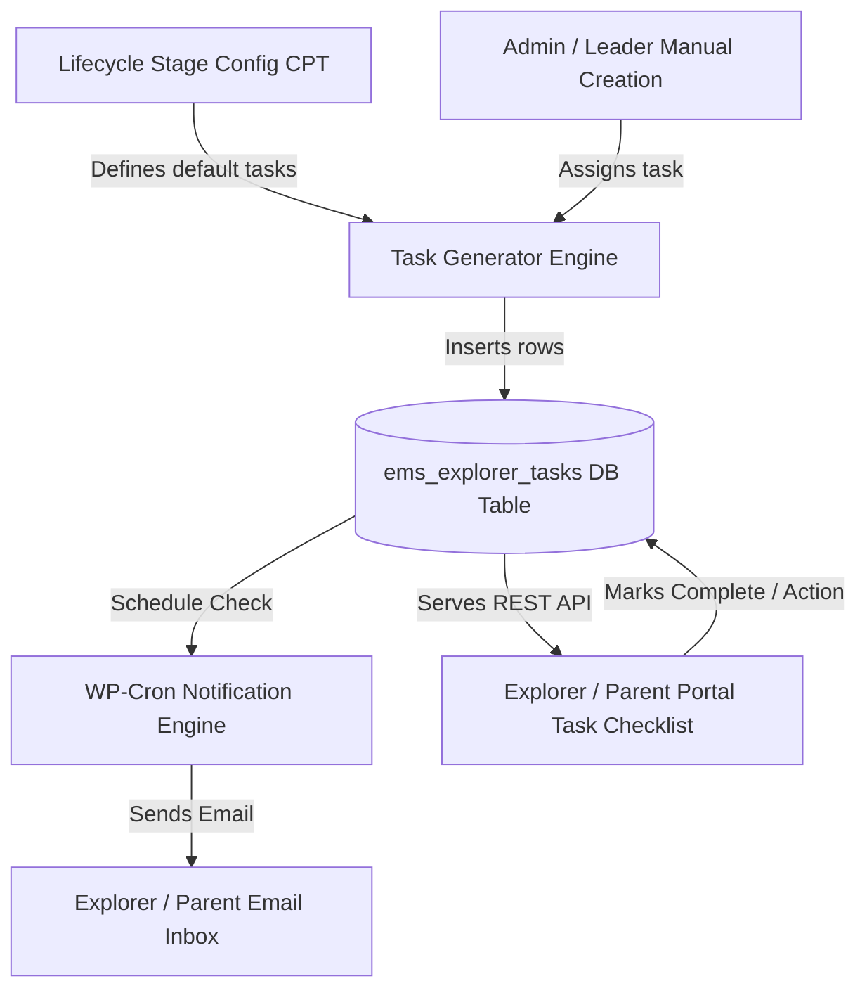
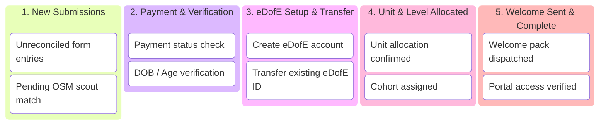
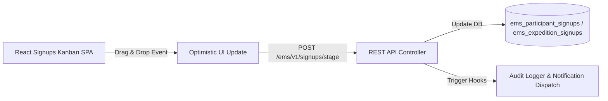

# Explorer Task Management & DofE Registration Kanban Specification

This document details the architectural specification and implementation plan for two core enhancements to the Expedition Management System (EMS):
1. **Configurable Expedition Lifecycle & Explorer Task Management System**
2. **DofE Registration Processing Kanban Board**

---

## 1. Configurable Expedition Lifecycle & Explorer Task Management System

### 1.1 Architectural Overview

The Expedition Lifecycle is decoupled from hardcoded steppers and driven by **configurable workflow templates** (`ems_lifecycle_stage` custom post type or database schema).

Explorers will be assigned actionable, trackable tasks with automated email notifications triggered on task assignment, approaching due dates, and overdue states.



---

### 1.2 Data Schema & Database Specifications

#### A. Custom Post Type: `ems_lifecycle_stage`
* **Title**: Stage Name (e.g. `1. Welcome & eDofE Setup`, `2. First Aid & Training Check`, `3. Team Allocation & Route Submission`, `4. Final Expedition Sign-off`).
* **Meta Fields**:
  * `ems_stage_order` *(int)*: Sequence position (1, 2, 3, 4...).
  * `ems_dofe_level` *(string)*: `bronze` | `silver` | `gold` | `all`.
  * `ems_expedition_type` *(string)*: `training` | `practice` | `qualifying` | `all`.
  * `ems_default_tasks` *(serialized array)*: List of task templates auto-instantiated when an explorer enters this stage.

#### B. Custom Database Table: `wp_ems_explorer_tasks`
Created via `EMS\Core\Table_Installer` on plugin update:

| Column | Type | Constraints | Description |
| :--- | :--- | :--- | :--- |
| `id` | `BIGINT(20)` | `PRIMARY KEY AUTO_INCREMENT` | Task instance ID |
| `scout_id` | `BIGINT(20)` | `INDEX, NOT NULL` | Target Explorer ID (`ems_osm_explorers.scout_id`) |
| `stage_id` | `BIGINT(20)` | `NULLABLE` | Linked `ems_lifecycle_stage` post ID |
| `expedition_post_id` | `BIGINT(20)` | `NULLABLE, INDEX` | Scoped to specific event |
| `team_post_id` | `BIGINT(20)` | `NULLABLE, INDEX` | Scoped to specific team |
| `title` | `VARCHAR(255)` | `NOT NULL` | Task title |
| `description` | `TEXT` | `NULLABLE` | Instructions & markdown details |
| `action_type` | `VARCHAR(50)` | `NOT NULL` | `complete_course` \| `submit_route` \| `verify_edofe` \| `external_url` \| `custom_check` |
| `action_url` | `VARCHAR(500)` | `NULLABLE` | Link to action (e.g. course URL or form link) |
| `priority` | `VARCHAR(20)` | `DEFAULT 'normal'` | `low` \| `normal` \| `high` \| `urgent` |
| `status` | `VARCHAR(20)` | `DEFAULT 'pending'` | `pending` \| `in_progress` \| `submitted` \| `completed` \| `overdue` |
| `due_date` | `DATETIME` | `NULLABLE, INDEX` | Task deadline |
| `notify_on_assign` | `TINYINT(1)` | `DEFAULT 1` | Send email upon task assignment |
| `reminder_days_before` | `INT` | `DEFAULT 3` | Days before due date to send reminder email |
| `assigned_by` | `BIGINT(20)` | `NOT NULL` | WP User ID of assigning leader |
| `created_at` | `DATETIME` | `NOT NULL` | Creation timestamp |
| `completed_at` | `DATETIME` | `NULLABLE` | Completion timestamp |

---

### 1.3 Automated Email Notification Engine

Notifications are processed via a recurring WP-Cron task (`ems_task_notification_cron`):

1. **Assignment Email**: Fired immediately upon task creation if `notify_on_assign = 1`.
2. **Upcoming Due Reminder**: Fired when `due_date - CURRENT_TIME = reminder_days_before`.
3. **Overdue Notice**: Fired when `CURRENT_TIME > due_date` and `status != 'completed'`.

#### Smart Tags for Templates:
* `{explorer_first_name}`, `{explorer_last_name}`
* `{task_title}`, `{task_description}`, `{due_date}`
* `{action_button_url}` (Direct link into portal task view)
* `{assigned_by_name}`

---

### 1.4 Admin Task Manager (Full CRUD)

Registered under **EMS Admin** → **Tasks & Workflows** (`ems-tasks`):
* **Task Creation Wizard**:
  * **Scope Selector**: Assign to Single Explorer, Team, Expedition Cohort, or Entire Unit.
  * **Due Date Picker** & **Reminder Schedule Configuration**.
  * **Template Import**: One-click import from `ems_lifecycle_stage` CPT.
* **Task Table & Filter Bar**:
  * Filter by Status (`Pending`, `Overdue`, `Completed`), Expedition, Team, or Unit.
  * Bulk actions: Mark Complete, Re-assign Due Date, Send Immediate Reminder Email, Delete.

---

### 1.5 Explorer & Parent Portal Task Checklist

Inside `[ems-portal]`, a new **"My Tasks"** checklist component renders on both Explorer and Parent views:

```
┌────────────────────────────────────────────────────────────────────────┐
│  📋 Required Tasks for David Strachan                     (2 Pending)  │
├────────────────────────────────────────────────────────────────────────┤
│  [ ] Complete First Aid Refresher Course                 Due: 15 Oct   │
│      Action: [ Go to Course ]  Status: Pending                         │
├────────────────────────────────────────────────────────────────────────┤
│  [ ] Submit Route Card for Mourne Practice               Due: 20 Oct   │
│      Action: [ Upload GPX/PDF ]  Status: Action Required               │
├────────────────────────────────────────────────────────────────────────┤
│  [✓] Complete Navigation Quiz                            Completed 5 Sep│
└────────────────────────────────────────────────────────────────────────┘
```

---

## 2. DofE Registration Processing Kanban Board

### 2.1 Problem Statement & Objectives

Replaces manual spreadsheet processing of participant applications and expedition sign-ups with a **real-time visual Kanban Board** inside WordPress Admin (**EMS Admin** → **Registration Processing**).

---

### 2.2 Kanban Workflow & Column Architecture

The board categorizes participant sign-ups into **5 operational lifecycle columns**:



#### Column Definitions & Automated State Transitions:

1. **`1. New Submissions`**:
   * *Entry Condition*: Participant or Expedition form submitted via Fluent Forms.
   * *Indicators*: Yellow badge if `scout_id` is unreconciled / unlinked.
2. **`2. Payment & Verification`**:
   * *Entry Condition*: Reconciled to an OSM explorer record.
   * *Indicators*: Stripe payment badge (`Paid` green, `Pending` red).
3. **`3. eDofE Setup & Transfer`**:
   * *Entry Condition*: Payment verified.
   * *Indicators*: eDofE status (`Registered`, `Needs Transfer`, `No eDofE ID`).
4. **`4. Unit & Level Allocated`**:
   * *Entry Condition*: eDofE account set up or transferred.
   * *Indicators*: ESU Unit badge and DofE Level badge (Bronze/Silver/Gold).
5. **`5. Welcome Sent & Complete`**:
   * *Entry Condition*: Admin clicks "Send Welcome Pack" or drags card to final column.
   * *Action*: Auto-triggers welcome email with portal login instructions.

---

### 2.3 Card Anatomy & Visual Layout

```
┌────────────────────────────────────────────────────────────────────────┐
│ 🔴 UNRECONCILED                            [ BRONZE ]  [ FORM #1042 ]  │
│                                                                        │
│ David Strachan                                                         │
│ Unit: Falcons ESU  •  Parent: Sarah Strachan                           │
│ Submitted: 24 Sep 2026                                                 │
│                                                                        │
│ ┌────────────────────────────────────────────────────────────────────┐ │
│ │ 💳 Payment: Paid    │  🆔 eDofE: 7894123 (Transfer Needed)          │ │
│ └────────────────────────────────────────────────────────────────────┘ │
│                                                                        │
│ Quick Actions:                                                         │
│ [ Match Explorer ]   [ Edit eDofE ID ]   [ 👁️ Quick View ]           │
└────────────────────────────────────────────────────────────────────────┘
```

#### Badges & Interactive Controls:
* **DofE Level Badges**: Bronze (`#cd7f32`), Silver (`#c0c0c0`), Gold (`#ffd700`).
* **Payment Badges**: Green pill (`Paid`), Red pill (`Unpaid / Pending`).
* **Reconciliation Alert**: Red indicator for submissions not yet linked to an OSM scout ID.
* **Inline Quick-Edit Fields**: Double-click eDofE Number or Unit to edit inline without opening modals.

---

### 2.4 Inspector Drawer & Batch Operations

* **Slide-Out Inspector Drawer**: Clicking a card opens full submission details, match reconciliation controls, and audit history.
* **Bulk Operations**: Multi-select cards to advance stages in bulk, send batch welcome emails, or export to CSV.
* **View Toggle**: Switch between **Kanban Columns View** and **Excel-Style Spreadsheet Grid View**.

---

### 2.5 Technical Implementation Roadmap



* **Frontend Stack**: Built with React & `@hello-pangea/dnd` inside `resources/js/admin/signups-board/`.
* **REST API Endpoints**:
  * `GET /ems/v1/signups/kanban` — Returns signups grouped by Kanban stage.
  * `POST /ems/v1/signups/update-stage` — Updates signup `kanban_stage` and logs audit entry.
  * `POST /ems/v1/tasks` — Task CRUD & bulk assignment endpoint.
