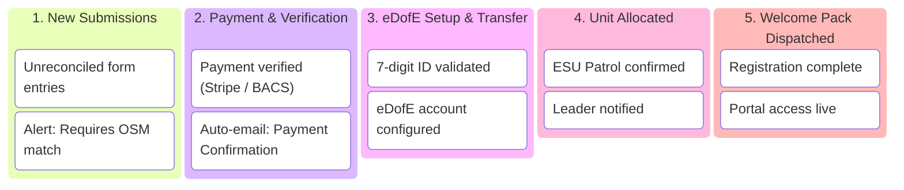

# Leader-Facing Signups Board, Registration Kanban & Analytics Dashboard Specification

This document details the architectural specification and implementation plan for the **Leader-Facing Signups Board & Registration Management System** in the **Expedition Management System (EMS)**.

---

## 1. Executive Summary & Architectural Scope

The Leader-Facing Signups Board centralizes the management of all participant applications and expedition bookings. It equips expedition leaders, DofE administrators, and unit coordinators with:

1. **A Real-Time Cumulative Signups Dashboard**: Visualizing participant place applications and expedition signups over time (starting on **1st August** of the active season), broken down by award level (**Bronze**, **Silver**, **Gold**).
2. **A Configurable Registration Kanban Pipeline**: Drag-and-drop processing of participant signups across customizable administrative stages.
3. **An Excel-Style Spreadsheet / Roster Grid**: Detailed tabular view with filters, sorting, inline eDofE editing, and batch reconciliation against Online Scout Manager (OSM).
4. **Automated & Manual Email Notifications**: Contextual emails dispatched via standard WordPress `wp_mail()`, automatically routed, tracked, and delivered through **FluentSMTP**.

```mermaid
flowchart TD
    subgraph Inbound Signups
        F6[Form 6: Participant Place Signup] --> DB_P[(wp_ems_participant_signups)]
        F7[Form 7: Expedition Preferences] --> DB_E[(wp_ems_expedition_signups)]
    end

    subgraph Data & Aggregation Layer
        DB_P --> REPO[Signup_Repository]
        DB_E --> REPO
        REPO --> REST_ANALYTICS[REST: /ems/v1/signups/analytics]
        REPO --> REST_BOARD[REST: /ems/v1/signups]
    end

    subgraph Leader UI (ems-signups SPA)
        REST_ANALYTICS --> TAB_DASH[Tab 1: Cumulative Signups Dashboard]
        REST_BOARD --> TAB_KANBAN[Tab 2: Kanban Pipeline]
        REST_BOARD --> TAB_GRID[Tab 3: Spreadsheet Roster]
        REST_BOARD --> TAB_CONFIG[Tab 4: Stage Settings]
    end

    subgraph Email Delivery Layer
        TAB_KANBAN -->|Trigger / Manual| EMAIL_ENG[EMS Email Engine]
        EMAIL_ENG -->|wp_mail| FSMTP[FluentSMTP Plugin]
        FSMTP -->|SMTP / SES API| MAIL_OUT[Outbound Email to Parent & Explorer]
    end
```

---

## 2. Cumulative Signups & Registration Dashboard

### 2.1 Overview & Objective

Expedition and DofE administration operates on an annual cycle kicking off on **1st August**. Leaders require continuous visibility into recruitment momentum, target pacing, and the conversion funnel between **Participant Place Registrations** (Form 6) and **Expedition Event Bookings** (Form 7).

The **Cumulative Signups Dashboard** appears as the primary analytical view within `ems-signups`.

---

### 2.2 Visual Dashboard Layout & Wireframe

```
┌─────────────────────────────────────────────────────────────────────────────────────────────────────────────┐
│ 📊 EMS SIGNUP INTELLIGENCE & RECRUITMENT DASHBOARD (Season 2026/27)                                         │
├─────────────────────────────────────────────────────────────────────────────────────────────────────────────┤
│ Season: [ 2026/27 (Aug 1 - Present) ▼ ]   Unit / District: [ All Units ▼ ]   Granularity: [ Weekly ▼ ]      │
├─────────────────────────────────────────────────────────────────────────────────────────────────────────────┤
│ ┌───────────────────────┐ ┌───────────────────────┐ ┌───────────────────────┐ ┌───────────────────────────┐ │
│ │ TOTAL PARTICIPANTS    │ │ EXPEDITION SIGNUPS    │ │ REGISTRATION-TO-EXPED │ │ UNRECONCILED ALERTS       │ │
│ │ 184                   │ │ 142                   │ │ 77.2%                 │ │ 18 Submissions            │ │
│ │ 🥉 92  🥈 61  🥇 31   │ │ 🥉 74  🥈 48  🥇 20   │ │ Target: >80%          │ │ [ Reconcile Now ➔ ]       │ │
│ └───────────────────────┘ └───────────────────────┘ └───────────────────────┘ └───────────────────────────┘ │
├─────────────────────────────────────────────────────────────────────────────────────────────────────────────┤
│ 📈 CUMULATIVE SIGNUPS OVER TIME (Starting 1st August)                                                       │
│ Combined View: Stacked Bars (Participant Places) + Trend Lines (Expedition Bookings)                        │
│                                                                                                             │
│ Count                                                                                                       │
│  200 ┤                                                                [G]      ■ Stacked Bars (Places):     │
│  180 ┤                                                       [G]      [S]        [G] Gold Participants      │
│  160 ┤                                              [G]      [S]      [S]        [S] Silver Participants    │
│  140 ┤                                     [G]      [S]      [S]  --▲-[S]        [B] Bronze Participants    │
│  120 ┤                            [G]      [S]  --▲-[S]  --▲-[S]                 ───────────────────────    │
│  100 ┤                   [G]      [S]  --▲-[S]       [B]      [B]      [B]     Overlaid Trend Lines:      │
│   80 ┤          [G]  --▲-[S]  --▲-[S]       [B]  --■--■   --■--■   --■--■      ▲---▲ Bronze Expeditions   │
│   60 ┤      --▲-[S]       [B]  --■--■   --■--■                                ■---■ Silver Expeditions   │
│   40 ┤  --▲-[S]  [B]  --■--■                                 --◆--◆   --◆--◆      ◆---◆ Gold Expeditions     │
│   20 ┤   [B] [B]                                    --◆--◆                                                  │
│    0 └───┴───┴───────┴────────┴────────┴────────┴────────┴────────┴────────┴────────┴─────────────          │
│        01 Aug  15 Aug   01 Sep   15 Sep   01 Oct   15 Oct   01 Nov   15 Nov   01 Dec   15 Dec               │
│                                                                                                             │
│  Hover Tooltip (Week 42 - 15 Oct):                                                                          │
│  ┌──────────────────────────────────────────────────────────────────────────────┐                          │
│  │ 📅 Week of 15 Oct 2026:                                                      │                          │
│  │ 📊 Cumulative Places (Bars): 142 (🥉 Bronze: 70 | 🥈 Silver: 48 | 🥇 Gold: 24) │                          │
│  │ 🧗 Cumulative Expeditions:   110 (77.5% total conversion)                    │                          │
│  │   • 🥉 Bronze Expeditions:    60 / 70 places  (85.7% converted)  [+10 gap]   │                          │
│  │   • 🥈 Silver Expeditions:    36 / 48 places  (75.0% converted)  [+12 gap]   │                          │
│  │   • 🥇 Gold Expeditions:      14 / 24 places  (58.3% converted)  [+10 gap]   │                          │
│  └──────────────────────────────────────────────────────────────────────────────┘                          │
├─────────────────────────────────────────────────────────────────────────────────────────────────────────────┤
│ 📊 BREAKDOWN BY AWARD LEVEL (Participant Places vs Expeditions)                                             │
│ ┌───────────────────────────────┐ ┌───────────────────────────────┐ ┌─────────────────────────────────────┐ │
│ │ 🥉 BRONZE LEVEL               │ │ 🥈 SILVER LEVEL               │ │ 🥇 GOLD LEVEL                       │ │
│ │ Participants: 92              │ │ Participants: 61              │ │ Participants: 31                    │ │
│ │ Expeditions:  74 (80.4%)      │ │ Expeditions:  48 (78.7%)      │ │ Expeditions:  20 (64.5%)            │ │
│ │ [████████████████░░░░]        │ │ [███████████████░░░░░]        │ │ [████████████░░░░░░░░]              │ │
│ └───────────────────────────────┘ └───────────────────────────────┘ └─────────────────────────────────────┘ │
└─────────────────────────────────────────────────────────────────────────────────────────────────────────────┘
```

---

### 2.3 Dashboard Key Performance Indicators (KPIs)

1. **Total Participant Places** (`ems_participant_signups` count where `created_at >= season_start`):
   - Total count with sub-pills for Bronze, Silver, Gold.
2. **Total Expedition Signups** (`ems_expedition_signups` count where `created_at >= season_start`):
   - Total count with sub-pills for Bronze, Silver, Gold.
3. **Registration-to-Expedition Conversion Rate**:
   - $\text{Conversion Rate} = \frac{\text{Unique Explorers with Form 7}}{\text{Unique Explorers with Form 6}} \times 100\%$
   - Pinpoints drop-off where participants enrolled for an award level but have not booked an expedition place.
4. **Unreconciled Queue Count**:
   - Number of submissions where `scout_id = 0` or unmatched with Online Scout Manager, serving as an urgent call to action.

---

### 2.4 Cumulative Time-Series Combo Chart Specification

#### A. Analytical Value of the Combo Architecture
Combining **Stacked Bars** and **Overlay Trend Lines** into a single coordinate plane delivers decisive analytical advantages over separate charts or multiple overlapping lines:
1. **Capacity vs. Activation**:
   - The **stacked bar** represents the *enrolled participant capacity* (the intake pool established via Form 6).
   - The **trend lines** represent *event activation* (the actual expedition bookings committed via Form 7).
2. **Zero Visual Collision**:
   - Six lines on one axis frequently criss-cross and create visual clutter.
   - By rendering participant places as solid stacked columns and expedition signups as continuous lines, the two datasets use distinct visual primitives (rectangles vs. paths) that never obscure each other.
3. **Immediate Cohort-Level Gap Diagnosis**:
   - Leaders can visually compare each expedition line directly against its corresponding segment or award total:
     - **Bronze Pace**: If the Bronze expedition line tracks just below the Bronze bar height, Bronze recruitment is healthy.
     - **Gold Lag Alert**: If the Gold expedition line flattens out while Gold participant places continue to climb, leaders immediately spot that Gold candidates are stalling on expedition bookings and can trigger targeted reminder emails.

#### B. Visual Encoding & Color Hierarchy
* **Time Anchor (X-Axis)**: Begins **1st August** of the active season year (`YYYY-08-01 00:00:00`). Bucketed weekly or daily.
* **Vertical Scale (Y-Axis)**: Cumulative headcount running total ($0$ to max season intake).
* **Stacked Bars (Participant Places - Form 6)**:
  * 🥉 **Bronze Segment (Base)**: Warm amber / copper (`#cd7f32`, opacity 0.85).
  * 🥈 **Silver Segment (Middle)**: Clean slate / steel (`#94a3b8`, opacity 0.85).
  * 🥇 **Gold Segment (Top)**: Warm gold (`#f59e0b`, opacity 0.85).
  * **Bar Total Height**: Cumulative sum of all participant place registrations.
* **Overlaid Lines (Expedition Bookings - Form 7)**:
  * 🥉 **Bronze Expeditions Line**: Deep bronze stroke (`#92400e`, 2.5px), marked with circular data points (`circle`).
  * 🥈 **Silver Expeditions Line**: Dark slate stroke (`#334155`, 2.5px), marked with square data points (`rect`).
  * 🥇 **Gold Expeditions Line**: Vibrant gold/amber stroke (`#d97706`, 2.5px), marked with diamond data points (`polygon`).
* **Interactive Tooltip**:
  * Hovering any time bucket reveals exact cumulative totals, level-by-level conversion percentages, and the outstanding participant gap for each award level.

#### C. React Implementation: Native Lightweight SVG
To avoid heavy third-party graphing dependencies in `package.json`, the chart is implemented as a lightweight, fully responsive React SVG component (`SignupComboChart.tsx`):
* Computes SVG viewBox scaling based on container dimensions.
* Renders `<rect>` elements for stacked bar segments with rounded tops on the uppermost segment.
* Renders smooth SVG `<path>` bezier curves for the three expedition trend lines with SVG markers.
* Emits zero runtime external dependencies and tests cleanly in Vitest without jsdom canvas stubbing.

---

### 2.5 Backend Analytics REST API

#### Endpoint: `GET /ems/v1/signups/analytics`
* **Permission**: `manage_options` (Admin / Leader)
* **Query Parameters**:
  * `season_year` *(int, optional, default: active season e.g. 2026)*
  * `start_date` *(string `YYYY-MM-DD`, optional, default: `{season_year}-08-01`)*
  * `end_date` *(string `YYYY-MM-DD`, optional, default: `current_date`)*
  * `unit_id` *(int, optional, filter by specific ESU)*
  * `granularity` *(string, `daily` | `weekly` | `monthly`, default: `weekly`)*

#### Database Aggregation Query Pattern:
```sql
SELECT 
    DATE(created_at) AS signup_date,
    'participant' AS signup_type,
    LOWER(dofe_level) AS level,
    COUNT(*) AS count
FROM {$wpdb->prefix}ems_participant_signups
WHERE created_at >= %s AND created_at <= %s
  AND (%d = 0 OR unit_id = %d)
GROUP BY DATE(created_at), LOWER(dofe_level)

UNION ALL

SELECT 
    DATE(created_at) AS signup_date,
    'expedition' AS signup_type,
    LOWER(dofe_level) AS level,
    COUNT(*) AS count
FROM {$wpdb->prefix}ems_expedition_signups
WHERE created_at >= %s AND created_at <= %s
  AND (%d = 0 OR unit_id = %d)
GROUP BY DATE(created_at), LOWER(dofe_level)
ORDER BY signup_date ASC;
```

#### JSON Response Schema:
```json
{
  "season": {
    "year": 2026,
    "start_date": "2026-08-01",
    "end_date": "2026-10-08"
  },
  "summary": {
    "total_participants": 184,
    "participants_by_level": { "bronze": 92, "silver": 61, "gold": 31 },
    "total_expeditions": 142,
    "expeditions_by_level": { "bronze": 74, "silver": 48, "gold": 20 },
    "conversion_rate_percent": 77.2,
    "unreconciled_count": 18
  },
  "timeline": [
    {
      "period": "2026-W31",
      "date_start": "2026-08-01",
      "date_end": "2026-08-02",
      "cumulative": {
        "participants_total": 12,
        "participants_bronze": 8,
        "participants_silver": 3,
        "participants_gold": 1,
        "expeditions_total": 4,
        "expeditions_bronze": 3,
        "expeditions_silver": 1,
        "expeditions_gold": 0
      }
    },
    {
      "period": "2026-W32",
      "date_start": "2026-08-03",
      "date_end": "2026-08-09",
      "cumulative": {
        "participants_total": 35,
        "participants_bronze": 21,
        "participants_silver": 10,
        "participants_gold": 4,
        "expeditions_total": 19,
        "expeditions_bronze": 12,
        "expeditions_silver": 5,
        "expeditions_gold": 2
      }
    }
  ]
}
```

---

## 3. Configurable Registration Kanban Pipeline

### 3.1 Pipeline Overview

The Kanban board replaces manual spreadsheet workflows with visual card progression. Applications enter the board automatically from Fluent Forms submissions and advance through verification stages.



---

### 3.2 Configurable Stages Architecture

Workflow stages are stored as a structured WordPress option `ems_signup_kanban_stages` (or custom post type `ems_signup_stage`):

#### Default Stage Definition:
```json
[
  {
    "id": "new_submission",
    "name": "New Submissions",
    "order": 1,
    "color": "#e0e0e0",
    "trigger_email_template_id": 0,
    "auto_status": "submitted"
  },
  {
    "id": "payment_verified",
    "name": "Payment & Verification",
    "order": 2,
    "color": "#ffe082",
    "trigger_email_template_id": 101,
    "auto_status": "payment_confirmed"
  },
  {
    "id": "edofe_setup",
    "name": "eDofE Setup & Transfer",
    "order": 3,
    "color": "#81d4fa",
    "trigger_email_template_id": 102,
    "auto_status": "edofe_pending"
  },
  {
    "id": "unit_allocated",
    "name": "Unit Allocated",
    "order": 4,
    "color": "#b39ddb",
    "trigger_email_template_id": 0,
    "auto_status": "allocated"
  },
  {
    "id": "complete",
    "name": "Welcome Sent & Complete",
    "order": 5,
    "color": "#a5d6a7",
    "trigger_email_template_id": 103,
    "auto_status": "processed"
  }
]
```

#### Drag-and-Drop Card Interactions:
* Moving a card between columns dispatches `POST /ems/v1/signups/{id}/stage`.
* If the target stage has an attached `trigger_email_template_id`, the system prompts the leader:
  > *"Advancing David Strachan to 'Payment & Verification' will send template 'Payment Received Notification' to sarah.strachan@example.com. Proceed? [Cancel] [Confirm & Send]"*
* Option for leaders to suppress automatic emails when doing bulk migrations.

---

### 3.3 Card Anatomy & UI Controls

```
┌────────────────────────────────────────────────────────────────────────┐
│ 🔴 UNRECONCILED                            [ BRONZE ]  [ FORM #1042 ]  │
│                                                                        │
│ David Strachan                                                         │
│ Unit: Falcons ESU  •  Parent: Sarah Strachan                           │
│ Submitted: 24 Sep 2026                                                 │
│                                                                        │
│ ┌────────────────────────────────────────────────────────────────────┐ │
│ │ 💳 Payment: Paid    │  🆔 eDofE: 7894123 (Transfer Needed)          │ │
│ └────────────────────────────────────────────────────────────────────┘ │
│                                                                        │
│ Quick Actions:                                                         │
│ [ 🔗 Match OSM ]   [ ✏️ Edit eDofE ]   [ ✉️ Send Email ]   [ 👁️ View ]  │
└────────────────────────────────────────────────────────────────────────┘
```

#### Visual Elements:
* **Award Level Badges**: Bronze (`#cd7f32`), Silver (`#c0c0c0`), Gold (`#ffd700`).
* **Payment Indicator**: Green pill (`Paid`), Red pill (`Unpaid / Pending`).
* **Reconciliation Alert**: Red badge if `scout_id` is unlinked.
* **Quick-Action Buttons**:
  * **Match OSM**: Opens match finder dialog to link against `ems_osm_explorers`.
  * **Edit eDofE**: Inline modal to update the 7-digit eDofE number.
  * **Send Email**: Quick dropdown of active email templates to send immediately.
  * **View**: Opens the slide-out Inspector Drawer.

---

### 3.4 Inspector Drawer & Match Reconciliation

Clicking any card slides out the **Inspector Drawer** from the right side of the screen:

* **Explorer & Parent Details**: Full names, emails, phone numbers, date of birth, emergency contact.
* **Form Submission Metadata**: Submission ID, timestamp, form source (Form 6 or Form 7).
* **OSM Reconciliation Engine**:
  * Search box querying `ems_osm_explorers`.
  * Suggested fuzzy matches based on first name prefix and last name.
  * **One-Click Match**: Links `scout_id`, copies `first_aid_status` (resolving Issue 2.3), and updates status to `processed`.
  * **Unlink Option**: Safely decouples a mismatched explorer.
* **Audit Trail**: Chronological log of status changes, stage movements, and emails sent.

---

## 4. Email Notification Infrastructure & FluentSMTP Integration

### 4.1 FluentSMTP Architecture Verification

> [!IMPORTANT]
> **FluentSMTP operates at the WordPress Core transport layer.**
> 
> * FluentSMTP hooks directly into WordPress core's `wp_mail()` filter/action pipeline (`pre_wp_mail`, `phpmailer_init`).
> * Any plugin or code that calls standard `wp_mail($to, $subject, $message, $headers, $attachments)` is automatically captured by FluentSMTP.
> * FluentSMTP takes care of:
>   * Routing emails via the configured SMTP, Amazon SES, SendGrid, Mailgun, or Brevo provider.
>   * Connection pooling and delivery retry logic.
>   * Persistent email logging (viewable under WP Admin → FluentSMTP → Email Logs).
> * **Application Code Impact**: Zero custom FluentSMTP code or vendor SDK is required in EMS. All EMS code calls standard `wp_mail()`.

### 4.2 EMS Email Engine Wrapper

To maintain clean separation of concerns and effortless PHPUnit testing, EMS provides an `EMS\Core\Email_Engine` service that wraps `wp_mail()`:

```php
namespace EMS\Core;

class Email_Engine {
    /**
     * Dispatch an email template to a recipient.
     *
     * @param string $recipient_email
     * @param string $subject
     * @param string $html_body
     * @param array  $headers
     * @return bool
     */
    public function send( string $recipient_email, string $subject, string $html_body, array $headers = array() ): bool {
        $default_headers = array(
            'Content-Type: text/html; charset=UTF-8',
        );
        $merged_headers = array_merge( $default_headers, $headers );

        // Standard WordPress wp_mail() call — intercepted transparently by FluentSMTP
        return wp_mail( $recipient_email, $subject, $html_body, $merged_headers );
    }
}
```

### 4.3 Signup Smart Tags

The template renderer substitutes dynamic parameters before passing the message to `Email_Engine`:

| Smart Tag | Description | Data Source |
|---|---|---|
| `{explorer_first_name}` | Participant's first name | `ems_participant_signups.explorer_first_name` |
| `{explorer_last_name}` | Participant's last name | `ems_participant_signups.explorer_last_name` |
| `{parent_name}` | Parent/Guardian name | Extracted from form submission |
| `{dofe_level}` | Award level (`Bronze`, `Silver`, `Gold`) | `ems_participant_signups.dofe_level` |
| `{unit_name}` | ESU Patrol / Unit name | `ems_participant_signups.unit_name` |
| `{edofe_number}` | 7-digit eDofE ID | `ems_participant_signups.dofe_number` |
| `{payment_status}` | Payment status | `ems_participant_signups.payment_status` |
| `{stage_name}` | Current pipeline stage | Active Kanban stage |
| `{portal_url}` | Direct link to participant portal | `get_site_url() . '/portal'` |

---

## 5. UI Architecture: Unified Navigation Tabs

The admin page at **EMS Admin** → **Signups & Kanban** (`ems-signups`) is organized into four top-level tabs:

```
┌─────────────────┬─────────────────┬──────────────────────┬──────────────────────┐
│  📊 Dashboard   │  📋 Kanban      │  📑 Spreadsheet Grid │  ⚙️ Stage Settings   │
└─────────────────┴─────────────────┴──────────────────────┴──────────────────────┘
```

1. **Dashboard Tab**: The cumulative time series charts, KPI summary cards, and award-level breakdown from 1st August forward.
2. **Kanban Tab**: Drag-and-drop workflow columns with cards, level badges, and quick-action triggers.
3. **Spreadsheet Grid Tab**: The high-density roster table (the existing comprehensive table) supporting sorting, multi-column filters, and bulk actions.
4. **Stage Settings Tab**: Administrative management of Kanban stages (add/edit/reorder stages, assign badge colors, bind automated email templates).

---

## 6. Implementation Roadmap & TDD Sequence

Following the mandatory **TDD Workflow**:

### Phase 1: Analytics Aggregation Backend (PHPUnit)
1. **Gherkin Feature**: `tests/features/admin-signups-analytics.feature` specifying cumulative counts, level breakdowns, and date filtering from 1st August.
2. **Repository Implementation**: Add `Signup_Repository::get_signup_analytics(int $season_year, string $start_date, string $end_date, int $unit_id)`.
3. **Controller Endpoint**: Register `GET /ems/v1/signups/analytics` in `Admin_View_Controller` or `Signup_Admin_Controller`.
4. **PHPUnit Tests**: Verify query generation, date boundary checks, cumulative running sums, and empty result handling.

### Phase 2: Signups Dashboard React UI (Vitest + RTL)
1. **Component Creation**: `resources/js/admin/signups-board/SignupsDashboard.tsx`.
2. **Chart Rendering**: Lightweight SVG or Chart component displaying cumulative time-series curves.
3. **KPI Stat Cards**: Summary indicators for Participants, Expeditions, Conversion %, and Unreconciled count.
4. **Filter Controls**: Season selector (defaulting to Aug 1), Unit filter, Granularity toggle.
5. **Vitest Unit Tests**: Mock API hook and assert correct stat display and filter responsiveness.

### Phase 3: Kanban Board & Stage Configuration
1. **Component Creation**: `resources/js/admin/signups-board/KanbanView.tsx` and `StageConfigModal.tsx`.
2. **Card Drag-and-Drop**: HTML5 drag-and-drop or `@hello-pangea/dnd` for moving cards between columns.
3. **Inspector Drawer Integration**: Connect drawer to cards for reconciliation and eDofE inline updates.
4. **Automated Triggers**: Trigger confirmation modal before dispatching stage emails.

### Phase 4: Tabbed Layout Integration & Local Deploy
1. **Index Refactor**: Update `resources/js/admin/signups-board/SignupsBoard.tsx` to host tabs: Dashboard, Kanban, Spreadsheet Grid, Settings.
2. **Build & Deploy**: Run `npm run build` and `bash bin/deploy.sh` to sync to local WordPress.
3. **Version Bump & Commit**: Commit with `commit-enforcer` conventions.
