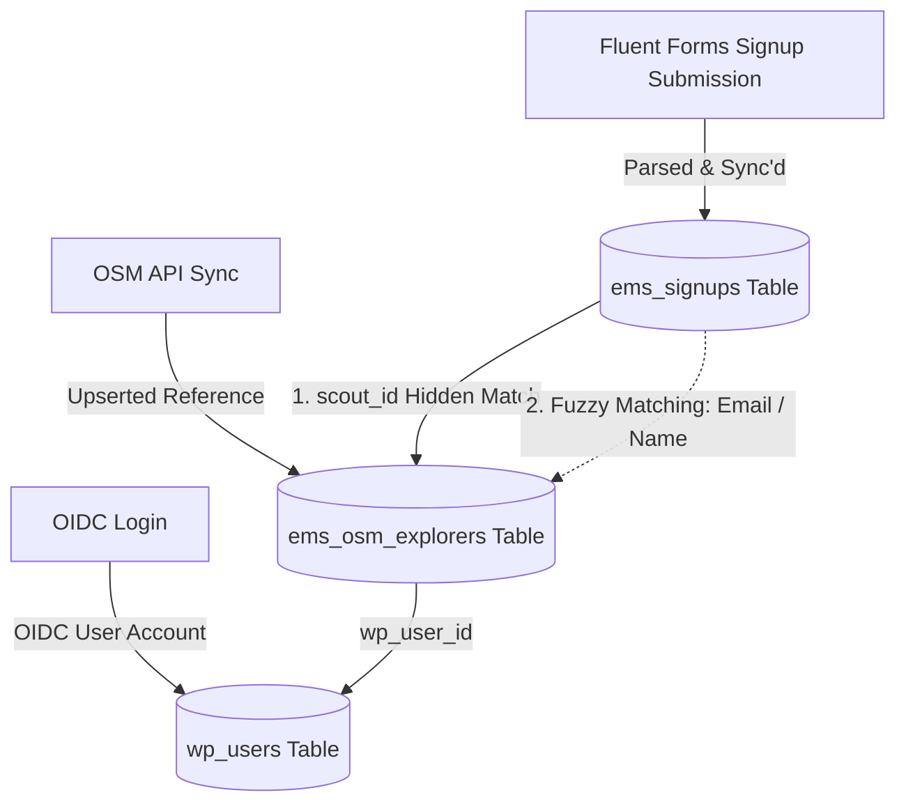
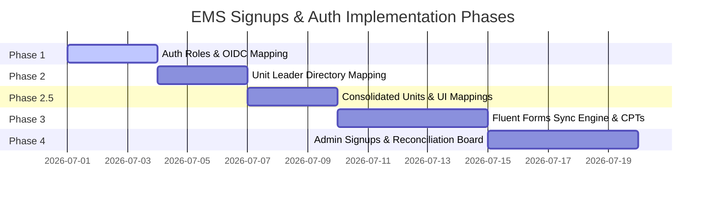

# EMS Signups and Authentication — Implementation Plan

This document defines the plan and technical specifications for implementing custom WordPress user roles, mapping these roles on OIDC login, setting up the Fluent Forms signup sync engine with a Unit Leader directory, and building the Admin Signups & Reconciliation Board.

---

## Completed Specs & Phases
Work completed on custom roles and OIDC mapping has been archived in [completed-signups-and-auth.md](file:///Users/davidstrachan/Projects/expedition-management-system/docs/completed-signups-and-auth.md).

## Technical Specifications

### [x] Spec 1: WordPress User Roles & OIDC Mapping (Completed)
Detailed specification and logic have been moved to [completed-signups-and-auth.md](file:///Users/davidstrachan/Projects/expedition-management-system/docs/completed-signups-and-auth.md).

### [x] Spec 2: Consolidated Units & Mappings (Completed)
Detailed specification and logic have been moved to [completed-signups-and-auth.md](file:///Users/davidstrachan/Projects/expedition-management-system/docs/completed-signups-and-auth.md).

---

### Spec 3: Signup Data Model & Fluent Forms Sync

Parents submit a Fluent Form to sign up their child for a DofE level and expedition. EMS hooks this submission, parses it, and creates a normalized relational record.

#### 1. Database Table: `ems_signups`
```sql
CREATE TABLE IF NOT EXISTS {$prefix}ems_signups (
    id                     BIGINT UNSIGNED NOT NULL AUTO_INCREMENT,
    scout_id               BIGINT UNSIGNED          DEFAULT NULL,
    parent_user_id         BIGINT UNSIGNED NOT NULL,
    unit_id                BIGINT UNSIGNED          DEFAULT NULL, -- Resolved ESU/Unit ID from lookup
    explorer_first_name    VARCHAR(100)    NOT NULL DEFAULT '',
    explorer_last_name     VARCHAR(100)    NOT NULL DEFAULT '',
    dofe_level             VARCHAR(20)     NOT NULL, -- 'bronze' | 'silver' | 'gold'
    expedition_preferences TEXT                     DEFAULT NULL, -- JSON string (dates, transport type, etc.)
    first_aid_status       VARCHAR(30)     NOT NULL DEFAULT 'none',
    signup_status          VARCHAR(30)     NOT NULL DEFAULT 'pending', -- 'pending' | 'processed'
    payment_status         VARCHAR(30)     NOT NULL DEFAULT 'pending', -- 'pending' | 'paid' | 'exempt'
    form_submission_id     BIGINT UNSIGNED NOT NULL,
    created_at             DATETIME        NOT NULL,
    updated_at             DATETIME        NOT NULL,
    PRIMARY KEY (id),
    KEY idx_scout_id (scout_id),
    KEY idx_parent_user_id (parent_user_id),
    KEY idx_unit_id (unit_id)
) {$charset};
```

#### 2. Form Mapping Indirection Layer & Admin UI
To decouple database ingestion from form changes and support multiple Fluent Forms:
* **Storage Option (`ems_form_mappings`)**: A serialized configuration matching form IDs to target database fields:
  ```json
  {
    "form_id": {
      "scout_id_field": "signup_child",
      "first_name_field": "signup_first_name",
      "last_name_field": "signup_last_name",
      "dofe_level_field": "signup_level",
      "esu_patrol_field": "signup_unit",
      "first_aid_field": "input_radio",
      "pref_fields": [
        "exped_practice_dates",
        "exped_qualifier_dates",
        "exped_type",
        "exped_team_names",
        "exped_asn"
      ]
    }
  }
  ```
* **Admin Mapping UI**: A tab under *EMS Settings* allowing the admin to select a form ID and map its raw input field names to the required EMS database fields. It also lists all form input keys as checkboxes, allowing the admin to select multiple fields to be serialized together into the JSON `expedition_preferences` column.
* **Form Submission Mapper**: An interface `Form_Submission_Mapper` resolved by `Form_Mapper_Factory` based on the form ID. Reads submission data using the configured mappings option to extract clean domain fields.
* **Dynamic Child Name Resolution (OSM)**: When rendering the parent portal and dynamic dropdown choices, EMS retrieves associated child IDs from `ems_children`. For each child, it calls the OSM custom data endpoint `ext/customdata/?action=getData` with parameters `section_id`, `associated_id` (Scout ID), and `associated_type=member` to query the child's detailed profile. EMS extracts the first name and last name (from group `contact_primary_1` or core `firstname`/`lastname` fields) to populate the dynamic options and labels.

#### 3. Fluent Forms Sync Integration Flow
1. **Dynamic Form Pre-population (Hooks)**:
   * **Hook**: `fluentform/input_default_value_{field_key}`
   * **Logic**: On form render, EMS looks up the parent's `ems_children` array from user metadata. Using the child's `section_ids`, EMS queries `ems_units` to resolve their patrol name. It dynamically populates:
     - The hidden child `scout_id` field.
     - The ESU/Unit dropdown field.
2. **Hooks**: 
   * **Signup Creation**: Register callback on `fluentform/submission_inserted`. Obtains the correct mapper for the form ID, extracts the fields, and inserts/updates `ems_signups`.
   * **Payment Processing**: Register callbacks on Fluent Forms payment events (e.g. `fluentform/payment_status_updated`) to mark the signup record as paid/pending based on the submission entry ID.
3. **Form Verification**: Ensure the submitted form ID has a registered mapping in `ems_form_mappings`.
4. **Validation (Hooks)**:
   * **Hook**: `fluentform/validation_errors`
   * **Rules**: Verify parent OIDC ownership of the submitted `scout_id`, validate that `dofe_level` is strictly bronze/silver/gold, and ensure the ESU/Unit exists.
5. **Leader & Unit Lookup**:
   * Map the selected/overridden ESU patrol name to the corresponding `ems_units.unit_id` and leader email.
6. **Write Signup**: Insert/update the row in the `ems_signups` table (storing the resolved `unit_id`).
7. **Temporary Signups List Screen (Admin UI)**:
   * A simple read-only HTML table registered under the **Explorers** menu page showing all records in `ems_signups` (First Name, Last Name, Level, ESU Unit ID, First Aid Status, Payment Status, and Created Date).
8. **Dummy Notifications**: Send transaction notifications using standard `wp_mail()` to parent, explorer, and resolved unit leader.

---

### Spec 4: Admin Signups Board & Reconciliation

Admin dashboards require a unified screen to review Fluent Forms signup data, verify them against OSM reference data, and link them together.

#### 1. Identity Linkage Model
To connect submissions generated by Fluent Forms with existing OSM Explorer records:



Reconciliation runs through these ordered priority paths:
1. **Direct Match (Hidden Scout ID)**: If the form is submitted via the Parent Portal, the form embeds the child's `scout_id` as a hidden field. This connects the signup row directly to `ems_osm_explorers.scout_id` with 100% confidence.
2. **Fuzzy Match (Email / Name)**: If `scout_id` is null or zero (e.g., a new recruit signup not yet synced in OSM):
   * Search `ems_osm_explorers` for a row matching the explorer's email address (case-insensitive).
   * If email is missing/blank, search by `first_name` and `last_name` combination.
   * If a match is found, show it as a **"Proposed Link"** on the admin dashboard.
3. **Unlinked (New Recruit)**: If no match is found, flag the signup as "New / Unlinked". The admin cannot process this signup until the explorer is created/synced in OSM.

#### 2. REST API Endpoints
* `GET ems/v1/signups`: Lists all signup records with resolved explorer names, emails, and linked status.
* `POST ems/v1/signups/{id}/reconcile`: Manually links a signup to a specific `scout_id`.
  * **Linkage Rule**: Confirming a manual link updates `ems_signups.scout_id` to link the signup record, but **does not** dynamically rewrite the parent user's WordPress metadata. We rely strictly on the next parent OIDC login hydration call to pull parent-child links from OSM globals (Option B).
  * **Validation Rules**:
    * Verify that both the signup record (`id`) and the target `scout_id` exist.
    * Prevent linking/reconciliation actions if the signup record's status is already marked as `'processed'`.
* `POST ems/v1/signups/{id}/process`: Marks a signup as `processed` (completed back-office allocation).

#### 3. Administrative Interface (React)
A new "Sign Ups" tab is registered in the Explorer View SPA in the WP Admin Dashboard:
* Displays a table of all sign-ups from `ems_signups`.
* For linked signups: Show explorer name, level, first aid, ESU unit, and a tick mark.
* **ESU/Unit Field**: Displays the mapped unit (ESU name and Short Code) based on the signup's `unit_id`. Renders an editable select/dropdown letting the administrator manually override or assign the correct unit at any point before processing.
* **Unit Mapping Exceptions**:
  * **0 Mapped Units**: Displays a warning badge indicating "Unassigned Unit".
  * **Multiple Mapped Units**: Displays an option listing the proposed units, prompting the administrator to click and select/confirm the correct one.
* For proposed/unlinked signups: Renders a warning badge and a "Link Explorer" button opening a search dialog to reconcile manually.
* Filter controls for: Level (Bronze/Silver/Gold), Status (Pending/Processed), ESU/Unit, and Matching Status (Linked/Proposed/Unlinked).
* Batch Action: "Mark Selected as Processed".

---

## Sequencing Recommendation & Phases



### [x] Phase 1 — WP User Roles & OIDC Mapping (Completed)
Tasks and scenarios implemented. See [completed-signups-and-auth.md](file:///Users/davidstrachan/Projects/expedition-management-system/docs/completed-signups-and-auth.md) for details.

### [x] Phase 2 — Unit Leader Directory & Admin Menus (Completed)
Tasks and scenarios implemented. See [completed-signups-and-auth.md](file:///Users/davidstrachan/Projects/expedition-management-system/docs/completed-signups-and-auth.md) for details.

### [x] Phase 2.5 — Consolidated Units Directory & Settings UI (Completed)
Tasks and scenarios implemented. See [completed-signups-and-auth.md](file:///Users/davidstrachan/Projects/expedition-management-system/docs/completed-signups-and-auth.md) for details.

### [x] Phase 3 — Fluent Forms Sync Engine & Unit Lookup Integration (Completed)
1. **Behavioral Design (TDD)**: Gherkin scenarios written in `tests/features/signup-fluentforms-sync.feature` covering child dropdown pre-population, valid form submission, parent ownership validation, and payment status updates.
2. **Implementation**:
   * Migrated `ems_signups` table via `EMS\Core\Table_Installer`.
   * Implemented `EMS\Integrations\Fluent_Forms_Sync` with seven FF hooks:
     - `fluentform/rendering_field_data_select` — populates `signup_child` dropdown from `ems_children` user meta.
     - `fluentform/validate_input_item_select` — bypasses Fluent Forms' strict value-matching for dynamic choices.
     - `fluentform/validation_errors` — enforces parent ownership of `scout_id` and valid `dofe_level`.
     - `fluentform/submission_inserted` — extracts fields via `ems_form_mappings` config, resolves `unit_id` from `ems_units`, and calls `Signup_Repository::create_signup()`.
     - `fluentform/after_payment_status_change` — maps `paid`/`succeeded` → `'paid'`; all else → `'pending'`; includes idempotency guard.
     - `fluentform/before_form_render` — enqueues inline JS that syncs unit + email fields when the child selector changes.
     - `fluentform/rendering_field_data_input_email` × 3 — pre-populates hidden email fields on form render (see below).
   * **Email notifications via Fluent Forms' built-in notification system** (no `wp_mail` calls from EMS):
     EMS pre-populates three hidden email fields so the FF notification system can address emails to the correct recipients without EMS needing its own mail logic. The fields are:

     | Field | Source | Notes |
     |---|---|---|
     | `signup_parent_email` | WP user account email | Always available |
     | `signup_explorer_email` | `ems_osm_explorers.email` via `scout_id` | Left empty if child not yet synced — no API call made |
     | `signup_leader_email` | `ems_units.leader_email` for resolved unit | Left empty if no unit mapping exists |

     All three are set server-side on render and updated client-side (JS `updateUnit()`) when the parent changes the child selector, so recipient addresses always track the selected child. Admins configure FF notification rules to use `{signup_parent_email}`, `{signup_explorer_email}`, and `{signup_leader_email}` as recipient smart tags.
   * Client-side sync script (`window.emsFormMappings`): includes `unitCode`, `unitId`, `explorerEmail`, and `leaderEmail` per child. Uses `jQuery(el).data('choicesjs')` (the correct Fluent Forms Choices.js key) with a 3 s polling retry for the `fluentform_init` timing race. Falls back to native `<select>` assignment if Choices.js is absent.
   * Implemented `EMS\Data\Signup_Repository` with `create_signup()`, `get_signup()`, `get_signup_by_submission_id()`, `update_payment_status_by_submission_id()`, and `get_all_signups()`.
   * `resolve_unit_for_child()` extended to SELECT and return `leader_email` alongside `short_code` and `unit_id`.
3. **Tests** (13 in suite, all green):
   * `tests/Unit/Integrations/Fluent_Forms_SyncTest.php` — 13 tests covering: dropdown injection, validation, submission (no `wp_mail`), parent/explorer/leader email population, and all payment-status mapping paths (paid, succeeded alias, processing→pending, idempotency guard).
   * `tests/Unit/Data/Signup_RepositoryTest.php` — covers create, get, update payment status.
4. **Bug Fixes Applied**:
   * **Choices.js sync**: `el.choicesInstance` is always `undefined` in Fluent Forms (instance stored under jQuery `.data('choicesjs')`). Fixed lookup and added polling retry.
   * **Payment status mapping**: `completed` was dead code (never sent by Fluent Forms). Corrected map: `paid` + `succeeded` → `'paid'`; all else → `'pending'`. Added idempotency guard via `get_signup_by_submission_id()`. Removed debug logger.
5. **Admin setup required** (one-time, in FF dashboard):
   * Add three hidden email fields (`signup_parent_email`, `signup_explorer_email`, `signup_leader_email`) to the Fluent Form.
   * Configure FF notification rules using those field values as recipient smart tags.

### Phase 4 — Admin Signups Board & Reconciliation UI
1. **Behavioral Design (TDD)**: Create Gherkin scenarios in `tests/features/admin-reconciliation.feature` covering REST API requests and manual linking constraints.
2. **Implementation**:
   * Implement REST endpoints for `/signups` listing (returning resolved unit details) and `/reconcile` / `/process` actions.
   * Create React Admin Component for "Sign Ups" tab, rendering the reconciliation workflow with dropdown overrides and unassigned/multi-unit warnings.
3. **Tests**:
   * **API Integration Tests**: Implement `tests/features/admin-reconciliation.feature` scenarios verifying `/reconcile` validates signup & `scout_id` existence, blocks reconciliation of already `'processed'` signups, and validates fuzzy matching query logic.
   * **UI Vitest Tests**: Write tests in `tests/js/AdminSignupsBoard.test.tsx` verifying component renders "Unlinked", "Proposed Link", "Unassigned Unit", and "Multiple Mapped Units" statuses, triggers manual search dialogs, and fires action API endpoints appropriately.
