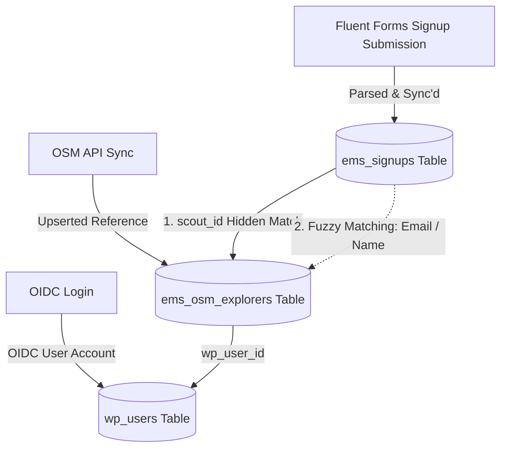
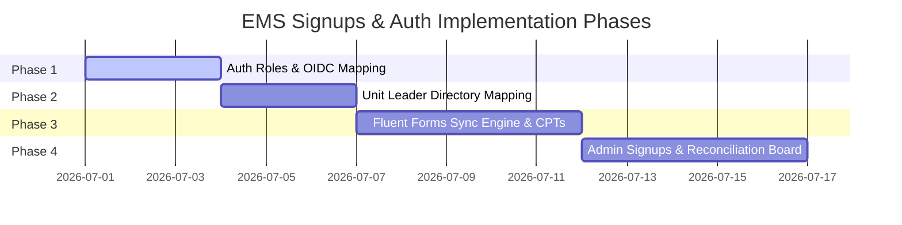

# EMS Signups and Authentication — Implementation Plan

This document defines the plan and technical specifications for implementing custom WordPress user roles, mapping these roles on OIDC login, setting up the Fluent Forms signup sync engine with a Unit Leader directory, and building the Admin Signups & Reconciliation Board.

---

## Completed Specs & Phases
Work completed on custom roles and OIDC mapping has been archived in [completed-signups-and-auth.md](file:///Users/davidstrachan/Projects/expedition-management-system/docs/completed-signups-and-auth.md).

## Technical Specifications

### [x] Spec 1: WordPress User Roles & OIDC Mapping (Completed)
Detailed specification and logic have been moved to [completed-signups-and-auth.md](file:///Users/davidstrachan/Projects/expedition-management-system/docs/completed-signups-and-auth.md).

---

### [x] Spec 2: Unit Leader Mapping Directory (Completed)
Detailed specification and logic have been moved to [completed-signups-and-auth.md](file:///Users/davidstrachan/Projects/expedition-management-system/docs/completed-signups-and-auth.md).

---

### Spec 3: Signup Data Model & Fluent Forms Sync

Parents submit a Fluent Form to sign up their child for a DofE level and expedition. EMS hooks this submission, parses it, and creates a normalized relational record.

#### 1. Database Table: `ems_signups`
```sql
CREATE TABLE IF NOT EXISTS {$prefix}ems_signups (
    id                     BIGINT UNSIGNED NOT NULL AUTO_INCREMENT,
    scout_id               BIGINT UNSIGNED          DEFAULT NULL,
    parent_user_id         BIGINT UNSIGNED NOT NULL,
    dofe_level             VARCHAR(20)     NOT NULL, -- 'bronze' | 'silver' | 'gold'
    expedition_preferences TEXT                     DEFAULT NULL, -- JSON string (dates, transport type, etc.)
    first_aid_status       VARCHAR(30)     NOT NULL DEFAULT 'none',
    signup_status          VARCHAR(30)     NOT NULL DEFAULT 'pending', -- 'pending' | 'processed'
    payment_status         VARCHAR(30)     NOT NULL DEFAULT 'pending', -- 'pending' | 'paid' | 'exempt'
    form_submission_id     BIGINT UNSIGNED NOT NULL,
    created_at             DATETIME        NOT NULL,
    updated_at             DATETIME        NOT NULL,
    PRIMARY KEY (id),
    KEY idx_scout_id (scout_id),
    KEY idx_parent_user_id (parent_user_id)
) {$charset};
```

#### 2. Fluent Forms Sync Integration Flow
1. **Hooks**: 
   * **Signup Creation**: Register a callback on `fluentform/submission_inserted` (fired when a form is submitted). Creates the signup row in `ems_signups` with initial metadata and sets the transaction status.
   * **Payment Processing**: Register callbacks on Fluent Forms payment status change events (e.g. `fluentform/payment_status_updated`). On receipt of payment webhook, dynamically update the `payment_status` column in `ems_signups` (e.g. to `'paid'`).
2. **Form Verification**: Retrieve the form ID from the entry and verify it matches the configuration WP option `ems_fluent_form_id`.
3. **Pre-population & Parsing Payload**:
   * **Pre-population**: If the parent portal opens the form for an existing synced child, the form template pre-populates the child's `scout_id` (hidden field) and automatically selects their home ESU/Unit based on the child's `patrol` field in `ems_osm_explorers`.
   * **Parse**: Extract `scout_id`, parent `user_id` (from `get_current_user_id()`), DofE level, expedition date/transport preferences, first aid status, and initial payment status.
4. **Leader Lookup**:
   * Determine the explorer's ESU/Unit (either from the form selection or looking up the `ems_osm_explorers` patrol field using `scout_id`).
   * Query `ems_unit_leaders` where `unit_name = $unit_name` to get the leader's email.
5. **Write Signup**: Insert/update the row in the `ems_signups` table.
6. **Payload Validation Rules**:
   * **Authentication**: Check that the parent submitting the form is authenticated and matches the logged-in user.
   * **DofE Level Validation**: Validate that the submitted `dofe_level` is strictly one of `'bronze'`, `'silver'`, or `'gold'`.
   * **Scout ID Validation**: If a `scout_id` is submitted, validate that it exists in the `ems_osm_explorers` table.
7. **Dummy Notifications**: Send transaction notifications using standard `wp_mail()`:
   * **Parent Email**: Confirming signup and payment status.
   * **Explorer Email**: Confirming preferences received.
   * **Leader Email**: Notifies the unit leader that an explorer signed up, requesting them to check OSM and confirm the unit profile share.

---

### Spec 4: Admin Signups Board & Reconciliation

Admin dashboards require a unified screen to review Fluent Forms signup data, verify them against OSM reference data, and link them together.

#### 1. Identity Linkage Model
To connect submissions generated by Fluent Forms with existing OSM Explorer records:



Reconciliation runs through these ordered priority paths:
1. **Direct Match (Hidden Scout ID)**: If the form is submitted via the Parent Portal, the form embeds the child's `scout_id` as a hidden field. This connects the signup row directly to `ems_osm_explorers.scout_id` with 100% confidence.
2. **Fuzzy Match (Email / Name)**: If `scout_id` is null or zero (e.g., a new recruit signup not yet synced in OSM):
   * Search `ems_osm_explorers` for a row matching the explorer's email address (case-insensitive).
   * If email is missing/blank, search by `first_name` and `last_name` combination.
   * If a match is found, show it as a **"Proposed Link"** on the admin dashboard.
3. **Unlinked (New Recruit)**: If no match is found, flag the signup as "New / Unlinked". The admin cannot process this signup until the explorer is created/synced in OSM.

#### 2. REST API Endpoints
* `GET ems/v1/signups`: Lists all signup records with resolved explorer names, emails, and linked status.
* `POST ems/v1/signups/{id}/reconcile`: Manually links a signup to a specific `scout_id`.
  * **Linkage Rule**: Confirming a manual link updates `ems_signups.scout_id` to link the signup record, but **does not** dynamically rewrite the parent user's WordPress metadata. We rely strictly on the next parent OIDC login hydration call to pull parent-child links from OSM globals (Option B).
  * **Validation Rules**:
    * Verify that both the signup record (`id`) and the target `scout_id` exist.
    * Prevent linking/reconciliation actions if the signup record's status is already marked as `'processed'`.
* `POST ems/v1/signups/{id}/process`: Marks a signup as `processed` (completed back-office allocation).

#### 3. Administrative Interface (React)
A new "Sign Ups" tab is registered in the Explorer View SPA in the WP Admin Dashboard:
* Displays a table of all sign-ups from `ems_signups`.
* For linked signups: Show explorer name, level, first aid, ESU unit, and a tick mark.
* For proposed/unlinked signups: Renders a warning badge and a "Link Explorer" button opening a search dialog to reconcile manually.
* Filter controls for: Level (Bronze/Silver/Gold), Status (Pending/Processed), ESU/Unit, and Matching Status (Linked/Proposed/Unlinked).
* Batch Action: "Mark Selected as Processed".

---

## Sequencing Recommendation & Phases



### [x] Phase 1 — WP User Roles & OIDC Mapping (Completed)
Tasks and scenarios implemented. See [completed-signups-and-auth.md](file:///Users/davidstrachan/Projects/expedition-management-system/docs/completed-signups-and-auth.md) for details.

### [x] Phase 2 — Unit Leader Directory & Admin Menus (Completed)
Tasks and scenarios implemented. See [completed-signups-and-auth.md](file:///Users/davidstrachan/Projects/expedition-management-system/docs/completed-signups-and-auth.md) for details.

### Phase 3 — Fluent Forms Sync Engine
1. **Behavioral Design (TDD)**: Create Gherkin scenarios in `tests/features/signup-fluentforms-sync.feature` representing signup form submissions.
2. **Implementation**:
   * Execute migration to create `ems_signups` table.
   * Bind callback to `fluentform/submission_inserted` to extract signup info, validate user permission, validate the `dofe_level` parameter, ensure `scout_id` is verified, look up unit leader mappings, and insert/update `ems_signups`.
3. **Tests**:
   * **PHPUnit (Forms Sync)**: Implement `tests/features/signup-fluentforms-sync.feature` to test parent user matching validation, `dofe_level` range validations, existing `scout_id` checks, repository storage, and `wp_mail` lookup notifications.

### Phase 4 — Admin Signups Board & Reconciliation UI
1. **Behavioral Design (TDD)**: Create Gherkin scenarios in `tests/features/admin-reconciliation.feature` covering REST API requests and manual linking constraints.
2. **Implementation**:
   * Implement REST endpoints for `/signups` listing and `/reconcile` / `/process` actions.
   * Create React Admin Component for "Sign Ups" tab, rendering the reconciliation workflow.
3. **Tests**:
   * **API Integration Tests**: Implement `tests/features/admin-reconciliation.feature` scenarios verifying `/reconcile` validates signup & `scout_id` existence, blocks reconciliation of already `'processed'` signups, and validates fuzzy matching query logic.
   * **UI Vitest Tests**: Write tests in `tests/js/AdminSignupsBoard.test.tsx` verifying component renders "Unlinked" and "Proposed Link" statuses, triggers manual search dialogs, and fires action API endpoints appropriately.
