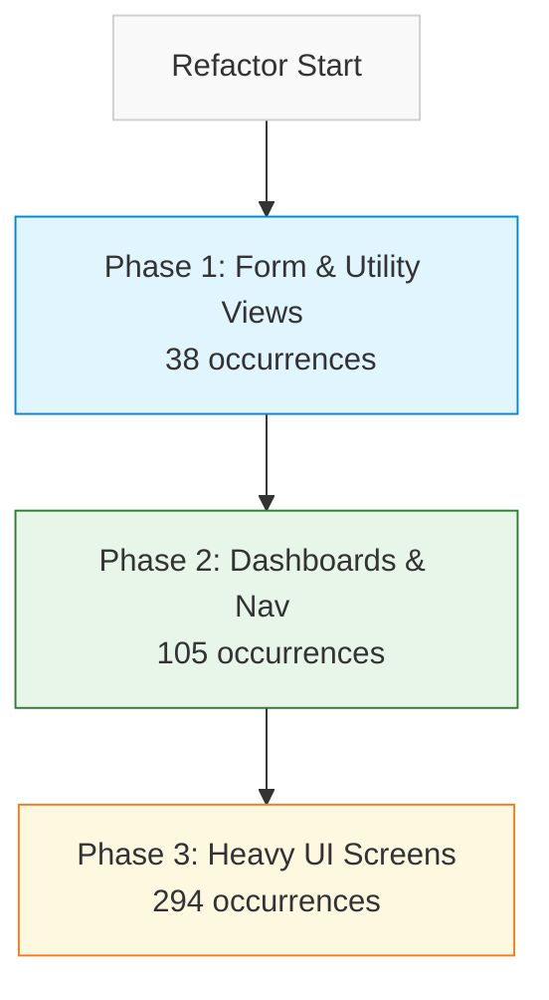

# Spec: EMS Stylesheet Migration & Refactoring Plan

This document outlines the systematic refactoring plan to eliminate inline styles (`style={{...}}`) across all EMS React components, migrating them to the centralized stylesheet [ems-admin.css](file:///Users/davidstrachan/Projects/expedition-management-system/resources/css/ems-admin.css) and standard WordPress admin classes.

---

## 1. Objectives

1. **Maintain Aesthetic Unity**: Align all custom controls and layouts with the WordPress Admin color palette, spacing scale, and interactive state indicators.
2. **Decouple Styles from Code**: Completely replace structural inline style definitions (margins, paddings, flex layouts, borders, alignments, and custom widths/heights) with CSS classes.
3. **Allow Dynamic Exception Handling**: Preserve inline styles *only* for strictly data-driven values that cannot be expressed statically (e.g., progress bar percentages, dynamic coordinates, or conditional colors based on user inputs).
4. **Iterative and Risk-Aware**: Execute migration in controlled phases to minimize regression testing surface area.

---

## 2. Refactoring Standards & CSS Conventions

All styles migrated from inline blocks will be written into `ems-admin.css` using the following patterns:

* **WordPress Core Classes**: Where standard WP elements exist, use native classes directly:
  * `.button`, `.button-primary`, `.button-secondary`, `.button-link`
  * `.notice`, `.notice-success`, `.notice-error`, `.notice-warning`, `.is-dismissible`
  * `.widefat`, `.striped` (tables)
  * `.spinner`
* **Custom Layout Utilities (`.ems-*`)**: Reusable structural classes defined globally (already partially added):
  * `.ems-panel`, `.ems-panel--full-height`
  * `.ems-toolbar`, `.ems-toolbar__group`, `.ems-toolbar__label`
  * `.ems-split`, `.ems-split__left`, `.ems-split__right`
  * `.ems-table`, `.ems-table-wrap`
  * `.ems-select`, `.ems-select-sm`, `.ems-checkbox`
* **Component-Specific BEM Styling**: For custom components that require dedicated CSS, write scoped rules in the stylesheet using a component namespace:
  * e.g., `.ems-detail-page`, `.ems-detail-page__sidebar`, `.ems-detail-page__meta`
  * e.g., `.ems-season-dashboard`, `.ems-season-card`

---

## 3. Scope Audit & Phased Plan

There are 14 files requiring refactoring, totaling approximately 479 inline style occurrences.



### Phase 1: Form & Utility Views (38 occurrences)
Focuses on simple forms, mapping configuration screens, and layout containers. Low logic complexity.

| Component | Target File | Style Count | Action Plan |
|---|---|---|---|
| `ColumnMapper` | [ColumnMapper.tsx](file:///Users/davidstrachan/Projects/expedition-management-system/resources/js/admin/column-mapper/ColumnMapper.tsx) | 2 | Migrate config wrappers to use `.ems-panel` and spacing classes. |
| `ImportReview` | [ImportReview.tsx](file:///Users/davidstrachan/Projects/expedition-management-system/resources/js/admin/column-mapper/ImportReview.tsx) | 7 | Migrate layout grid, custom table wrapper margins, and color-coded status buckets. |
| `ExpeditionBoard` | [ExpeditionBoard.tsx](file:///Users/davidstrachan/Projects/expedition-management-system/resources/js/admin/expedition-board/ExpeditionBoard.tsx) | 3 | Extract main wrapper styling, tab header margin-top alignment. |
| `SeasonForm` | [SeasonForm.tsx](file:///Users/davidstrachan/Projects/expedition-management-system/resources/js/admin/expedition-board/SeasonForm.tsx) | 8 | Convert form group wrapper margins to standard classes. |
| `EventForm` | [EventForm.tsx](file:///Users/davidstrachan/Projects/expedition-management-system/resources/js/admin/expedition-board/EventForm.tsx) | 7 | Standardize input widths and grid gaps. |
| `OSMMapPicker` | [OSMMapPicker.tsx](file:///Users/davidstrachan/Projects/expedition-management-system/resources/js/admin/expedition-board/OSMMapPicker.tsx) | 9 | Extract map selection containers and modal spacing. |
| `OSMReadOnlyMap` | [OSMReadOnlyMap.tsx](file:///Users/davidstrachan/Projects/expedition-management-system/resources/js/admin/expedition-board/OSMReadOnlyMap.tsx) | 2 | Standardize static canvas borders and placeholder sizes. |
| `RichTextEditor` | [RichTextEditor.tsx](file:///Users/davidstrachan/Projects/expedition-management-system/resources/js/admin/expedition-board/RichTextEditor.tsx) | 3 | Extract text editor boundary containers. |

### Phase 2: Dashboards & Nav (105 occurrences)
Focuses on list-heavy views that structure teams and events but lack deeply nested edit states.

| Component | Target File | Style Count | Action Plan |
|---|---|---|---|
| `EventsDashboard` | [EventsDashboard.tsx](file:///Users/davidstrachan/Projects/expedition-management-system/resources/js/admin/expedition-board/EventsDashboard.tsx) | 29 | Standardize filters layout, dashboard stat grids, and card actions. |
| `ExpeditionView` | [ExpeditionView.tsx](file:///Users/davidstrachan/Projects/expedition-management-system/resources/js/admin/expedition-board/ExpeditionView.tsx) | 49 | Extract multi-column rosters, expand/collapse section heights, and status badges. |
| `OSMReference` | [OSMReference.tsx](file:///Users/davidstrachan/Projects/expedition-management-system/resources/js/admin/expedition-board/OSMReference.tsx) | 24 | Migrate search inputs, mapping result lists, and alignment settings. |

### Phase 3: Heavy UI Screens (294 occurrences)
Highly interactive screens containing a significant density of layout grids, nested components, and multi-state lists.

| Component | Target File | Style Count | Action Plan |
|---|---|---|---|
| `SeasonDashboard` | [SeasonDashboard.tsx](file:///Users/davidstrachan/Projects/expedition-management-system/resources/js/admin/expedition-board/SeasonDashboard.tsx) | 61 | Migrate timeline blocks, season container flex boxes, and status controls. |
| `EventDetailPage` | [EventDetailPage.tsx](file:///Users/davidstrachan/Projects/expedition-management-system/resources/js/admin/expedition-board/EventDetailPage.tsx) | 109 | Complex refactor of sidebar configurations, drag-and-drop region borders, detailed layout headers, and tab navigation. |
| `SignupsBoard` | [SignupsBoard.tsx](file:///Users/davidstrachan/Projects/expedition-management-system/resources/js/admin/signups-board/SignupsBoard.tsx) | 124 | Extract heavy datagrid table headers, filtering blocks, action popovers, and status color states. |

---

## 4. Required Additions to `ems-admin.css`

To safely migrate these inline styles, we need to add the following utility classes to `ems-admin.css`:

```css
/* Forms & Layout Grid spacing */
.ems-grid-2 { display: grid; grid-template-columns: 1fr 1fr; gap: 16px; }
.ems-grid-3 { display: grid; grid-template-columns: repeat(3, 1fr); gap: 16px; }
.ems-form-group { margin-bottom: 16px; }
.ems-form-label { display: block; font-weight: 600; margin-bottom: 6px; }

/* Dashboard metrics */
.ems-stat-grid { display: flex; gap: 16px; margin-bottom: 20px; }
.ems-stat-card { flex: 1; padding: 16px; background: #fff; border: 1px solid #ccd0d4; border-radius: 6px; }
.ems-stat-card__label { font-size: 12px; color: #646970; text-transform: uppercase; }
.ems-stat-card__value { font-size: 24px; font-weight: 600; color: #1d2327; margin-top: 4px; }

/* Tabs inside detailed panels */
.ems-detail-tabs { border-bottom: 1px solid #ccd0d4; display: flex; gap: 4px; margin-bottom: 20px; }
.ems-detail-tab { padding: 8px 16px; border: 1px solid transparent; border-bottom: none; cursor: pointer; font-weight: 500; }
.ems-detail-tab--active { border-color: #ccd0d4; background: #fff; border-top-left-radius: 4px; border-top-right-radius: 4px; color: #2271b1; }
```

---

## 5. Verification & Testing

Every phase will be verified using the following workflow:
1. Compile assets: `npm run build`
2. Sync to WordPress: `bash bin/deploy.sh`
3. Execute Jest/Vitest suite: `npm run test` (if applicable)
4. Manual sanity checks: Validate responsive states, select dropdown arrow clearance, and layout alignments in the WP Admin interface under multiple viewport sizes.
