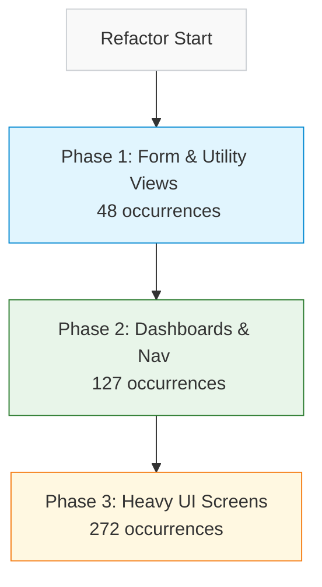

# Spec: EMS Stylesheet Migration & Refactoring Plan

This document outlines the systematic refactoring plan to eliminate inline styles (`style={{...}}`) across all EMS React components, migrating them to the centralized stylesheet [ems-admin.css](file:///Users/davidstrachan/Projects/expedition-management-system/resources/css/ems-admin.css) and standard WordPress admin classes.

---

## 1. Objectives

1. **Maintain Aesthetic Unity**: Align all custom controls and layouts with the WordPress Admin color palette, spacing scale, and interactive state indicators.
2. **Decouple Styles from Code**: Completely replace structural inline style definitions (margins, paddings, flex layouts, borders, alignments, and custom widths/heights) with CSS classes.
3. **Allow Dynamic Exception Handling**: Preserve inline styles *only* for strictly data-driven values that cannot be expressed statically (e.g., progress bar percentages, dynamic coordinates, or conditional colors based on user inputs).
4. **Iterative and Risk-Aware**: Execute migration in controlled phases to minimize regression testing surface area.

---

## 2. Refactoring Standards & CSS Conventions

All styles migrated from inline blocks will be written into `ems-admin.css` using the following patterns:

* **WordPress Core Classes**: Where standard WP elements exist, use native classes directly:
  * `.button`, `.button-primary`, `.button-secondary`, `.button-link`
  * `.notice`, `.notice-success`, `.notice-error`, `.notice-warning`, `.is-dismissible`
  * `.widefat`, `.striped` (tables)
  * `.spinner`
* **Custom Layout Utilities (`.ems-*`)**: Reusable structural classes defined globally (already partially added):
  * `.ems-panel`, `.ems-panel--full-height`
  * `.ems-toolbar`, `.ems-toolbar__group`, `.ems-toolbar__label`
  * `.ems-split`, `.ems-split__left`, `.ems-split__right`
  * `.ems-table`, `.ems-table-wrap`
  * `.ems-select`, `.ems-select-sm`, `.ems-checkbox`
* **Component-Specific BEM Styling**: For custom components that require dedicated CSS, write scoped rules in the stylesheet using a component namespace:
  * e.g., `.ems-detail-page`, `.ems-detail-page__sidebar`, `.ems-detail-page__meta`
  * e.g., `.ems-season-dashboard`, `.ems-season-card`

---

## 3. Scope Audit & Phased Plan

There are **16 files** requiring refactoring, totaling **447 inline style occurrences**.



### Phase 1: Form & Utility Views (48 occurrences)
Focuses on simple forms, mapping configuration screens, and layout containers. Low logic complexity.

| Component | Target File | Style Count | Action Plan |
|---|---|---|---|
| `ColumnMapper` | [ColumnMapper.tsx](file:///Users/davidstrachan/Projects/expedition-management-system/resources/js/admin/column-mapper/ColumnMapper.tsx) | 2 | Migrate section selector wrapper and label to `.ems-panel` and spacing classes. |
| `ImportReview` | [ImportReview.tsx](file:///Users/davidstrachan/Projects/expedition-management-system/resources/js/admin/column-mapper/ImportReview.tsx) | 7 | Migrate review container, section selector, bucket wrappers, scrollable error list, and error span colors. |
| `ExpeditionBoard` | [ExpeditionBoard.tsx](file:///Users/davidstrachan/Projects/expedition-management-system/resources/js/admin/expedition-board/ExpeditionBoard.tsx) | 3 | Extract header flex layout, subtitle typography, and conditional tab content margin. |
| `SeasonForm` | [SeasonForm.tsx](form wrapper, label blocks, input margins, error span, cancel button) | 8 | Convert form wrapper, block label, input margin, error text, and cancel button margin. |
| `EventForm` | [EventForm.tsx](file:///Users/davidstrachan/Projects/expedition-management-system/resources/js/admin/expedition-board/EventForm.tsx) | 7 | Standardize form wrapper, field error spans, and form actions row. |
| `OSMMapPicker` | [OSMMapPicker.tsx](file:///Users/davidstrachan/Projects/expedition-management-system/resources/js/admin/expedition-board/OSMMapPicker.tsx) | 10 | Extract container, header row, button, placeholder box, leaflet map wrapper, and help text. |
| `OSMReadOnlyMap` | [OSMReadOnlyMap.tsx](file:///Users/davidstrachan/Projects/expedition-management-system/resources/js/admin/expedition-board/OSMReadOnlyMap.tsx) | 2 | Standardize container margin and static canvas wrapper. |
| `RichTextEditor` | [RichTextEditor.tsx](file:///Users/davidstrachan/Projects/expedition-management-system/resources/js/admin/expedition-board/RichTextEditor.tsx) | 3 | Extract textarea boundary, wrapper margin, and iframe boundary. |

### Phase 2: Dashboards & Nav (127 occurrences)
Focuses on list-heavy views that structure teams and events but lack deeply nested edit states.

| Component | Target File | Style Count | Action Plan |
|---|---|---|---|
| `EventsDashboard` | [EventsDashboard.tsx](file:///Users/davidstrachan/Projects/expedition-management-system/resources/js/admin/expedition-board/EventsDashboard.tsx) | 29 | Standardize header row, new event card, tab nav, loading state, table headers, row links, and action buttons. |
| `ExpeditionView` | [ExpeditionView.tsx](file:///Users/davidstrachan/Projects/expedition-management-system/resources/js/admin/expedition-board/ExpeditionView.tsx) | 49 | Extract FA icons, legend, meta field pairs, route status badges, team table cells, training requirements section, and expedition header panel. |
| `OSMReference` | [OSMReference.tsx](file:///Users/davidstrachan/Projects/expedition-management-system/resources/js/admin/expedition-board/OSMReference.tsx) | 24 | Migrate container, filter bar, column sort headers, table cells, and avatar icons. |
| `EventPlanningBoard` | [EventPlanningBoard.tsx](file:///Users/davidstrachan/Projects/expedition-management-system/resources/js/admin/expedition-board/EventPlanningBoard.tsx) | 10 | Migrate notice margins, empty state text, toolbar overrides, spinner container, and table header/row styles. |

### Phase 3: Heavy UI Screens (272 occurrences)
Highly interactive screens containing a significant density of layout grids, nested components, and multi-state lists.

| Component | Target File | Style Count | Action Plan |
|---|---|---|---|
| `SeasonDashboard` | [SeasonDashboard.tsx](file:///Users/davidstrachan/Projects/expedition-management-system/resources/js/admin/expedition-board/SeasonDashboard.tsx) | 61 | Migrate filter bar, season card, event card header/body/metadata, team columns, and team header. |
| `EventDetailPage` | [EventDetailPage.tsx](file:///Users/davidstrachan/Projects/expedition-management-system/resources/js/admin/expedition-board/EventDetailPage.tsx) | 109 | Complex refactor of sidebar team panels, member lists, warning banners, section headers, metadata fields, and status badges. |
| `SignupsBoard` | [SignupsBoard.tsx](file:///Users/davidstrachan/Projects/expedition-management-system/resources/js/admin/signups-board/SignupsBoard.tsx) | 124 | Extract datagrid headers, filter pills, level selector, skill badges, avatar circles, and table layout. |

---

## 4. Inline Style Patterns Found (Audited)

### Structural (Candidate for CSS Classes)
These patterns appear repeatedly and are prime candidates for extraction:

| Pattern | Frequency | Proposed Class |
|---|---|---|
| `display: 'flex', alignItems: 'center', gap` | 40+ | `.ems-flex-center`, `.ems-flex-center-gap-*` |
| `display: 'flex', justifyContent: 'space-between', alignItems: 'center'` | 15+ | `.ems-flex-between` |
| `marginBottom: '16px'` / `'20px'` / `'24px'` | 30+ | `.ems-mb-*` spacing scale |
| `padding: '16px'` / `'12px 16px'` / `'20px'` | 20+ | `.ems-p-*` spacing scale |
| `background: '#fff', border: '1px solid #ccd0d4', borderRadius` | 15+ | `.ems-card` |
| `fontSize: '12px', fontWeight: 600, textTransform: 'uppercase'` | 10+ | `.ems-label-uppercase` |
| `display: 'inline-block', borderRadius, padding, fontSize` (badges) | 20+ | `.ems-status-badge` |
| `borderLeft: '3px solid', padding` (warnings) | 5+ | `.ems-warning-callout`, `.ems-error-callout` |

### Conditional State (CSS Custom Properties or Modifier Classes)
These styles depend on runtime state and need modifier classes or `style` with CSS custom properties:

| Pattern | Context | Strategy |
|---|---|---|
| Filter pill active/inactive (background, border, color) | SignupsBoard, EventsDashboard | Modifier classes: `.ems-filter-pill`, `.ems-filter-pill--active` |
| Team size warning border color | EventDetailPage, SeasonDashboard | Modifier: `.ems-team-panel--warning` |
| Event header background by level | SeasonDashboard | Modifier: `.ems-event-header--bronze/silver/gold` |
| Row highlight on selection | EventPlanningBoard | Modifier: `.ems-table-row--selected` |
| Archived row opacity | EventsDashboard | Modifier: `.ems-table-row--archived` |

### Dynamic Exception (Keep as Inline `style`)
These genuinely require inline styles and should **not** be extracted:

| Pattern | Context | Reason |
|---|---|---|
| `minHeight` in RichTextEditor | Editor textarea/iframe | Value driven by props |
| `background` with template literal `backtick` expressions | Multiple | Runtime conditional color logic |
| `border-color` with template literals | Team panel conditional border | Runtime state |

---

## 5. Required Additions to `ems-admin.css`

To safely migrate these inline styles, the following utility and component classes must be added to `resources/css/ems-admin.css`:

### 5.1 Spacing Utilities
```css
/* Margin bottom scale */
.ems-mb-4  { margin-bottom: 4px; }
.ems-mb-6  { margin-bottom: 6px; }
.ems-mb-8  { margin-bottom: 8px; }
.ems-mb-10 { margin-bottom: 10px; }
.ems-mb-12 { margin-bottom: 12px; }
.ems-mb-16 { margin-bottom: 16px; }
.ems-mb-20 { margin-bottom: 20px; }
.ems-mb-24 { margin-bottom: 24px; }

/* Margin top scale */
.ems-mt-4  { margin-top: 4px; }
.ems-mt-8  { margin-top: 8px; }
.ems-mt-10 { margin-top: 10px; }
.ems-mt-12 { margin-top: 12px; }
.ems-mt-16 { margin-top: 16px; }

/* Margin left */
.ems-ml-4  { margin-left: 4px; }
.ems-ml-6  { margin-left: 6px; }
.ems-ml-8  { margin-left: 8px; }

/* Padding */
.ems-p-12  { padding: 12px; }
.ems-p-16  { padding: 16px; }
.ems-p-20  { padding: 20px; }
.ems-px-16 { padding-left: 16px; padding-right: 16px; }
.ems-py-8  { padding-top: 8px; padding-bottom: 8px; }
```

### 5.2 Flex Utilities
```css
.ems-flex-center {
    display: flex;
    align-items: center;
}

.ems-flex-between {
    display: flex;
    justify-content: space-between;
    align-items: center;
}

.ems-flex-col {
    display: flex;
    flex-direction: column;
}

/* Gap scale */
.ems-gap-2  { gap: 2px; }
.ems-gap-4  { gap: 4px; }
.ems-gap-6  { gap: 6px; }
.ems-gap-8  { gap: 8px; }
.ems-gap-10 { gap: 10px; }
.ems-gap-12 { gap: 12px; }
.ems-gap-16 { gap: 16px; }
.ems-gap-20 { gap: 20px; }
.ems-gap-24 { gap: 24px; }
```

### 5.3 Typography
```css
.ems-label-uppercase {
    font-size: 12px;
    font-weight: 600;
    text-transform: uppercase;
    letter-spacing: 0.04em;
    color: #50575e;
}

.ems-meta-text {
    font-size: 12px;
    color: #646970;
}

.ems-small-text {
    font-size: 11px;
}

.ems-monospace {
    font-family: monospace;
}
```

### 5.4 Forms & Layout
```css
.ems-form-group {
    margin-bottom: 16px;
}

.ems-form-label {
    display: block;
    margin-bottom: 6px;
}

.ems-field-error {
    color: #d63638;
    font-size: 13px;
}

.ems-form-actions {
    margin-top: 8px;
}

.ems-block-input {
    display: block;
    width: 100%;
}
```

### 5.5 Cards & Panels
```css
.ems-card {
    background: #fff;
    border: 1px solid #ccd0d4;
    border-radius: 4px;
    padding: 16px;
}

.ems-card--flat {
    background: #fff;
    border: 1px solid #dcdcde;
    border-radius: 4px;
    padding: 12px;
}

.ems-card__header {
    display: flex;
    justify-content: space-between;
    align-items: center;
    margin-bottom: 16px;
}
```

### 5.6 Callouts & Notices
```css
.ems-warning-callout {
    background: #fffbeb;
    border-left: 3px solid #d97706;
    padding: 6px 10px;
    font-size: 11px;
    color: #b45309;
}

.ems-error-callout {
    background: #fef2f2;
    border-left: 3px solid #dc2626;
    padding: 6px 10px;
    font-size: 11px;
    color: #b91c1c;
}
```

### 5.7 Status & Badge Elements
```css
.ems-status-badge {
    display: inline-block;
    padding: 2px 8px;
    border-radius: 10px;
    font-size: 11px;
    font-weight: 600;
    text-transform: capitalize;
}

.ems-avatar-circle {
    display: inline-flex;
    justify-content: center;
    align-items: center;
    width: 24px;
    height: 24px;
    border-radius: 50%;
    color: #fff;
    font-weight: bold;
    font-size: 12px;
}

.ems-avatar-circle--red {
    background: #d63638;
}

.ems-avatar-circle--blue {
    background: #2271b1;
}

.ems-avatar-circle--gold {
    background: #dba617;
}

.ems-avatar-circle--green {
    background: #00a32a;
}

/* Skill badge (smaller variant) */
.ems-skill-badge {
    display: inline-flex;
    justify-content: center;
    align-items: center;
    width: 22px;
    height: 22px;
    border-radius: 50%;
    color: #fff;
    font-weight: bold;
    font-size: 11px;
    margin-right: 4px;
}
```

### 5.8 Filter Pills
```css
.ems-filter-pill {
    display: inline-flex;
    align-items: center;
    cursor: pointer;
    padding: 6px 12px;
    background: #fff;
    border: 1px solid #ccd0d4;
    border-radius: 20px;
    color: #646970;
    font-weight: 500;
    transition: all 0.2s;
}

.ems-filter-pill--active {
    background: #e5f3ff;
    border-color: #2271b1;
    color: #1d2327;
}

.ems-filter-pill input[type="radio"] {
    display: none;
}
```

### 5.9 Meta Field Pairs
```css
.ems-meta-field {
    margin-bottom: 12px;
}

.ems-meta-field__label {
    font-size: 11px;
    font-weight: 600;
    color: #888;
    margin-bottom: 4px;
    text-transform: uppercase;
    letter-spacing: 0.03em;
}

.ems-meta-field__value {
    font-size: 14px;
    color: #1d2327;
}

.ems-meta-field__value--empty {
    color: #bbb;
}
```

### 5.10 Table Row Modifiers
```css
.ems-table-row--selected {
    background: #f0f6fc;
}

.ems-table-row--archived {
    opacity: 0.6;
}

.ems-table-cell--center {
    text-align: center;
}

.ems-table-cell--right {
    text-align: right;
}
```

### 5.11 Event Header Level Modifiers
```css
/* Apply on event card header background */
.ems-event-header--bronze {
    background: #f8f4e8;
}

.ems-event-header--silver {
    background: #f0f4f8;
}

.ems-event-header--gold {
    background: #fef9e6;
}
```

### 5.12 Section Header
```css
.ems-section-header {
    font-size: 14px;
    font-weight: 600;
    color: #1d2327;
    margin-bottom: 12px;
}
```

### 5.13 Team Panel (EventDetailPage sidebar)
```css
.ems-team-panel {
    border: 1px solid #dcdcde;
    border-radius: 4px;
    padding: 16px;
    background: #fff;
    min-width: 260px;
    flex: 1 1 260px;
    display: flex;
    flex-direction: column;
    gap: 8px;
}

.ems-team-panel--warning {
    border-color: #f0b849;
}

.ems-team-panel__header {
    display: flex;
    justify-content: space-between;
    align-items: center;
    border-bottom: 1px solid #e5e7eb;
    padding-bottom: 8px;
}

.ems-team-member {
    display: flex;
    justify-content: space-between;
    align-items: center;
    padding: 6px 0;
    border-bottom: 1px solid #f3f4f6;
    font-size: 13px;
}

.ems-empty-member {
    color: #aaa;
    font-size: 13px;
    padding: 8px 0;
    text-align: center;
}
```

### 5.14 First Aid Icons
```css
.ems-fa-full {
    color: #1b5e20;
    font-weight: bold;
    margin-right: 4px;
}

.ems-fa-response {
    color: #2e7d32;
    font-weight: bold;
    margin-right: 4px;
}
```

---

## 6. Component-Specific CSS (Per Phase)

### Phase 1 Components

#### `ColumnMapper` / `ImportReview`
```css
.ems-section-selector {
    margin-bottom: 20px;
}

.ems-section-selector label {
    margin-right: 10px;
}

.ems-import-bucket {
    margin-bottom: 20px;
}

.ems-import-bucket__list {
    max-height: 150px;
    overflow-y: auto;
    border: 1px solid #ddd;
    padding: 10px;
}

.ems-import-error {
    color: #d63638;
    margin-left: 10px;
}
```

#### `OSMMapPicker`
```css
.ems-map-picker {
    margin-bottom: 16px;
    background: #fafafa;
    border: 1px solid #dcdcde;
    border-radius: 4px;
    padding: 12px;
}

.ems-map-picker__header {
    display: flex;
    gap: 10px;
    margin-bottom: 10px;
    align-items: center;
}

.ems-map-picker__title {
    font-size: 13px;
    font-weight: 600;
    color: #1d2327;
}

.ems-map-placeholder {
    height: 300px;
    display: flex;
    align-items: center;
    justify-content: center;
    background: #f0f0f1;
    color: #646970;
    border-radius: 3px;
}

.ems-map-canvas {
    height: 300px;
    border-radius: 3px;
    border: 1px solid #dcdcde;
    z-index: 1;
}

.ems-map-help {
    margin: 6px 0 0;
    font-size: 11px;
    color: #646970;
}
```

#### `RichTextEditor`
```css
.ems-editor-wrapper {
    margin-top: 4px;
}

/* minHeight remains inline-driven by props */
```

#### `SeasonForm` / `EventForm`
```css
.ems-form-wrapper {
    padding: 16px;
    border: 1px solid #ddd;
    background: #fff;
    margin-bottom: 20px;
}

.ems-form-wrapper--lg {
    padding: 20px;
    background: #fff;
}

.ems-form-label-block {
    display: block;
    margin-bottom: 12px;
}

.ems-form-hint {
    display: block;
    margin-top: 4px;
}

.ems-btn-cancel {
    margin-left: 8px;
}
```

### Phase 2 Components

#### `EventsDashboard`
```css
.ems-dashboard-header {
    display: flex;
    justify-content: space-between;
    align-items: center;
    margin-bottom: 16px;
}

.ems-dashboard-title {
    margin: 0;
    font-size: 20px;
    color: #1d2327;
}

.ems-new-event-card {
    margin-bottom: 20px;
    padding: 20px;
    background: #f6f7f7;
    border: 1px solid #dcdcde;
    border-radius: 4px;
}

.ems-tab-nav {
    display: flex;
    border-bottom: 1px solid #dcdcde;
    margin-bottom: 16px;
    align-items: center;
}

.ems-loading-state {
    text-align: center;
    padding: 40px;
    color: #50575e;
}

.ems-code-badge {
    background: #f0f0f0;
    padding: 2px 6px;
    border-radius: 3px;
    font-size: 12px;
}
```

#### `ExpeditionView`
```css
.ems-expedition-panel {
    background: #fff;
    border: 1px solid #ddd;
    border-radius: 4px;
    padding: 20px;
}

.ems-expedition-title {
    margin-top: 0;
    margin-bottom: 16px;
    font-size: 18px;
}

.ems-expedition-code {
    font-weight: 400;
    font-size: 14px;
    color: #666;
}

.ems-trainings-section {
    margin-top: 16px;
}

.ems-route-badge {
    display: inline-block;
    border-radius: 3px;
    padding: 1px 7px;
    font-size: 11px;
}

.ems-route-badge--approved {
    background: #00a32a;
    color: #fff;
}

.ems-route-badge--rejected {
    background: #d63638;
    color: #fff;
}

.ems-fa-legend {
    display: flex;
    gap: 16px;
    font-size: 11px;
    color: #555;
    margin-top: 8px;
    margin-bottom: 4px;
}
```

#### `OSMReference`
```css
.ems-osm-ref-container {
    padding: 12px;
    background: #fff;
}

.ems-osm-ref-filter-bar {
    display: flex;
    gap: 12px;
    flex-wrap: wrap;
    align-items: center;
    margin-bottom: 16px;
    padding: 10px 12px;
    background: #f9f9f9;
    border: 1px solid #ddd;
}

.ems-osm-ref-col-header {
    cursor: pointer;
    user-select: none;
    white-space: nowrap;
}

.ems-osm-ref-col-sort {
    font-size: 10px;
}

.ems-osm-ref-col-sort--active {
    opacity: 1;
}

.ems-osm-ref-col-sort--inactive {
    opacity: 0.35;
}
```

#### `EventPlanningBoard`
```css
.ems-planning-toolbar {
    border-bottom: none;
    padding-bottom: 0;
    margin-bottom: 12px;
}

.ems-planning-spinner {
    padding: 20px;
}

.ems-planning-empty {
    color: #646970;
    font-style: italic;
}
```

### Phase 3 Components

#### `SeasonDashboard`
```css
.ems-season-filter-bar {
    margin-bottom: 16px;
    padding: 12px;
    background: #fff;
    border: 1px solid #ddd;
    display: flex;
    gap: 12px;
    align-items: center;
    flex-wrap: wrap;
}

.ems-season-card {
    margin-bottom: 24px;
    border: 1px solid #ddd;
    padding: 16px;
    background: #fff;
}

.ems-season-header {
    display: flex;
    justify-content: space-between;
    align-items: center;
    margin-bottom: 20px;
}

.ems-event-card-wrapper {
    margin-bottom: 12px;
    border: 1px solid #eee;
    padding: 12px;
    background: #fff;
}

.ems-event-card-header {
    cursor: pointer;
    display: flex;
    justify-content: space-between;
    align-items: flex-start;
    gap: 12px;
    padding: 10px 12px;
    margin: -12px -12px 12px -12px;
    border-bottom: 1px solid #eee;
}

.ems-event-meta-row {
    margin-bottom: 12px;
    font-size: 12px;
    color: #666;
    display: flex;
    gap: 12px;
    flex-wrap: wrap;
}

.ems-team-column {
    flex: 1 1 200px;
    min-width: 180px;
    max-width: 260px;
    border: 1px solid #eee;
    background: #fafafa;
}

.ems-team-column__header {
    display: flex;
    justify-content: space-between;
    align-items: center;
    padding: 8px 10px;
    background: #f0f0f0;
    border-bottom: 1px solid #eee;
    font-weight: 600;
}

.ems-size-warning {
    color: #d63638;
    font-weight: bold;
}
```

#### `EventDetailPage`
See `.ems-team-panel` and `.ems-meta-field` classes in section 5. Additional:
```css
.ems-detail-sec-header {
    font-size: 14px;
    font-weight: 600;
    color: #1d2327;
    border-bottom: 1px solid #eee;
    padding-bottom: 4px;
}

.ems-detail-notes {
    font-size: 14px;
    line-height: 1.6;
}

.ems-detail-link {
    color: #2271b1;
    text-decoration: none;
    font-weight: 600;
}

.ems-detail-link-loading {
    font-size: 12px;
    color: #888;
    font-style: italic;
    margin-top: 2px;
}

.ems-detail-link-error {
    font-size: 12px;
    color: #555;
    font-style: italic;
    margin-top: 2px;
}
```

#### `SignupsBoard`
```css
.ems-signups-container {
    font-family: 'Inter', sans-serif;
    color: #1d2327;
    display: flex;
    gap: 20px;
    position: relative;
}

.ems-signups-main {
    flex: 1;
    min-width: 0;
}

.ems-signups-toolbar {
    padding: 12px 16px;
    background: #fff;
    border: 1px solid #ccd0d4;
    border-radius: 6px;
    margin-bottom: 16px;
}

.ems-signups-level-filter {
    display: flex;
    align-items: center;
    gap: 8px;
}

.ems-signups-level-select {
    padding: 6px 12px;
    border: 1px solid #ccd0d4;
    border-radius: 4px;
    background: #fff;
    font-size: 13px;
}

.ems-signups-avatar-wrap {
    display: inline-flex;
    align-items: center;
    gap: 6px;
}

.ems-signups-completed-list {
    display: flex;
}
```

---

## 7. Verification & Testing

Every phase will be verified using the following workflow:
1. Compile assets: `npm run build`
2. Sync to WordPress: `bash bin/deploy.sh`
3. Execute Jest/Vitest suite: `npm run test` (if applicable)
4. Manual sanity checks: Validate responsive states, select dropdown arrow clearance, and layout alignments in the WP Admin interface under multiple viewport sizes.

## 8. Audit Metadata
- **Audit date**: 2026-07-04
- **Total inline `style={{` occurrences**: 447
- **Files affected**: 16
- **CSS file**: `resources/css/ems-admin.css` (391 lines, existing)
