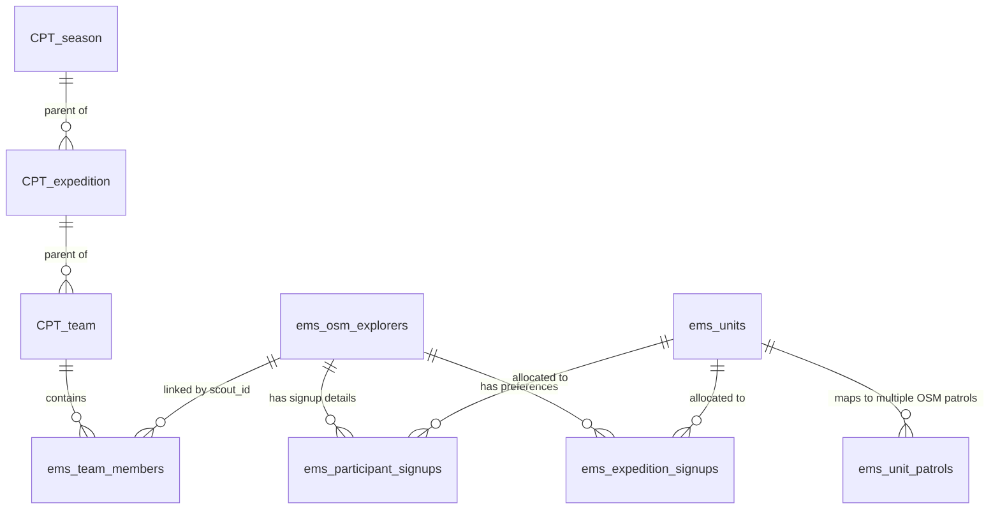
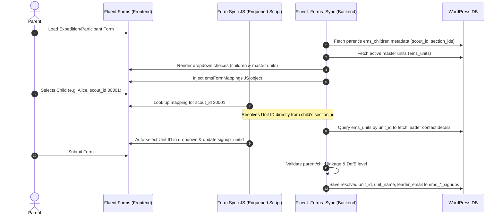

# Expedition Management System (EMS) — Systems Architecture Documentation

This document provides a detailed overview of the system architecture, data models, admin screens, and integrations for the **Expedition Management System (EMS)**. It serves as the single source of truth for systems architects and developers.

---

## 1. Architectural Overview & Context

The EMS is a WordPress plugin ([ems-plugin.php](file:///Users/davidstrachan/Projects/expedition-management-system/ems-plugin.php)) designed to manage Duke of Edinburgh (DofE) expeditions, teams, explorer training compliance, and parental registrations. It is built using a modern decoupled architecture:
*   **Backend**: Object-oriented PHP 8.2+ with namespaces, autoloading (PSR-4), strict typing, and a test-driven (TDD) foundation.
*   **Frontend**: React-based Single Page Applications (SPAs) embedded in the WordPress Admin dashboard using ES Modules, alongside classic WordPress settings tabs.
*   **Database**: A hybrid data model utilizing WordPress Custom Post Types (CPTs) for core entities and custom SQL relational tables for high-performance querying and relationship mapping.
*   **Integrations**: Online Scout Manager (OSM) as the identity anchor and reference provider, Tutor LMS for training status verification, and Fluent Forms for parent signups and Stripe payment processing.

### System Components & Integrations

```mermaid
graph TD
    subgraph WordPress Admin Dashboard (React SPA)
        ExpeditionBoard[Expedition Board / Team Builder]
        ExplorerList[Explorer List / Ref Grid]
        ColumnMapperUI[Flexi-Record Column Mapper]
    end

    subgraph WordPress Admin Views (PHP Rendered & Forms)
        TrainingReport[Tutor LMS Training Report]
        SettingsPage[Plugin Configuration Page & Tabs]
        SignupsPage[Fluent Forms Signups View]
        UnitLookupTab[Unit Lookup / Interactive Mapping UI]
    end

    subgraph EMS Plugin Core
        PluginInit[Plugin Core Hook Registry]
        OSMClient[OSM API Client]
        OSMReferenceSync[OSM Reference Sync Manager]
        FluentSync[Fluent Forms Sync Handler]
        TutorClient[Tutor LMS client]
        RESTControllers[WP REST API Controllers]
        DataModel[CPT Registry & Repository Layer]
    end

    subgraph Database (MySQL)
        WPCpt[(WP Post Meta & CPTs)]
        CustomTables[(Custom Relational SQL Tables)]
    end

    subgraph External Systems
        OSM[(Online Scout Manager API)]
        TutorLMSPlugin[(Tutor LMS Database)]
        FluentFormsPlugin[(Fluent Forms Database)]
    end

    %% Frontend Interactions
    ExpeditionBoard -->|REST API| RESTControllers
    ExplorerList -->|REST API| RESTControllers
    ColumnMapperUI -->|REST API| RESTControllers

    %% Backend Controllers to Repositories
    RESTControllers --> DataModel
    PluginInit --> DataModel

    %% Repositories to DB
    DataModel --> WPCpt
    DataModel --> CustomTables

    %% Integration Handlers to External Systems & DB
    OSMReferenceSync -->|OAuth2 / REST| OSMClient
    OSMClient <--> OSM
    FluentSync -->|Hooks / Submissions| FluentFormsPlugin
    FluentSync --> CustomTables
    TutorClient --> TutorLMSPlugin
    TrainingReport --> TutorClient
    
    classDef default fill:#f9f9f9,stroke:#333,stroke-width:1px;
    classDef database fill:#e1f5fe,stroke:#0288d1,stroke-width:1.5px;
    classDef external fill:#fff3e0,stroke:#f57c00,stroke-width:1.5px;
    class WPCpt,CustomTables database;
    class OSM,TutorLMSPlugin,FluentFormsPlugin external;
```

---

## 2. Architectural Decision Records (ADRs)

Reconciled from technical discovery, these architecture design records govern the EMS implementation:

*   **ADR 001: Data Modeling Strategy**: Use a hybrid approach — Custom Post Types (CPTs) for core hierarchical entities (`season`, `expedition`, `team`) to exploit native WP admin view lists, and custom database tables for relational child mapping data to allow high-performance querying.
*   **ADR 002: OSM Integration & Sync Strategy**: Reference-first data sync using a persistent OSM Scout ID (`scout_id`) as the immutable primary key. WP user accounts are independent and are only generated/hydrated during active OIDC login sessions. Multi-child accounts map children arrays to parent accounts in User Meta.
*   **ADR 003: Frontend Integration Pattern**: React-based SPAs embedded via shortcodes, styled using Elementor's global CSS custom properties (e.g. `--e-global-color-primary`, `--e-global-typography-primary-font-family`) for design consistency with the marketing theme, bypassing Elementor's asset optimization conflicts.
*   **ADR 004: Volunteer Availability & Confirmation Logic**: Custom database table `ems_volunteer_availability` for scheduling availability per user per date. This avoids unqueryable serialized strings and enables fast calendar deficit calculations.
*   **ADR 005: File Management & Security**: Secure route files stored outside public directories (in `/wp-content/uploads/ems-secure/` blocked by `.htaccess`). Downloads are served via a custom REST proxy `/ems/v1/download-route/{id}` that validates explorer, parent, or leader permissions.
*   **ADR 006: Administrative Interface**: Native-looking WordPress administrative views using React bundles enqueued with `@wordpress/components` styling packages (pinned to stable minor versions to avoid breaking changes during core WordPress upgrades).
*   **ADR 007: Test-Driven Development (TDD) Mandate**: All backend and frontend code follows the strict Red-Green-Refactor development loop. Code is not staged or pushed without verifying associated PHPUnit/Vitest coverage.
*   **ADR 008: Testing Frameworks**: Brain Monkey stubs for testing isolated PHP code without loading WordPress core, and Vitest + React Testing Library to verify React behavior from the user's perspective.
*   **ADR 009: Post-Login Hydration Flow (Identity vs. Context)**: Two-step user initialization where the OIDC handshake links the WP user, followed by a secondary startup payload context pull (`getDataPayload`). Captured access tokens are used in memory and **discarded immediately** after meta values are written.
*   **ADR 010: Admin-Triggered OSM Sync OAuth**: Mid-session OAuth code exchange for administrative data pulls and flexi-record syncs. Tokens are used in memory and never stored, keeping the security surface minimal.
*   **ADR 011: Custom Database Tables**: Relational and time-series data (member assignments, availability, submission version histories) reside in custom SQL tables created/updated via `dbDelta()` in [Table_Installer](file:///Users/davidstrachan/Projects/expedition-management-system/src/Core/Table_Installer.php).
*   **ADR 012: Auth Provider Interface**: Isolation of the concrete `login-with-google` OIDC plugin dependency behind the `EMS\Auth\Auth_Provider` interface.
*   **ADR 013: Flexirecord Mapper**: Configurable JSON mapping configurations (`ems_flexirecord_column_map`) storing columns (e.g. `f_1`, `f_2`) dynamically per section to avoid breaking on structural changes, bucketing data into clean, partial, or unparseable buckets.
*   **ADR 014: Direct Section ID Unit Matching (Fluent Forms)**: To match the 1-to-1 relationship where each OSM Section represents an ESU Unit, the parent/child signup form resolution maps the child's `section_id` directly to a `unit_id` in `wp_ems_units` without looking up patrol names.

---

## 3. Decoupled Data Model

EMS implements a hybrid data model defined in [Table_Installer.php](file:///Users/davidstrachan/Projects/expedition-management-system/src/Core/Table_Installer.php) and [CPT_Registry.php](file:///Users/davidstrachan/Projects/expedition-management-system/src/Core/CPT_Registry.php).

### Entity-Relationship Diagram



### 3.1 Custom Post Types (CPTs)
```
Season (season CPT)
  └── Event / Expedition (expedition CPT)
        └── Team (team CPT)
```

#### A. Season (`season`)
Top-level container for a flight of events in an academic year.
*   **Meta Fields**:
    *   `ems_season_year` (string, e.g. `2026-27`)
    *   `ems_season_status` (string: `active` | `archived`)

#### B. Event / Expedition (`expedition`)
Manages individual training events, practice expeditions, and qualifying expeditions.
*   **Hierarchy**: Belongs to a parent `season` (Post Parent ID).
*   **Meta Fields**:
    *   `ems_event_code` (string): Unique event identifier within a season (e.g. `H-SP1`).
    *   `ems_type` (string): `training` | `practice` | `qualifying`
    *   `ems_transport` (string): `hillwalking` | `biking` | `paddling`
    *   `ems_level` (string): `bronze` | `silver` | `gold`
    *   `ems_lic_id` (int): WP User ID of the Leader in Charge.
    *   `ems_lic_name` / `ems_lic_email` / `ems_lic_phone` (strings): Contact details of the LiC.
    *   `ems_start_date` / `ems_end_date` (ISO 8601 date strings).
    *   `ems_start_time` / `ems_end_time` (time strings).
    *   `ems_start_location` / `ems_end_location` (strings).
    *   `ems_osm_event_id` (int): Links to an Online Scout Manager event.
    *   `ems_route_deadline` (ISO 8601 date).
    *   `ems_route_info` (HTML string): Routing notes, map links, instructions.
    *   `ems_status` (string): `planning` | `open` | `confirmed` | `completed`

#### C. Team (`team`)
Groups participants within an event.
*   **Hierarchy**: Belongs to a parent `expedition` (Post Parent ID).
*   **Meta Fields**:
    *   `ems_team_code` (string): Unique identifier (e.g. `H-SP1-1`). Generated sequentially from the parent event's `ems_event_code`.
    *   `ems_team_number` (int): The numeric suffix (enforced sequentially).
    *   `ems_route_status` (string): `pending` | `feedback_required` | `approved`
    *   `ems_route_feedback` (string): Most recent feedback from the Leader in Charge.
    *   `ems_gpx_file_id` (int): WP Media ID of the latest GPX file.
    *   `ems_route_card_file_id` (int): WP Media ID of the latest PDF/doc route card.
*   **Validation**: Team size of 4–7 is the official range. Sizes outside this range generate an admin warning but are not hard-blocked. Teams with zero members are deleted automatically.

---

### 3.2 Custom Relational DB Tables

Custom SQL tables store relational, attendance, sync reference, and history data.

#### A. Master Units (`ems_units`)
Serves as the master unit list representing Explorer Scout Units (ESUs).
*   `id` (BIGINT UNSIGNED, Primary Key): Autoincrement ID.
*   `unit_id` (BIGINT UNSIGNED, Unique): The unique master identifier for the unit.
*   `district` (VARCHAR): Mapped district name (e.g., `Braid`).
*   `name` (VARCHAR): Full name of the unit (e.g., `CR-Pink Panthers`).
*   `short_code` (VARCHAR, Unique): Short identifier (e.g., `CR-Pink Panthers`).
*   `leader_email` (VARCHAR): Contact email of the unit leader.
*   `created_at` (DATETIME): Creation timestamp.
*   `updated_at` (DATETIME): Last update timestamp.

#### B. Unit Patrols (`ems_unit_patrols`)
Maintains the mapping of synced OSM sections and patrols to their master unit.
*   `id` (BIGINT UNSIGNED, Primary Key): Autoincrement ID.
*   `unit_id` (BIGINT UNSIGNED): Foreign key mapping to `ems_units.unit_id`.
*   `section_id` (BIGINT UNSIGNED): The synced OSM section identifier.
*   `patrol_id` (BIGINT): The synced OSM patrol identifier.
*   `name` (VARCHAR): Synced patrol name.
*   `active` (TINYINT): Mapped active status flag.
*   `synced_at` (DATETIME): Last synced timestamp.
*   *Indexes*: Unique constraint on `(patrol_id, section_id)` ensures duplicates are not created.

#### C. Team Members (`ems_team_members`)
Links Explorers to Teams.
*   `id` (BIGINT UNSIGNED, Primary Key)
*   `team_post_id` (BIGINT UNSIGNED): Links to the `team` CPT record.
*   `scout_id` (BIGINT UNSIGNED): Primary identity anchor (OSM `member_id`).
*   `user_id` (BIGINT UNSIGNED): Link to `wp_users.ID` (0 if the explorer hasn't logged in via OIDC yet).
*   `added_by` / `added_at`: Tracking attributes.

#### D. Volunteer Availability (`ems_volunteer_availability`)
Tracks volunteer cover for expedition dates.
*   `id` (BIGINT UNSIGNED, Primary Key)
*   `user_id` (BIGINT UNSIGNED): Mapped volunteer user.
*   `expedition_post_id` (BIGINT UNSIGNED): Mapped event.
*   `date` (DATE): Target date.
*   `overnight` (TINYINT): Mapped overnight availability flag.
*   `confirmed` (TINYINT) / `confirmed_by` (BIGINT): Sign-off tracking.

#### E. Route Submissions (`ems_route_submissions`)
Maintains a versioned audit trail of route file updates and status changes.
*   `id` (BIGINT UNSIGNED, Primary Key)
*   `team_post_id` (BIGINT UNSIGNED): Associated team.
*   `version` (INT): Incremental version number.
*   `file_type` (VARCHAR): `gpx` | `route_card`
*   `wp_media_id` (BIGINT UNSIGNED): Mapped file in WordPress Media Library.
*   `status` (VARCHAR): `pending` | `feedback_required` | `approved`
*   `submitted_by` (BIGINT UNSIGNED): WP User ID of the uploader.
*   `submitted_at` (DATETIME): Submission timestamp.
*   `feedback` (TEXT): Feedback text left by the reviewer.

#### F. Synced OSM Explorers (`ems_osm_explorers`)
Local cache of Online Scout Manager participants. 
*   `scout_id` (BIGINT UNSIGNED, UNIQUE): Mapped OSM member ID.
*   `wp_user_id` (BIGINT UNSIGNED, Nullable): Mapped WordPress User ID.
*   `section_id` (BIGINT UNSIGNED): OSM section identifier.
*   `first_name` / `last_name` / `email` / `parent_email` / `patrol` (VARCHARs).
*   `first_aid_level` (VARCHAR): Local override for first aid qualifications.
*   `last_local_update_at` / `last_ems_push_at` (DATETIME): Used to track dirty fields.

#### G. Synced OSM Events (`ems_osm_events`)
Cached OSM events.
*   `event_id` (BIGINT UNSIGNED): OSM event ID.
*   `section_id` (BIGINT UNSIGNED): Sync source section.
*   `name` / `start_date` / `end_date` / `location` (event properties).

#### H. Synced OSM Event Attendance (`ems_osm_event_attendance`)
RSVP statuses for synced events.
*   `event_id` / `scout_id` (BIGINT UNSIGNED, UNIQUE index): Relational link.
*   `status` (VARCHAR): Member attendance state (e.g. `Attending`, `Declined`).

#### I. Participant Signups (`ems_participant_signups`)
DofE Participation Place registrations (Form 6) submitted via Fluent Forms.
*   `scout_id` (BIGINT UNSIGNED): Synced explorer scout ID (link anchor).
*   `parent_user_id` (BIGINT UNSIGNED): WordPress User ID of parent submitting.
*   `unit_id` (BIGINT UNSIGNED, Nullable): Mapped Master Unit ID from `ems_units`.
*   `unit_name` (VARCHAR): ESU Unit Name from form dropdown.
*   `explorer_first_name` / `explorer_last_name` / `explorer_email` (VARCHAR): Explorer's details.
*   `parent_email` / `leader_email` (VARCHAR): Parent and local unit leader emails.
*   `dofe_level` (VARCHAR): `bronze` | `silver` | `gold`.
*   `dob` (DATE, Nullable): Explorer's date of birth.
*   `dofe_registered` (VARCHAR): `y`, `y-other`, `n` status.
*   `dofe_number` / `dofe_org` (VARCHAR): Existing eDofE ID and other transferring organisation name.
*   `signup_status` / `payment_status` (VARCHAR): State flags.
*   `form_submission_id` (BIGINT UNSIGNED): Fluent Forms entry ID.

#### J. Expedition Signups (`ems_expedition_signups`)
Specific expedition event signup entries (Form 7) submitted via Fluent Forms.
*   `scout_id` (BIGINT UNSIGNED): Synced explorer scout ID (link anchor).
*   `parent_user_id` (BIGINT UNSIGNED): WordPress User ID of parent submitting.
*   `unit_id` (BIGINT UNSIGNED, Nullable): Mapped Master Unit ID from `ems_units`.
*   `unit_name` (VARCHAR): ESU Unit Name from form dropdown.
*   `explorer_first_name` / `explorer_last_name` / `explorer_email` (VARCHAR): Explorer's details.
*   `parent_email` / `leader_email` (VARCHAR): Parent and local unit leader emails.
*   `dofe_level` (VARCHAR): `bronze` | `silver` | `gold`.
*   `expedition_preferences` (TEXT): JSON string of type (`exped_type`), practice/qualifier dates, teammate list.
*   `first_aid_status` / `first_aid_expiry` (DATE): First aid compliance details.
*   `signup_status` / `payment_status` (VARCHAR): State flags.
*   `form_submission_id` (BIGINT UNSIGNED): Fluent Forms entry ID.

---

### 3.3 WordPress User Roles & Metadata
EMS registers custom user roles managed via [Role_Manager.php](file:///Users/davidstrachan/Projects/expedition-management-system/src/Core/Role_Manager.php):
*   `ems_explorer`: Custom capabilities for participants (`ESU Explorer` display name).
*   `ems_parent`: Account representing a parent or guardian (`ESU Parent` display name).
*   `ems_leader`: Administrative role for local unit leaders (`ESU Leader` display name).

During OIDC login, [OIDC_Login_Handler.php](file:///Users/davidstrachan/Projects/expedition-management-system/src/Integrations/OIDC_Login_Handler.php) hydrates standard WP User accounts with the following metadata:
*   `ems_osm_id` (int): User's OSM account ID.
*   `ems_access_type` (string): Account class (`parent` | `member` | `local`).
*   `ems_scout_ids` (array): List of OSM member IDs linked to the logged-in user.
*   `ems_section_ids` (array): List of OSM section IDs the user administers.
*   `ems_children` (array): Synced child profile details containing:
    * `scout_id` (int)
    * `first_name` (string)
    * `last_name` (string)
    * `section_ids` (array of ints)
*   `ems_unit` (string): Synced patrol/unit name.

---

## 4. Plugin Core Lifecycle & Installer

### 4.1 Initialization Sequence
1. The plugin entrypoint [ems-plugin.php](file:///Users/davidstrachan/Projects/expedition-management-system/ems-plugin.php) hooks into WordPress.
2. Registers activation/deactivation hooks:
   * **Activation**: Calls `EMS\Core\Table_Installer::install()` to create or upgrade custom database tables, and registers user roles via `EMS\Core\Role_Manager::register_roles()`.
   * **Deactivation**: Core tables and options are kept intact to avoid data loss, but roles can be scrubbed if configured.
3. Automatically runs the autoloader. Instantiates core integrations, REST API controllers, and hooks them into WordPress init filters.

### 4.2 Safe DB Migrations
The installer uses WordPress's `dbDelta` framework to apply changes incrementally. For high-risk schema updates that `dbDelta` cannot execute safely on its own (like dropping unique keys or modifying legacy tables):
1. **Explicit Index Drops**: Drops indexes (e.g., `idx_patrol_section` from the units table) via explicit raw SQL calls before executing modifications, preventing MariaDB/MySQL constraint errors.
2. **Explicit Column Creation**: Runs manual `ALTER TABLE ADD COLUMN` statements for timestamp fields (`created_at`) when core `dbDelta` fails to parse default parameters correctly.
3. **Obsolete Table Cleanup**: Programmatically drops deprecated tables (like the legacy `wp_ems_unit_leaders` table) during plugin updates to maintain database hygiene.

---

## 5. Unit Lookup Dashboard & Interactive Mapping

The **Unit Lookup** tab in the plugin settings provides an administration grid to manage master units, set leader contact emails, and resolve unmatched records.

### 5.1 Unmatched Patrol Resolution Query
To identify synced patrols from OSM that do not belong to any master unit, the system performs a `LEFT JOIN` on `wp_ems_units`:
```sql
SELECT p.* 
FROM wp_ems_unit_patrols p
LEFT JOIN wp_ems_units u ON p.unit_id = u.unit_id
WHERE p.unit_id IS NULL OR p.unit_id = 0 OR u.unit_id IS NULL;
```
This catches patrols whose `unit_id` is unset (`NULL` or `0`) or points to a master unit that has been deleted.

### 5.2 Interactive Mapping Actions
Administrators are presented with a responsive table of unmatched synced patrols, providing two actions:
1. **Link Patrol (`link_patrol`)**:
   * Drops down a select menu populated with all active master units.
   * On submit, processes the selection and runs a secure database update mapping that patrol's row in `wp_ems_unit_patrols` directly to the chosen unit's `unit_id`.
2. **Create Master Unit (`create_unit_from_patrol`)**:
   * Instantly spawns a new master unit in `wp_ems_units` using the patrol name and section ID.
   * **Unit ID Sequence Generation**: Resolves the next available numeric unit ID by selecting `MAX(unit_id)` from `wp_ems_units` and incrementing it (starting at `900000` if no custom units exist).
   * **Smart Prefix Parsing**: Separates string prefixes (e.g., matching `CR-Pink Panthers` $\rightarrow$ parses District: `CR`, Short Code/Name: `Pink Panthers`).
   * Commits the new unit to `wp_ems_units` and automatically runs the linkage update on `wp_ems_unit_patrols` in a single workflow.

---

## 6. REST API Specifications

All endpoints are registered under the `/wp-json/ems/v1/` namespace. Endpoints verify standard WordPress REST nonces (`X-WP-Nonce`) and implement role-based security:

| Endpoint | HTTP Method | Access Rules | Description |
|---|---|---|---|
| `/expedition-board` | `GET` | `manage_options` | Returns full seasons, events, teams, and member datasets for the Team Builder. |
| `/seasons` | `GET` | `manage_options` | Lists all seasons. |
| `/seasons` | `POST` | `manage_options` | Creates a new season. |
| `/seasons/{id}/archive`| `POST`/`PUT` | `manage_options` | Archives a target season (toggles status). |
| `/seasons/{id}` | `DELETE` | `manage_options` | Deletes a season (only if it has no events). |
| `/events` | `POST` | `manage_options` | Creates a new event under a season. |
| `/events/{id}` | `POST`/`PUT` | `manage_options` | Updates event details. |
| `/events/{id}` | `DELETE` | `manage_options` | Deletes an event (only if it contains no teams). |
| `/events/{id}/teams` | `POST` | `manage_options` | Creates a new team in the event. |
| `/events/{src}/populate/{target}` | `POST` | `manage_options` | Bulk-copies team structures from a source event to a target event. |
| `/teams/{id}` | `DELETE` | `manage_options` | Deletes a team (cascading cleanup). |
| `/teams/{id}/move` | `POST`/`PUT` | `manage_options` | Moves a team to a different event of the same type. |
| `/teams/{id}/duplicate`| `POST` | `manage_options` | Clones a team's configuration to a target event. |
| `/teams/{id}/members` | `POST` | `manage_options` | Adds an explorer to a team roster. |
| `/teams/{id}/members/{scout_id}` | `DELETE` | `manage_options` | Removes an explorer from a team roster (triggers auto-cleanup). |
| `/explorers/{scout_id}/move-team` | `POST`/`PUT` | `manage_options` | Moves a single explorer between teams. |
| `/explorers/{scout_id}/first-aid` | `POST`/`PUT` | `manage_options` | Updates an explorer's local first aid qualification. |
| `/explorer/{scout_id}` | `GET` | `manage_options` | Returns detailed contact and training compliance data for a member. |
| `/team/{team_id}` | `GET` | `manage_options` | Returns hydrated team roster details and compliance flags. |
| `/patrol/{patrol}` | `GET` | `manage_options` | Returns list of explorers matching a patrol/unit string. |
| `/events/{id}/training-requirements` | `GET` | `manage_options` | Lists mapped Tutor LMS course IDs required for the event. |
| `/events/{id}/training-requirements` | `POST` | `manage_options` | Saves mapped Tutor LMS course requirement IDs for the event. |
| `/sync-status` | `GET` | `manage_options` | Returns execution status of background OSM sync cron. |
| `/signups/participants` | `GET` | `manage_options` | Returns DofE Participation Place registrations. |
| `/signups/participants/{id}/process` | `POST` | `manage_options` | Allocates a Participation Place slot. |
| `/signups/participants/{id}/archive` | `POST` | `manage_options` | Archives a Participation Place registration. |
| `/signups/expeditions` | `GET` | `manage_options` | Returns specific expedition signups. |
| `/signups/expeditions/{id}/process` | `POST` | `manage_options` | Processes an expedition entry. |
| `/signups/expeditions/{id}/archive` | `POST` | `manage_options` | Archives an expedition entry. |
| `/flexi-structure` | `GET` | `manage_options` | Returns structure of an OSM flexi-record. |
| `/flexi-column-map` | `GET` / `POST` | `manage_options` | Configures and saves OSM flexi-record column maps. |
| `/flexi-review` | `GET` | `manage_options` | Fetches flexi-record rows and buckets them. |
| `/flexi-commit` | `POST` | `manage_options` | Syncs the clean bucketed flexi-record data. |

---

## 7. Third-Party Integrations Architecture

### 7.1 Online Scout Manager (OSM) Integration
OSM acts as the source of truth for membership, patrol configurations, events, and attendance data.

*   **API Client and Driver Model**: Managed by [OSM_API_Client.php](file:///Users/davidstrachan/Projects/expedition-management-system/src/Integrations/OSM_API_Client.php). The client decouples the request structure from the transport layer using [Driver_Interface.php](file:///Users/davidstrachan/Projects/expedition-management-system/src/Integrations/Drivers/Driver_Interface.php):
    *   [Live_Driver.php](file:///Users/davidstrachan/Projects/expedition-management-system/src/Integrations/Drivers/Live_Driver.php): Performs HTTPS requests using OAuth2 bearer tokens.
    *   [Mock_Driver.php](file:///Users/davidstrachan/Projects/expedition-management-system/src/Integrations/Drivers/Mock_Driver.php): Emulates OSM API responses using local JSON mock files for development.
*   **API Rate Limiting**: Client-side token bucket algorithm in [Rate_Limiter.php](file:///Users/davidstrachan/Projects/expedition-management-system/src/Integrations/Rate_Limiter.php) limiting requests to **10 per second**.
*   **Zero-Persistence Token Policy**: OAuth tokens are captured in memory to fetch context upon login or sync. **Tokens are discarded immediately after configuration updates are written.** No user tokens are stored on the server.
*   **Persistent Synced Sections**: When a reference sync occurs via [OSM_Reference_Sync.php](file:///Users/davidstrachan/Projects/expedition-management-system/src/Integrations/OSM_Reference_Sync.php), all successfully synced sections are automatically appended and saved to the `ems_managed_sections` database option. This ensures synced sections do not expire after the 1-hour `ems_available_sections` transient cache dies.

### 7.2 Tutor LMS Integration
EMS integrates with the **Tutor LMS** database to verify training compliance.
*   **Direct Database Queries**: [TutorLMS_Client.php](file:///Users/davidstrachan/Projects/expedition-management-system/src/Integrations/TutorLMS_Client.php) bypasses core Tutor LMS overhead. It queries posts directly for published courses (`post_type = 'courses'`) and enrollment records (`post_type = 'tutor_enrolled'`).
*   **Completion Flags**: Checked via WordPress user meta keys (`_tutor_completed_course_{course_id}`).
*   **Batch Compilation**: Matrix layouts resolve student training progress in only two database queries.

### 7.3 Fluent Forms Integration
EMS connects with **Fluent Forms** to process parent signups and payments.

*   **Dropdown Filters**: [Fluent_Forms_Sync.php](file:///Users/davidstrachan/Projects/expedition-management-system/src/Integrations/Fluent_Forms_Sync.php) filters the child select dropdown (`signup_child`), dynamically listing children mapped under user meta (`ems_children`).
*   **Explorer Email Pre-population**: If an explorer email is found, the system pre-populates the input field and appends the `"ff-read-only"` style class to prevent parental modification.
*   **Leader Email Resolution**: Retrieves and stores the local unit leader's email by performing unit database lookups matching the selected ESU.
*   **Stripe Webhook Mappings**: Listens to Stripe payment webhook changes. If a payment status completes (`paid` or `succeeded`), the sync engine updates `payment_status` in the custom `ems_participant_signups` or `ems_expedition_signups` table (based on the matching submission type), maintaining an idempotent guard to prevent payment downgrades.

#### Unit Resolution Workflow (Direct Section ID Matching)
To match the 1-to-1 relationship where each OSM Section represents an ESU Unit, the signup form unit resolution bypasses patrol name matching entirely:



---

## 8. Frontend Portal Shortcodes

EMS React SPAs are rendered within custom page templates (`ems-page-template.php`) using WordPress shortcodes:

| Shortcode | Portal | Target Audience | Primary Function |
|---|---|---|---|
| `[ems-explorer-portal]` | Explorer SPA | Synced Explorers | Display assigned team members, routes, checklists, and Tutor LMS progress checklists. |
| `[ems-parent-portal]` | Parent SPA | Verified Parents | Select children, view timelines, and launch expedition registration forms. |
| `[ems-volunteer-dashboard]` | Volunteer Board | Adult Helpers | Submit dates availability and overnight coverage grids. |
| `[ems-leader-portal]` | Leader Portal | Unit Leaders / LiCs | View allocations, assigned events helper rosters, and download print sheets. |
| `[ems-route-submit]` | Upload Form | Team Members | Upload `.gpx` maps and `.pdf` route cards (version audited). |
| `[ems-route-status]` | Status Board | Team Members | View route card review statuses and Leader-in-Charge annotations. |
